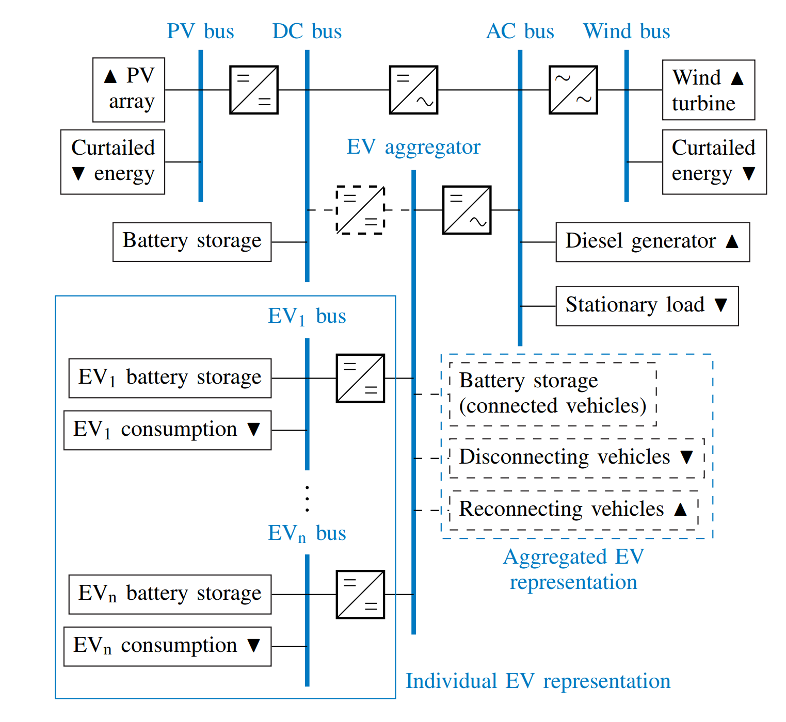
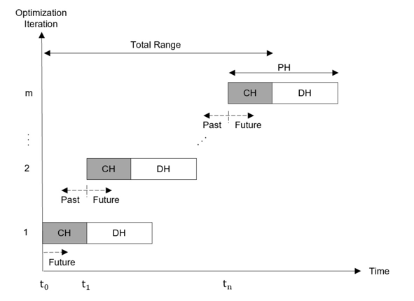

# REVOL-E-TION 

### Resilient Electric Vehicle Optimization model for Local Energy TransitION

REVOL-E-TION is an energy system model toolset designed to optimize integration of electric vehicle fleets into 
local energy systems such as mini- and microgrids, company sites, apartment blocks or single homes and estimate
the resulting technoeconomic potentials in terms of costs and revenues within the energy (and optionally also the
mobility system). It is built as a wrapper on top of the [oemof](https://oemof.org) energy system model framework. 

#### Created by 
Philipp Rosner, M.Sc. and Brian Dietermann, M.Sc.  
Institute of Automotive Technology  
Department of Mobility Systems Engineering  
TUM School of Engineering and Design  
Technical University of Munich  
philipp.rosner@tum.de  
September 2nd, 2021

#### Contributors
Marcel Brödel, M.Sc. - Research Associate 01/2024-

David Eickholt, B.Sc. - Semester Thesis submitted 07/2021  
Marcel Brödel, B.Sc. - Semester Thesis submitted 05/2022  
Hannes Henglein, B.Sc. - Semester Thesis submitted 10/2022  
Marc Alsina Planelles, B.Sc. - Master's Thesis submitted 10/2022  
Juan Forero Yacaman - Bachelor's Thesis submitted 04/2023  
Elisabeth Spiegl - Bachelor's Thesis submitted 06/2023  
Hannes Henglein, B.Sc. - Master's Thesis ongoing  
Alejandro Hernando Armengol, B.Sc. - Master's Thesis submitted 10/2023

## Licensing
REVOL-E-TION is licensed under the Apache 2.0 open source license.  
The full license text can be found in the LICENSE file in the root directory of the repository.

## Related publications
- P. Rosner and M. Lienkamp, "Unlocking the Joint Potential of Electric Mobility and Rural Electrification - A Concept for Improved Integration using Modular Batteries," 2022 IEEE PES/IAS PowerAfrica, Kigali, Rwanda, 2022, pp. 1-5, https://doi.org/10.1109/PowerAfrica53997.2022.9905305.
- P. Rosner, B. Dietermann, M. Brödel and M. Lienkamp, "REVOL-E-TION: A Flexible and Scalable Model to Optimally Integrate Bidirectional EV Fleets in Local Energy Systems", Poster, 2024 Vehicle2Grid Conference, Münster, Germany, 2024, https://doi.org/10.13140/RG.2.2.19632.16648

## Description  
REVOL-E-TION is a scalable generator for (mixed integer) linear energy system models of local energy systems with or without electric vehicle fleets.
It can be used to optimize component sizes and/or dispatch behavior of the system to achieve least cost in the simulation timeframe.
Simulation results are later extrapolated and discounted to a project timeframe to estimate the technoeconomic potential of the system in the long run.
Please note that this split between simulation and extrapolation improves computational effort, but creates possibly unwanted incentives for the optimizer (e.g. preferring low initial cost but operationally expensive power sources), especially when sizing components.

REVOL-E-TION groups oemof components and buses into blocks representing real-world systems (e.g. a PV array) for easy application.
Electric vehicles (in fact any mobile storage devices) are modeled individually within a block called a CommoditySystem.
Their behavior (i.e. when they depart and arrive again, how much energy they use in between and whether they can be charged externally) is described in a so called log file.
Log files can be created using the integrated Discrete Event Simulation (DES), which is also capable of modeling range extension through a Battery CommoditySystem as well as multiple use cases in different time frames (e.g. summer/winter) for the commoditites.

The following system diagram shows the basic structure including one example of each block class (blocks are indicated by dashed lines):


## Installation
REVOL-E-TION is designed to run under Windows 10, Ubuntu 22.04 LTS and MacOS 15 Sequoia, each with Python 3.11.
While portability is generally built in, other operating systems are untested.

#### Step 1: Getting the source code
REVOL-E-TION is available at the institute's [GitHub](https://github.com/TUMFTM/REVOL-E-TION) and can be cloned from there using 
```
git clone https://github.com/TUMFTM/REVOL-E-TION.git
```

#### Step 2: Create a clean virtual environment
It is recommended to create and activate a clean virtual environment for the installation of REVOL-E-TION.
This can be done using the following command:
```
python -m venv <path_to_virtual_environment>
source <path_to_virtual_environment>/bin/activate
```
or alternatively with conda:
```
conda create -n <name_of_virtual_environment> python=3.11
conda activate <name_of_virtual_environment>
```

#### Step 3: Install package and dependencies locally
Navigate to the root directory of the cloned repository and install the package and its dependencies using pip:
```
pip install -e .
```
This will install the ```revoletion``` package in editable mode, meaning that changes to the source code will be reflected in the installed package without reinstalling it.

#### Step 4: MILP Solver
REVOL-E-TION requires a [pyomo compatible](https://pyomo.readthedocs.io/en/stable/solving_pyomo_models.html#supported-solvers) Mixed Integer Linear Programming (MILP) solver (as does oemof).
The open-source [cbc](https://github.com/coin-or/Cbc/releases/latest) solver works well.
The proprietary [Gurobi](https://www.gurobi.com/downloads/) solver is recommended however, as it is faster in execution, especially for large problems and offers a free academic license.

#### Step 5: Basic Usage
Running REVOL-E-TION requires closely defined scenario(s) to simulate and common simulation settings to operate on.
Both are to be given as .csv-files specified as parameters in the terminal execution command using one of three options:

1. No parameters passed: graphical selection dialogs open automatically for scenario and settings files. (simple option)
2. Only filenames passed: scenario and settings files are searched in the ./input/scenarios and ./input/settings directories respectively. (best for local execution on host machine)
3. Valid paths to files passed: scenario and settings files are searched in the specified directories (best for remote execution on a server)

The actual terminal command can also be given in multiple forms:

1. Direct execution of the package's main module, e.g. ```python -m revoletion.main <scenario_file_parameter> <settings_file_parameter> ``` (best for local execution on host machine, e.g. through a run configuration in PyCharm)
2. Call to the package's entry point, e.g. ```revoletion <scenario_file_parameter> <settings_file_parameter>``` (best for remote execution on a server as it works irrespective of the current working directory as long as the correct environment is active)

Example scenario and settings files are provided in the respective directories.
Formatting of the scenario and settings files can be taken from the example files and is explained in tabular form below.
Some parameters in the scenario files reference to other files specified by file name within the input directory specified in the settings file.
This mostly applies to timeseries data.
Furthermore, to describe the mapping of different timeframes defining behavior of CommoditySystems (see below), modification of the ```mapper_timeframe_example.py``` code file might be necessary to fit the scenario as this is not simply and flexibly done in parameter files.
The filename of the modified file has to be given in the scenario file under the key ```filename_mapper``` and the file has to be placed in the respective input directory specified in the settings file.

Concerning computational effort, REVOL-E-TION relies heavily on single core computing power for each scenario and especially in 'go' strategy uses significant memory. To avoid memory limitations, it is advised to limit the number of parallel scenarios to be executed in the settings file depending on the hardware used.

## General Terms & Definitions
The following table details common terms occuring in further descriptions and the code:

| Term                   | Description                                                                                                                                                                                                                                                                                                                                                                                                                                                                                                                                                                                                                                                                                                                                                                                                                                                                      |
|------------------------|----------------------------------------------------------------------------------------------------------------------------------------------------------------------------------------------------------------------------------------------------------------------------------------------------------------------------------------------------------------------------------------------------------------------------------------------------------------------------------------------------------------------------------------------------------------------------------------------------------------------------------------------------------------------------------------------------------------------------------------------------------------------------------------------------------------------------------------------------------------------------------|
| Run                    | A single execution of REVOL-E-TION defined by a single scenario file (possibly containing multiple scenario definitions as columns) and settings file each. Common information and methods valid for all scenarios are defined in a SimulationRun object.                                                                                                                                                                                                                                                                                                                                                                                                                                                                                                                                                                                                                        |
| Scenario               | A set of parameters (i.e. an energy system) to be simulated and/or optimized. It is defined by a column in the scenario file and some timeseries inputs.                                                                                                                                                                                                                                                                                                                                                                                                                                                                                                                                                                                                                                                                                                                         |
| Strategy               | The (energy management) strategy to dispatch the energy system's blocks generally (see CommoditySystem capability levels later on for differences). REVOL-E-TION supports two strategies: "go" for single shot global optimization and "rh" for rolling horizon (i.e. time slotted myopic) optimization similar to Model Predictive Control (MPC). The former is a special case of the latter with just a single horizon. Component size optimization is only applicable in "go".                                                                                                                                                                                                                                                                                                                                                                                                |
| Horizon                | A single optimization process by the solver, whether as the only one of the scenario ("go" strategy) or as a slice of the simulation timeframe ("rh" strategy). In the latter case, the total simulation time is split up into prediction horizons (each of which is represented in the code by a PredictionHorizon object) that are simulated consecutively. However, overlap between the horizons is necessary to ensure feasibilty of dispatch. Therefore, only the first part of the prediction horizon (called control horizon) is actually used for overall result calculation, while the rest is discarded. The simulation timeframe is automatically split up into horizons as per the defined length of prediction and control horizons from the scenario file. See the following diagram for clarification:  |
| Block                  | A set of oemof components representing a real-world system including necessary converters and buses. Each is represented by an instance of the Block parent class with further child classes. The blocks present in the energy system are defined in the scenario file as a dictionary, except for the core block (of class SystemCore) containing the AC and DC buses as well as the converter(s) inbetween them. Multiple instances of one block can coexist in a model. The possible types (i.e. Classes) are laid out in the following chapter.                                                                                                                                                                                                                                                                                                                              |
| Component              | A component is an oemof element that is either a source, a sink, a bus, a converter or a storage.                                                                                                                                                                                                                                                                                                                                                                                                                                                                                                                                                                                                                                                                                                                                                                                |

## Classes of Blocks
The following table details the classes of blocks that can be specified in the "blocks" parameter of the scenario in the scenario file with respective names for the instances. Block instances cannot be named "scenario". Each instance requires a certain set of parameters dependent on its class. These are specified in the following chapter.

| Class Name              | Description                                                                                                                                                                                                                                                                                                                                                                                                                                                                                                                                                                                                                                                    |
|-------------------------|----------------------------------------------------------------------------------------------------------------------------------------------------------------------------------------------------------------------------------------------------------------------------------------------------------------------------------------------------------------------------------------------------------------------------------------------------------------------------------------------------------------------------------------------------------------------------------------------------------------------------------------------------------------|
| InvestBlock             | Parent class for all blocks that are possibly being sized in optimization (i.e. where an investment decision has to be taken) and for which entering ```'opt'``` as the size in the scenario file will trigger that size optimization. However, this option is only compatible with the "go" strategy. Class contains mostly methods for result evaluation.                                                                                                                                                                                                                                                                                                    |
| RenewableInvestBlock    | Parent class for all InvestBlocks representing a renewable source with a curtailment sink component and variable potential power (defined as a fraction of nominal power to enable sizing) over time. Child of class InvestBlock.                                                                                                                                                                                                                                                                                                                                                                                                                              |
| SystemCore              | Class for collection of central energy system components (AC and DC buses and the two unidirectional transformers between them). Child of class Block. This is present once and only once in every energy system defined in REVOL-E-TION under the name "core". For pure AC or DC systems, the respective core cost and size parameters can be set to zero to have no effect on the result.                                                                                                                                                                                                                                                                    |
| FixedDemand             | Class for undeferrable (i.e. inflexible) power demand such as households. Child of class Block. Power timeseries is defined in a csv file.                                                                                                                                                                                                                                                                                                                                                                                                                                                                                                                     |
| PVSource                | Class for photovoltaic array. Child of class RenewableInvestBlock. Power potential is defined either in a [Solcast](https://solcast.com/) or [PVGIS](https://re.jrc.ec.europa.eu/pvg_tools/en/) formatted csv file (both pre-downloaded) or retrieved from either the [Solcast](https://docs.solcast.com.au/#intro) or [PVGIS](https://joint-research-centre.ec.europa.eu/photovoltaic-geographical-information-system-pvgis/getting-started-pvgis/api-non-interactive-service_en) API (selection of API requires active internet connection. In addition the Solcast API requires an active subscription plan. There is a limited free plan for researchers). | 
| WindSource              | Class for wind turbine. Child of class RenewableInvestBlock. Power potential is defined either in a csv timeseries file or from PVSource data containing wind speed, which is then converted to power for a specific turbine height. For the latter option, a PVSource block must exist.                                                                                                                                                                                                                                                                                                                                                                       |
| ControllableSource      | Class for independently controllable power sources (e.g. fossil generator, hydro power plant) that is unlimited in energy. Child of class InvestBlock.                                                                                                                                                                                                                                                                                                                                                                                                                                                                                                         |
| GridConnection          | Class for utility grid and/or energy market connection. Child of class InvestBlock. A GridConnection instance can contain multiple GridMarkets. Definition of GridMarket instances happens in a separate csv file.                                                                                                                                                                                                                                                                                                                                                                                                                                             |
| StationaryEnergyStorage | Class for stationary battery energy storage systems. Child of class InvestBlock. A posteriori aging (i.e. capacity reduction) estimation is possible and will be taken into the next horizon as a reduced available SOC range. Storage modelling is done linearly without SOC or temperature based limits of charge or discharge power.                                                                                                                                                                                                                                                                                                                        |
| CommoditySystem         | Parent class for fleets of mobile battery based devices (e.g. electric vehicles or battery rental). Child of class InvestBlock. Behavior is defined in a csv file (the log) that can either be given or generated within the integrated Discrete Event Simulation from stochastic behavioral parameters to be given in a usecase definition csv file for different timeframes defined in ```mapper_timeframe.py``` in code. Each CommoditySystem consists of at least one MobileCommodity representing one vehicle or battery.                                                                                                                                 |
| VehicleCommoditySystem  | Class for fleet of electric vehicles, possibly with range extension using a BatteryCommoditySystem (see [publication](https://ieeexplore.ieee.org/document/9905305)). Child of class CommoditySystem.                                                                                                                                                                                                                                                                                                                                                                                                                                                          |
| BatteryCommoditySystem  | Class for fleet of mobile batteries. Child of class CommoditySystem.                                                                                                                                                                                                                                                                                                                                                                                                                                                                                                                                                                                           |

## Scenario Input Parameters
The scenario file defines all noncomplex (i.e. integer, float, string, boolean) parameters of the scenarios.
Complex (multidimensional) parameters are mostly defined through links to other files (by filename) in the scenario file.
The following table specifies each parameter for each possible block class in the scenario file.
If and only if a block of a certain class exists within the scenario are these parameters required and read in. 
Therefore not every scenario file contains all possible parameters.
The first column of the scenario file defines the name of the block the parameter in the second column applies to.
An example scenario file is provided in the ```./input/scenarios``` directory.
As all string values specified in the scenario definition file are converted to lower case, all files have to be named in lower case to be read in properly. 

| Block                   | Key                   | Name                                                       | Type         | Description                                                                                                                                                                                                                                                                                                                                                                             | Valid values or format                                            |
|-------------------------|-----------------------|------------------------------------------------------------|--------------|-----------------------------------------------------------------------------------------------------------------------------------------------------------------------------------------------------------------------------------------------------------------------------------------------------------------------------------------------------------------------------------------|-------------------------------------------------------------------|
| Scenario                | starttime             | Start time                                                 | str          | Start time of the project and the simulation. The project always starts at 00:00 local time                                                                                                                                                                                                                                                                                             | 'dd.mm.YYYY'                                                      |
|                         | timestep              | Time step                                                  | str          | Time step used for the simulation                                                                                                                                                                                                                                                                                                                                                       | formats compatible with pd.to_timedelta() such as '15min' or '1H' |
|                         | sim_duration          | Simulation duration                                        | int          | Simulation duration in days                                                                                                                                                                                                                                                                                                                                                             | [1, inf[                                                          |
|                         | prj_duration          | Project duration                                           | int          | Project duration in years to which the economic results of the simulation duration are extrapolated                                                                                                                                                                                                                                                                                     | [1, inf[                                                          |
|                         | strategy              | Strategy                                                   | str          | Optimization strategy                                                                                                                                                                                                                                                                                                                                                                   | 'go' or 'rh' (global optimum, rolling horizon)                    |
|                         | len_ph                | Prediction horizon length                                  | int          | Length of the prediction horizon in hours. Neglected for every optimization strategy other than 'rh'                                                                                                                                                                                                                                                                                    | [1, inf[                                                          |
|                         | len_ch                | Control horizon length                                     | int          | Length of the control horizon in hours. Neglected for every optimization strategy other than 'rh'                                                                                                                                                                                                                                                                                       | [1, inf[                                                          |
|                         | truncate_ph           | Truncate Prediction Horizon                                | bool         | Toggles whether to truncate predictions horizons to simulation end time when using 'rh' optimization strategy. If activated all horizons are truncated to the simulation end time. Deactivation requires additional input data for all Prediction Horizons even beyond the end of the simulation specified by "starttime" and "sim_duration"                                            | True, False                                                       |
|                         | wacc                  | Weighted average cost of capital                           | float        | Weighted average cost of capital: discount rate for future expenses/revenues and energies per year                                                                                                                                                                                                                                                                                      | [0, 1]                                                            |
|                         | currency              | Currency                                                   | str          | Currency used to display results of economic calculations. No influence of calculation itself, only used for displaying.                                                                                                                                                                                                                                                                | e.g. 'EUR', 'USD'                                                 |
|                         | latitude              | Latitude                                                   | float        | Latitude of the location of the local energy system. Used to determine timezone, pv and wind data. Has to be given in WGS84                                                                                                                                                                                                                                                             | [-90, 90]                                                         |
|                         | longitude             | Longitude                                                  | float        | Latitude of the location of the local energy system. Used to determine timezone, pv and wind data. Has to be given in WGS84                                                                                                                                                                                                                                                             | [-90, 90]                                                         |
|                         | cost_eps              | Epsilon costs                                              | float        | Cost added to some flows in order to disincentivice circular flows                                                                                                                                                                                                                                                                                                                      | [0, inf[                                                          |
|                         | filename_mapper       | Filename TimeframeMapper                                   | str          | Filename of the file containing the mapping function for the CommoditySystems' DES. The file has to The filename has to be given without the ending ".py". The file itself has to be placed in ```./input/TimeframeMapper```.                                                                                                                                                           | string with filename of python file without ".py"                 |
|                         | blocks                | Blocks                                                     | dict         | All blocks present in the scenario except for the SystemCore, which is added automatically, in the format {block_name: class_name}. Non valid names are 'run', 'scenario' and 'core' (default name for block of class SystemCore).                                                                                                                                                      | '{'custom block name': 'class name of block'}'                    |
| SystemCore              | size_acdc_existing    | Existing AC/DC size                                        | float or str | Maximum installed power of the AC/DC converter in the SystemCore in W. To set both converter sizes to the same value set one size to 'equal'                                                                                                                                                                                                                                            | [0, inf[ or 'equal'                                               |
|                         | invest_acdc           | Investment into AC/AC converter                            | bool or str  | Enable additional investment into the AC/DC converter of the SystemCore. If one of the invest parameters is set to 'equal' both investments are forced to the same size                                                                                                                                                                                                                 | True, False, 'equal'                                              |
|                         | size_dcac_existing    | Existing DC/AC size                                        | float or str | Maximum installed power of the DC/AC converter in the SystemCore in W. To set both converter sizes to the same value set one size to 'equal'                                                                                                                                                                                                                                            | [0, inf[ or 'equal'                                               |
|                         | invest_dcac           | Investment into DC/AC converter                            | bool or str  | Enable additional investment into the DC/AC converter of the SystemCore. If one of the invest parameters is set to 'equal' both investments are forced to the same size                                                                                                                                                                                                                 | True, False, 'equal'                                              |
|                         | capex_spec            | Specific capital expenditures                              | float        | Specific capital expenditures for each of the converters in the SystemCore: cost in currency per installed power (cumulative size of "size_acdc" and "size_dcac") in W                                                                                                                                                                                                                  | [0, inf[                                                          |
|                         | mntex_spec            | Specific maintenance expenditures                          | float        | Specific maintenance expenditures for each of the converters in the SystemCore: cost in currency per year per installed power in W                                                                                                                                                                                                                                                      | [0, inf[                                                          |
|                         | opex_spec             | Specific operational expenditures                          | float or str | Specific operational expenditures for each of the converters in the SystemCore cost in currency per converted energy in Wh. Energy is measured at converter inflow                                                                                                                                                                                                                      | string with filename or [0, inf[                                  |
|                         | ls                    | Lifespan                                                   | float        | Lifespan of the block in years after which it will be replaced                                                                                                                                                                                                                                                                                                                          | [1, inf[                                                          |
|                         | ccr                   | Cost change ratio                                          | float        | Cost change ratio of the block's nominal price per year to be considered for replacement after its lifespan                                                                                                                                                                                                                                                                             | [0, inf[                                                          |
|                         | eff_dcac              | DC/AC efficiency                                           | float        | Efficiency of the DC/AC converter in the SystemCore                                                                                                                                                                                                                                                                                                                                     | [0, 1]                                                            |
|                         | eff_acdc              | AC/DC efficiency                                           | float        | Efficiency of the AC/DC converter in the SystemCore                                                                                                                                                                                                                                                                                                                                     | [0, 1]                                                            |
| FixedDemand             | load_profile          | Load Profile                                               | str or float | Load profile for the fixed demand. Can be given as float to define a constant demand in W or as a filename of a csv file containing a timeseries specifying the fixed demand of the block. The file has to include the two columns 'time' and 'power' including a timezone aware timestamp and the corresponding power value in W                                                       | string with filename or [0, inf[                                  |
|                         | crev_spec             | Specific customer revenue                                  | float        | Specific customer revenue for consumed energy in currency per Wh                                                                                                                                                                                                                                                                                                                        | [0, inf[                                                          |
| WindSource              | size_existing         | Existing size                                              | float        | Installed rated power of wind turbine in W                                                                                                                                                                                                                                                                                                                                              | [0, inf[                                                          |
|                         | invest                | Investment                                                 | bool         | Enable additional investment into the wind turbine                                                                                                                                                                                                                                                                                                                                      | True, False                                                       |
|                         | data_source           | Data source                                                | str          | Data source for wind power. Wind power can either be calculated from the PV data or given as a separate file                                                                                                                                                                                                                                                                            | string containing the name of a block of class PVSource or 'file' |
|                         | height                | Height                                                     | float        | Height of the wind turbine <mark>-> define measuring position for height </mark>                                                                                                                                                                                                                                                                                                        | [0, inf[                                                          |
|                         | filename              | Filename                                                   | str          | Filename of csv file containing wind power data with the columns time (timezone aware timestamp) and power_spec (specific power in W per rated power in W) for each defined timestamp                                                                                                                                                                                                   | string with filename                                              |
|                         | capex_spec            | Specific capital expenditures                              | float        | Specific capital expenditures: cost in currency per installed rated power in W                                                                                                                                                                                                                                                                                                          | [0, inf[                                                          |
|                         | mntex_spec            | Specific maintenance expenditures                          | float        | Specific maintenance expenditures: cost in currency per year per installed rated power in W                                                                                                                                                                                                                                                                                             | [0, inf[                                                          |
|                         | opex_spec             | Specific operational expenditures                          | float or str | Specific operational expenditures: cost in currency per generated energy in Wh. Can be given as float or filename of a csv file containing a timeseries                                                                                                                                                                                                                                 | string with filename or [0, inf[                                  |
|                         | ls                    | Lifespan                                                   | float        | Lifespan of the block in years after which it will be replaced                                                                                                                                                                                                                                                                                                                          | [1, inf[                                                          |
|                         | ccr                   | Cost change ratio                                          | float        | Cost change ratio of the block's nominal price per year to be considered for replacement after its lifespan                                                                                                                                                                                                                                                                             | [0, inf[                                                          |
|                         | eff                   | Efficiency                                                 | float        | Efficiency of the wind turbine                                                                                                                                                                                                                                                                                                                                                          | [0, 1]                                                            |
| PVSource                | size_existing         | Existing size                                              | float        | Installed peak power of the pv array in in Wp                                                                                                                                                                                                                                                                                                                                           | [0, inf[                                                          |
|                         | invest                | Investment                                                 | bool         | Enable additional investment into the PV system                                                                                                                                                                                                                                                                                                                                         | True, False                                                       |
|                         | data_source           | Data source                                                | str          | Data source for pv power. This can be PVGIS or Solcast API or a file containing data from PVGIS or Solcast. If Solcast API is chosen a valid API key has to specified in ```.input\PVSource\solcast_api.conf``` by copying and renaming ```.input\PVSource\solcast_api_template.conf```                                                                                                 | 'pvgis api', 'solcast api', pvgis file', 'solcast file'           |
|                         | filename              | Filename                                                   | str          | Name of a PVGIS or Solcast csv file if "data_source" is set to 'pvgis file' or 'solcast file'. Name of a parameter file or None to use the default values if 'pvgis api' or 'solcast api' is chosen.                                                                                                                                                                                    | string with filename                                              |
|                         | capex_spec            | Specific capital expenditures                              | float        | Specific capital expenditures: cost in currency per installed peak power in W                                                                                                                                                                                                                                                                                                           | [0, inf[                                                          |
|                         | mntex_spec            | Specific maintenance expenditures                          | float        | Specific maintenance expenditures: cost in currency per year per installed peak power in W                                                                                                                                                                                                                                                                                              | [0, inf[                                                          |
|                         | opex_spec             | Specific operational expenditures                          | float or str | Specific operational expenditures: cost in currency per generated energy in Wh. Can be given as float or filename of a csv file containing a timeseries                                                                                                                                                                                                                                 | string with filename or [0, inf[                                  |
|                         | ls                    | Lifespan                                                   | float        | Lifespan of the block in years after which it will be replaced                                                                                                                                                                                                                                                                                                                          | [1, inf[                                                          |
|                         | ccr                   | Cost change ratio                                          | float        | Cost change ratio of the block's nominal price per year to be considered for replacement after its lifespan                                                                                                                                                                                                                                                                             | [0, inf[                                                          |
|                         | eff                   | Efficiency                                                 | float        | Efficiency of the <mark>PV array's DC/DC converter</mark>                                                                                                                                                                                                                                                                                                                               | [0, 1]                                                            |
| ControllableSource      | size_existing         | Existing size                                              | float        | Installed rated power of the source in W                                                                                                                                                                                                                                                                                                                                                | [0, inf[                                                          |
|                         | invest                | Investment                                                 | bool         | Enable additional investment into the power source                                                                                                                                                                                                                                                                                                                                      | True, False                                                       |
|                         | capex_spec            | Specific capital expenditures                              | float        | Specific capital expenditures: cost in currency per installed power in W                                                                                                                                                                                                                                                                                                                | [0, inf[                                                          |
|                         | mntex_spec            | Specific maintenance expenditures                          | float        | Specific maintenance expenditures: cost in currency per year per installed peak power in W                                                                                                                                                                                                                                                                                              | [0, inf[                                                          |
|                         | opex_spec             | Specific operational expenditures                          | float or str | Specific operational expenditures: cost in currency per generated energy in Wh. Can be given as float or filename of a csv file containing a timeseries                                                                                                                                                                                                                                 | string with filename or [0, inf[                                  |
|                         | ls                    | Lifespan                                                   | float        | Lifespan of the block in years after which it will be replaced                                                                                                                                                                                                                                                                                                                          | [1, inf[                                                          |
|                         | ccr                   | Cost change ratio                                          | float        | Cost change ratio of the block's nominal price per year to be considered for replacement after its lifespan                                                                                                                                                                                                                                                                             | [0, inf[                                                          |
|                         | eff                   | Efficiency                                                 | float        | Efficiency of the source                                                                                                                                                                                                                                                                                                                                                                | [0, 1]                                                            |
| GridConnection          | size_g2s_existing     | Existing maximum power from grid to local site             | float        | Maximum installed power for the power flow from the grid to the local site in W. To set both directions' existing powers to the same value set one size to 'equal'                                                                                                                                                                                                                      | [0, inf[, 'equal'                                                 |
|                         | invest_g2s            | Investment into Grid2Site                                  | bool or str  | Enable additional investment into the maximum power from the grid to the local site. To ensure the same additional power for both directions set one invest variable to 'equal'                                                                                                                                                                                                         | [0, inf[                                                          |
|                         | size_s2g_existing     | Existing maximum power from local site to grid             | float        | Maximum installed power for the power flow from the local site to the grid in W. To set both directions' existing powers to the same value set one size to 'equal'                                                                                                                                                                                                                      | [0, inf[, 'equal'                                                 |
|                         | invest_s2g            | Investment into Site2Grid                                  | bool or str  | Enable additional investment into the maximum power from the local site to the grid. To ensure the same additional power for both directions set one invest variable to 'equal'                                                                                                                                                                                                         | [0, inf[                                                          |
|                         | peakshaving           | Peakshaving                                                | str          | Peakshaving period. Peakshaving can be deactivated by setting this parameter to 'None'                                                                                                                                                                                                                                                                                                  | 'None', 'day', 'week', 'month', 'quarter', 'year'                 |
|                         | opex_peak_spec        | Operational expenditures for peakshaving                   | float        | Specific operational expenditures for maximum power drawn from the public grid in cost in currency per peak power in W per peakshaving duration                                                                                                                                                                                                                                         | [0, inf[                                                          |
|                         | capex_spec            | Specific capital expenditures                              | float        | Specific capital expenditures: cost in currency per installed power (cumulative size of "size_s2g" and "size_g2s") in W of the grid connection                                                                                                                                                                                                                                          | [0, inf[                                                          |
|                         | mntex_spec            | Specific maintenance expenditures                          | float        | Specific maintenance expenditures: cost in currency per year per installed power (cumulative size of "size_s2g" and "size_g2s") in W of the grid connection                                                                                                                                                                                                                             | [0, inf[                                                          |
|                         | ls                    | Lifespan                                                   | float        | Lifespan of the block in years after which it will be replaced                                                                                                                                                                                                                                                                                                                          | [1, inf[                                                          |
|                         | ccr                   | Cost change ratio                                          | float        | Cost change ratio of the block's nominal price per year to be considered for replacement after its lifespan                                                                                                                                                                                                                                                                             | [0, inf[                                                          |
|                         | eff                   | Efficiency                                                 | float        | Efficiency of the grid connection                                                                                                                                                                                                                                                                                                                                                       | [0, 1]                                                            |
|                         | filename_markets      | Markets file                                               | str          | If multiple markets should be specified the filename of a file containing the parameters for different markets can be set here. Otherwise set to 'None'. If a markets file is specified, the default market specified by the following three parameters in this file will be neglected.                                                                                                 | string with filename or 'None'                                    |
|                         | res_only              | Renewable energy sources only                              | bool         | Default market: If activated, selling energy to the grid is restricted to energy produced by renewable energies blocks (PVSource, WindSource) in the current timestep and energy stored in a storage with activated "res_only" parameter                                                                                                                                                | 'True' or 'False'                                                 |
|                         | opex_spec_g2s         | Specific operational expenditures for grid to local site   | float or str | Default market: Specific operational expenditures for buying energy from the default market: cost in currency per energy in Wh. Can be given as float or filename of a csv file containing a timeseries                                                                                                                                                                                 | string with filename or [0, inf[                                  |
|                         | opex_spec_s2g         | Specific operational expenditures for local site to grid   | float or str | Default market: Specific operational expenditures for selling energy to the default market; cost in currency per energy in Wh. Can be given as float or filename of a csv file containing a timeseries                                                                                                                                                                                  | string with filename or [0, inf[                                  |
| StationaryEnergyStorage | size_existing         | Existing size                                              | float        | Existing nominal capacity of the storage in Wh                                                                                                                                                                                                                                                                                                                                          | [0, inf[                                                          |
|                         | invest                | Investment                                                 | bool         | Enable additional investment into the storage capacity                                                                                                                                                                                                                                                                                                                                  | True, False                                                       |
|                         | res_only              | Renewable energy sources only                              | bool         | If activated, only energy from renewable sources can be stored in the storage                                                                                                                                                                                                                                                                                                           | 'True' or 'False'                                                 |
|                         | aging                 | Aging                                                      | bool         | Battery aging calculation after each horizon. Aging results are taken into account for the next horizon                                                                                                                                                                                                                                                                                 | 'True' or 'False'                                                 |
|                         | chemistry             | Chemistry                                                  | str          | Cell chemistry of the storage to select the correct aging model for aging calculation                                                                                                                                                                                                                                                                                                   | 'NMC', 'LFP'                                                      |
|                         | temp_battery          | Battery temperature                                        | float or str | Battery temperature used as stress factor in aging model. Can be set to a constant value or defined using the timeseries of a PVSource block as this contains a temperature timeseries                                                                                                                                                                                                  | string with name of block of class PVSource or ]-inf, inf[        |
|                         | capex_spec            | Specific capital expenditures                              | float        | Specific capital expenditures: cost in currency per installed nominal storage capacity in Wh                                                                                                                                                                                                                                                                                            | [0, inf[                                                          |
|                         | mntex_spec            | Specific maintenance expenditures                          | float        | Specific maintenance expenditures: cost in currency per year per installed nominal storage capacity in Wh                                                                                                                                                                                                                                                                               | [0, inf[                                                          |
|                         | opex_spec             | Specific operational expenditures                          | float or str | Specific operational expenditures: cost in currency per energy stored in the storage in Wh. Energy is measured at storage inflow. Can be given as float or filename of a csv file containing a timeseries                                                                                                                                                                               | string with filename [0, inf[                                     |
|                         | ls                    | Lifespan                                                   | float        | Lifespan of the block in years after which it will be replaced                                                                                                                                                                                                                                                                                                                          | [1, inf[                                                          |
|                         | eff_roundtrip         | Roundtrip efficiency                                       | float        | Storage roundtrip efficiency. Charge and discharge efficiency is calculated using sqrt(eff_roundtrip)                                                                                                                                                                                                                                                                                   | [0, 1]                                                            |
|                         | crate_chg             | Charge C-rate                                              | float        | Maximum C-rate for charging                                                                                                                                                                                                                                                                                                                                                             | [0, inf[                                                          |
|                         | crate_dis             | Discharge C-rate                                           | float        | Maximum C-rate for discharging                                                                                                                                                                                                                                                                                                                                                          | [0, inf[                                                          |
|                         | soc_init              | Initial SOC                                                | float        | Initial SOC of the storage at simulation start                                                                                                                                                                                                                                                                                                                                          | [0, 1]                                                            |
|                         | soh_init              | Initial SOH                                                | float        | Initial SOH of the storage at simulation start                                                                                                                                                                                                                                                                                                                                          | [0, 1]                                                            |
|                         | sdr                   | Self discharge rate                                        | float        | Self discharge rate of storage components per month (30 days)                                                                                                                                                                                                                                                                                                                           | [0, inf[                                                          |
|                         | ccr                   | Cost change ratio                                          | float        | Cost change ratio of the block's nominal price per year to be considered for replacement after its lifespan                                                                                                                                                                                                                                                                             | [0, inf[                                                          |
| VehicleCommoditySystem  | data_source           | Data source                                                | str          | Define whether usage timeseries should be read from existing log file or be generated using the Discrete event simulation (DES) module                                                                                                                                                                                                                                                  | 'des', 'log'                                                      |
|                         | filename              | Filename                                                   | str          | Filename of csv file containing existing log or usecase definition for DES                                                                                                                                                                                                                                                                                                              | string with filename                                              |
|                         | num                   | Number                                                     | int          | Number of commodities within the commodity system                                                                                                                                                                                                                                                                                                                                       | [1, inf[                                                          |
|                         | size_existing         | Existing size                                              | float        | Installed nominal capacity of the commodity's storage in Wh for all commodities within the commodity system                                                                                                                                                                                                                                                                             | [0, inf[                                                          |
|                         | invest                | Invest                                                     | float        | Enable additional investment into the commodities' storages                                                                                                                                                                                                                                                                                                                             | True, False                                                       |
|                         | lvl_cap               | Capability level                                           | str          | Physical capability level of the commodity system's commodities for power feedback into the local energy grid. Available options are unidirectional charging ('ud'), vehicle-to-vehicle (restricted to commodities within the same commodity system, 'v2v') and vehicle-to-site ('v2s')                                                                                                 | 'ud', 'v2v', 'v2s'                                                |
|                         | mode_scheduling       | Scheduling Mode                                            | str          | Optimization level for charging the commodity system's commodities: Available options are uncoordinated charging ('uc'), three different rulebased strategies (equal distribution of the available power - 'equal', first come first served - 'fcfs', soc based charging - 'soc') and optimized charging ('oc'). If 'uc', 'equal', fcfs' or 'soc' are chosen, "lvl_cap" has to be 'ud'. | 'uc', equal', fcfs', 'soc', 'oc'                                  |
|                         | forecast_hours        | Forecast hours                                             | float        | Only relevant for rulebased charging strategies: Defines how much time in advance a trip can be seen by the charging scheduler in order to adjust the target SOC based on "soc_target_high" and "soc_target_low"                                                                                                                                                                        | [0, inf[                                                          |
|                         | power_lim_static      | Static power limit                                         | float        | Static power limit limiting the cumulative charging power of the commodity system. Neglected for uncoordinated charging strategies.                                                                                                                                                                                                                                                     | 'None', [0, inf[                                                  |
|                         | system                | System                                                     | str          | The bus (AC or DC) the block is connected to                                                                                                                                                                                                                                                                                                                                            | 'AC', 'DC'                                                        |
|                         | rex_cs                | Range extender commodity system                            | str          | Only relevant if DES is activated. Name of a BatteryCommoditySystem which can be used as Range Extender.                                                                                                                                                                                                                                                                                | string with name of BatteryCommoditySystem                        |
|                         | aging                 | Aging                                                      | bool         | Battery aging calculation after each horizon. Aging results are taken into account for the next horizon                                                                                                                                                                                                                                                                                 | 'True', 'False'                                                   |
|                         | chemistry             | Chemistry                                                  | str          | Cell chemistry of the storage to select the correct aging model for aging calculation                                                                                                                                                                                                                                                                                                   | 'NMC', 'LFP'                                                      |
|                         | temp_battery          | Battery temperature                                        | float or str | Battery temperature used as stress factor in aging model. Can be set to a constant value or defined using the timeseries of a PVSource block as this contains a temperature timeseries                                                                                                                                                                                                  | string with name of block of class PVSource or ]-inf, inf[        |
|                         | ls                    | Lifespan                                                   | float        | Lifespan of the block in years after which it will be replaced                                                                                                                                                                                                                                                                                                                          | [1, inf[                                                          |
|                         | soh_init              | Initial SOH                                                | float        | Initial SOH of the storage at simulation start                                                                                                                                                                                                                                                                                                                                          | [0, 1]                                                            |
|                         | soc_init              | Initial SOC                                                | float        | Initial SOC of the storage at simulation start                                                                                                                                                                                                                                                                                                                                          | [0, 1]                                                            |
|                         | soc_target_high       | Higher target SOC                                          | float        | Only relevant for rulebased charging strategies: SOC to which the commodity is charged if charging to "soc_target_low" would lead to a SOC lower than "soc_return" after the trip for the upcoming trip                                                                                                                                                                                 | [0, 1]                                                            |
|                         | soc_target_low        | Lower target SOC                                           | float        | Only relevant for rulebased charging strategies: Default target SOC                                                                                                                                                                                                                                                                                                                     | [0, 1]                                                            |
|                         | soc_return            | Return SOC                                                 | float        | <mark>Minimum SOC after the trip. For DES this is used to calculate the numbers of necessary Range Extender batteries. For rulebased charging strategies this is used to determine the target SOC.</mark>                                                                                                                                                                               | [0, 1]                                                            |
|                         | capex_spec            | Specific capital expenditures                              | float        | Specific capital expenditures: cost in currency per installed nominal traction battery storage capacity in Wh                                                                                                                                                                                                                                                                           | [0, inf[                                                          |
|                         | mntex_spec            | Specific maintenance expenditures                          | float        | Specific maintenance expenditures: cost in currency per year per installed nominal traction battery storage capacity in Wh                                                                                                                                                                                                                                                              | [0, inf[                                                          |
|                         | opex_spec             | Specific operational expenditures                          | float or str | Specific operational expenditures: cost in currency per energy stored in the storage in Wh. Energy is measured at storage inflow. Can be given as float or filename of a csv file containing a timeseries                                                                                                                                                                               | string with filename or [0, inf[                                  |
|                         | opex_spec_sys_chg     | Specific operational expenditures for system charging      | float or str | Specific operational expenditures for system charging: cost in currency per energy charged into commodity system in Wh. This can be used to simulate different operators for commodities and local energy grid. Negative costs can lead to unwanted behavior (e.g. wasting energy)! Can be given as float or filename of a csv file containing a timeseries                             | string with filename or [0, inf[                                  |
|                         | opex_spec_sys_dis     | Specific operational expenditures for system discharging   | float or str | Specific operational expenditures for system discharging: cost in currency per energy discharged from commodity system in Wh. This can be used to simulate different operators for commodities and local energy grid. Negative costs can lead to unwanted behavior (e.g. wasting energy)! Can be given as float or filename of a csv file containing a timeseries                       | string with filename or [0, inf[                                  |
|                         | opex_spec_ext_ac      | Specific operational expenditures for external AC charging | float or str | Specific operational expenditures for external AC charging: cost in currency per charged energy in Wh. Can be given as float or filename of a csv file containing a timeseries                                                                                                                                                                                                          | string with filename or [0, inf[                                  |
|                         | opex_spec_ext_dc      | Specific operational expenditures for external DC charging | float or str | Specific operational expenditures for external DC charging: cost in currency per charged energy in Wh. Can be given as float or filename of a csv file containing a timeseries                                                                                                                                                                                                          | string with filename or [0, inf[                                  |
|                         | crev_spec_time        | Specific customer revenues per time                        | float        | Specific customer revenues per time: Revenues from vehicle utilization specified as revenue in currency per used time in hours. Total revenue is calculated by summing up time and distance revenue                                                                                                                                                                                     | [0, inf[                                                          |
|                         | crev_spec_dist        | Specific customer revenues per distance                    | float        | Specific customer revenues per distance: Revenues from vehicle utilization specified as revenue in currency per driven distance in km. Total revenue is calculated by summing up time and distance revenue                                                                                                                                                                              | [0, inf[                                                          |
|                         | pwr_chg               | Maximum charging power                                     | float        | Maximum charging power when connected to local energy system in W                                                                                                                                                                                                                                                                                                                       | [0, inf[                                                          |
|                         | pwr_dis               | Maximum discharging power                                  | float        | Maximum discharging power when connected to local energy system in W                                                                                                                                                                                                                                                                                                                    | [0, inf[                                                          |
|                         | pwr_ext_ac            | Maximum power for external AC charging                     | float        | Maximum charging power when connected to an external AC charger in W                                                                                                                                                                                                                                                                                                                    | [0, inf[                                                          |
|                         | pwr_ext_dc            | Maximum power for external DC charging                     | float        | Maximum charging power when connected to an external DC charger in W                                                                                                                                                                                                                                                                                                                    | [0, inf[                                                          |
|                         | factor_pwr_des        | Factor for maximum charging power in DES                   | float        | Factor to reduce the maximum charging power which is used to calculate blocking times for commodity recharging in the DES. A smaller factor will lead to more flexibility in charging scheduling but to a reduced number of fulfilled trip requests                                                                                                                                     | [0, 1]                                                            |
|                         | eff_storage_roundtrip | Storage roundtrip efficiency                               | float        | Roundtrip efficiency of the commodity's storage measured at the connection between the commodity's bus and the storage                                                                                                                                                                                                                                                                  | [0, 1]                                                            |
|                         | eff_chg_ac            | AC charging efficiency                                     | float        | Efficiency of the commodity's On-Board-Charger (OBC) in charging direction. Taken into account for AC charging ath the local grid and external AC charging                                                                                                                                                                                                                              | [0, 1]                                                            |
|                         | eff_chg_dc            | DC charging efficiency                                     | float        | Efficiency of a DC charging station in charging direction. Taken into account for DC charging at the local grid only                                                                                                                                                                                                                                                                    | [0, 1]                                                            |
|                         | eff_dis_ac            | AC discharging efficiency                                  | float        | Efficiency of the commodity's On-Board-Charger (OBC) in discharging direction. Taken into account for AC discharging at the local grid and external AC discharging                                                                                                                                                                                                                      | [0, 1]                                                            |
|                         | eff_dis_dc            | DC discharging efficiency                                  | float        | Efficiency of a DC charging station in discharging direction. Taken into account for DC discharging at the local grid only                                                                                                                                                                                                                                                              | [0, 1]                                                            |
|                         | ccr                   | Cost change ratio                                          | float        | Cost change ratio of the block's nominal price per year to be considered for replacement after its lifespan                                                                                                                                                                                                                                                                             | [0, 1]                                                            |
|                         | sdr                   | Self discharge rate                                        | float        | Self discharge rate of storage components per month (30 days)                                                                                                                                                                                                                                                                                                                           | [0, inf[                                                          |
| BatteryCommoditySystem  | data_source           | Data source                                                | str          | Define whether usage timeseries should be read from existing log file or be generated using the Discrete event simulation (DES) module                                                                                                                                                                                                                                                  | 'log', 'des'                                                      |
|                         | filename              | Filename                                                   | str          | Filename of csv file containing existing log or usecase definition for DES                                                                                                                                                                                                                                                                                                              | string with filename                                              |
|                         | num                   | Number                                                     | int          | Number of commodities within the commodity system                                                                                                                                                                                                                                                                                                                                       | [0, inf[                                                          |
|                         | size_existing         | Existing size                                              | float        | Installed nominal capacity of the commodity's storage in Wh for all commodities within the commodity system                                                                                                                                                                                                                                                                             | [0, inf[                                                          |
|                         | invest                | Investment                                                 | bool         | Enable additional investment into the commodities' storages                                                                                                                                                                                                                                                                                                                             | True, False                                                       |
|                         | lvl_cap               | Capability level                                           | str          | Physical capability level of the commodity system's commodities for power feedback into the local energy grid. Available options are unidirectional charging ('ud'), vehicle-to-vehicle (restricted to commodities within the same commodity system, 'v2v') and vehicle-to-site ('v2s)                                                                                                  | 'ud', 'v2v', 'v2s'                                                |
|                         | mode_scheduling       | Scheduling Mode                                            | str          | Scheduling mode for charging the commodity system's commodities: Available options are uncoordinated charging ('uc'), three different rulebased strategies (equal distribution of the available power - 'equal', first come first served - 'fcfs', soc based charging - 'soc') and optimized charging ('oc'). If 'uc', 'equal', fcfs' or 'soc' are chosen, "lvl_cap" has to be 'ud'.    | 'uc', equal', fcfs', 'soc', 'oc'                                  |
|                         | forecast_hours        | Forecast hours                                             | float        | Only relevant for rulebased charging strategies: Defines how much time in advance a trip can be seen by the charging scheduler in order to adjust the target SOC based on "soc_target_high" and "soc_target_low"                                                                                                                                                                        | [0, inf[                                                          |
|                         | power_lim_static      | Static power limit                                         | float        | Static power limit limiting the cumulative charging power of the commodity system. Neglected for uncoordinated charging strategies.                                                                                                                                                                                                                                                     | 'None', [, inf[                                                   |
|                         | system                | System                                                     | str          | The bus (AC or DC) the block is connected to                                                                                                                                                                                                                                                                                                                                            | 'AC', 'DC'                                                        |
|                         | aging                 | Aging                                                      | bool         | Battery aging calculation after each horizon. Aging results are taken into account for the next horizon                                                                                                                                                                                                                                                                                 | 'True', 'False'                                                   |
|                         | chemistry             | Chemistry                                                  | str          | Cell chemistry of the storage to select the correct aging model for aging calculation                                                                                                                                                                                                                                                                                                   | 'NMC', 'LFP'                                                      |
|                         | temp_battery          | Battery temperature                                        | float or str | Battery temperature used as stress factor in aging model. Can be set to a constant value or defined using the timeseries of a PVSource block as this contains a temperature timeseries                                                                                                                                                                                                  | string with name of block of class PVSource or ]-inf, inf[        |
|                         | ls                    | Lifespan                                                   | float        | Lifespan of the block in years after which it will be replaced                                                                                                                                                                                                                                                                                                                          | [1, inf[                                                          |
|                         | soh_init              | Initial SOH                                                | float        | Initial SOH of the storage at simulation start                                                                                                                                                                                                                                                                                                                                          | [0, 1]                                                            |
|                         | soc_init              | Initial SOC                                                | float        | Initial SOC of the storage at simulation start                                                                                                                                                                                                                                                                                                                                          | [0, 1]                                                            |
|                         | soc_target            | Target SOC                                                 | float        | Only relevant for rulebased charging strategies: SOC to which the commodity is charged                                                                                                                                                                                                                                                                                                  | [0, 1]                                                            |
|                         | soc_return            | Return SOC                                                 | float        | <mark>Minimum SOC after the trip. For DES this is used to calculate the numbers of necessary Range Extender batteries. For rulebased charging strategies this is used to determine the target SOC.</mark>                                                                                                                                                                               | [0, 1]                                                            |
|                         | capex_spec            | Specific capital expenditures                              | float        | Specific capital expenditures: cost in currency per installed nominal traction battery storage capacity in Wh                                                                                                                                                                                                                                                                           | [0, inf[                                                          |
|                         | mntex_spec            | Specific maintenance expenditures                          | float        | Specific maintenance expenditures: cost in currency per year per installed nominal traction battery storage capacity in Wh                                                                                                                                                                                                                                                              | [0, inf[                                                          |
|                         | opex_spec             | Specific operational expenditures                          | float or str | Specific operational expenditures: cost in currency per energy stored in the storage in Wh. Energy is measured at storage inflow. Can be given as float or filename of a csv file containing a timeseries                                                                                                                                                                               | string with filename or [0, inf[                                  |
|                         | opex_spec_sys_chg     | Specific operational expenditures for system charging      | float or str | Specific operational expenditures for system charging: cost in currency per energy charged into commodity system in Wh. This can be used to simulate different operators for commodities and local energy grid. Negative costs can lead to unwanted behavior (e.g. wasting energy)! Can be given as float or filename of a csv file containing a timeseries                             | string with filename or [0, inf[                                  |
|                         | opex_spec_sys_dis     | Specific operational expenditures for system discharging   | float or str | Specific operational expenditures for system discharging: cost in currency per energy discharged from commodity system in Wh. This can be used to simulate different operators for commodities and local energy grid. Negative costs can lead to unwanted behavior (e.g. wasting energy)! Can be given as float or filename of a csv file containing a timeseries                       | string with filename or [0, inf[                                  |
|                         | opex_spec_ext_ac      | Specific operational expenditures for external AC charging | float or str | Specific operational expenditures for external AC charging: cost in currency per charged energy in Wh. Can be given as float or filename of a csv file containing a timeseries                                                                                                                                                                                                          | string with filename or [0, inf[                                  |
|                         | opex_spec_ext_dc      | Specific operational expenditures for external DC charging | float or str | Specific operational expenditures for external DC charging: cost in currency per charged energy in Wh. Can be given as float or filename of a csv file containing a timeseries                                                                                                                                                                                                          | string with filename or [0, inf[                                  |
|                         | crev_spec_time        | Specific customer revenues per time                        | float        | Specific customer revenues per time: Revenues from battery utilization specified as revenue in currency per used time in hours                                                                                                                                                                                                                                                          | [0, inf[                                                          |
|                         | pwr_chg               | Maximum charging power                                     | float        | Maximum charging power when connected to local energy system in W                                                                                                                                                                                                                                                                                                                       | [0, inf[                                                          |
|                         | pwr_dis               | Maximum discharging power                                  | float        | Maximum discharging power when connected to local energy system in W                                                                                                                                                                                                                                                                                                                    | [0, inf[                                                          |
|                         | pwr_ext_ac            | Maximum power for external AC charging                     | float        | Maximum charging power when connected to an external AC charger in W                                                                                                                                                                                                                                                                                                                    | [0, inf[                                                          |
|                         | pwr_ext_dc            | Maximum power for external DC charging                     | float        | Maximum charging power when connected to an external DC charger in W                                                                                                                                                                                                                                                                                                                    | [0, inf[                                                          |
|                         | factor_pwr_des        | Factor for maximum charging power in DES                   | float        | Factor to reduce the maximum charging power which is used to calculate blocking times for commodity recharging in the DES. A smaller factor will lead to more flexibility in charging scheduling but to a reduced number of fulfilled trip requests                                                                                                                                     | [0, 1]                                                            |
|                         | eff_storage_roundtrip | Storage roundtrip efficiency                               | float        | Roundtrip efficiency of the commodity's storage measured at the connection between the commodity's bus and the storage                                                                                                                                                                                                                                                                  | [0, 1]                                                            |
|                         | eff_chg_ac            | AC charging efficiency                                     | float        | Efficiency of the commodity's On-Board-Charger (OBC) in charging direction. Taken into account for AC charging ath the local grid and external AC charging                                                                                                                                                                                                                              | [0, 1]                                                            |
|                         | eff_chg_dc            | DC charging efficiency                                     | float        | Efficiency of a DC charging station in charging direction. Taken into account for DC charging at the local grid only                                                                                                                                                                                                                                                                    | [0, 1]                                                            |
|                         | eff_dis_ac            | AC discharging efficiency                                  | float        | Efficiency of the commodity's On-Board-Charger (OBC) in discharging direction. Taken into account for AC discharging at the local grid and external AC discharging                                                                                                                                                                                                                      | [0, 1]                                                            |
|                         | eff_dis_dc            | DC discharging efficiency                                  | float        | Efficiency of a DC charging station in discharging direction. Taken into account for DC discharging at the local grid only                                                                                                                                                                                                                                                              | [0, 1]                                                            |
|                         | ccr                   | Cost change ratio                                          | float        | Cost change ratio of the block's nominal price per year to be considered for replacement after its lifespan                                                                                                                                                                                                                                                                             | [0, 1]                                                            |
|                         | sdr                   | Self discharge rate                                        | float        | Self discharge rate of storage components per month (30 days)                                                                                                                                                                                                                                                                                                                           | [0, inf[                                                          |


## Settings Input Parameters
The settings file defines all common parameters for the scenarios in a simulation run.
Its structure is much simpler than with the scenario file.
The following table specifies each parameter of a complete settings file, all of which are required for every run.

| Parameter         | Type | Description                                                                                                                                                                                                                                                                                                                                                                                                     | Valid values or format            |
|-------------------|------|-----------------------------------------------------------------------------------------------------------------------------------------------------------------------------------------------------------------------------------------------------------------------------------------------------------------------------------------------------------------------------------------------------------------|-----------------------------------|
| solver            | str  | Name of the solver to be used by pyomo for linear optimization                                                                                                                                                                                                                                                                                                                                                  | Tested: ['cbc', 'gurobi', 'gplk'] |
| parallel          | bool | Trigger whether to use parallelization through python's multiprocessing library or work through the scenarios sequentially on a single core. If "paralllel" is True with only one scenario, sequential mode is selected automatically and a corresponding warning is logged. The benefit of parallelization of scenarios is naturally greatest in runs with many scenarios defined.                             | ['True', 'False']                 |
| max_process_num   | int  | Maximum number of processes to be used in case "parallel" is True. This should not exceed the number of threads of the processor(s) used to ensure computational efficiency. Especially in the "go" strategy, REVOL-E-TION is RAM heavy, therefore an even lower setting might make sense in runs with many "go" scenarios. Parameter is ignored if "parallel" is False.                                        | [0,inf[                           |
| path_input_data   | str  | Directory to search for input data. If path is specified as 'project' the default directory within the project is used. Otherwise the path specified for this parameter will be used.                                                                                                                                                                                                                           | 'project' or any path             |
| path_output_data  | str  | Directory to save output data. If path is specified as 'project' the default directory within the project is used. Otherwise the path specified for this parameter will be used.                                                                                                                                                                                                                                | 'project' or any path             |
| save_results      | bool | Trigger whether to save the result summary (covering all scenarios) and timeseries (separately for every scenario) into the selected or default result directory.                                                                                                                                                                                                                                               | ['True', 'False']                 |
| save_des_results  | bool | Trigger whether to save the DES results (i.e. the resulting log and process dataframe) as separate csv files per CommoditySystem and scenario into the selected or default result directory for later usage in other simulations.                                                                                                                                                                               | ['True', 'False']                 |
| print_results     | bool | Trigger whether to print core result values of a scenario (e.g. the LCOE) and each block (e.g. the optimum size) to the terminal after the scenario has successfully completed.                                                                                                                                                                                                                                 | ['True', 'False']                 |
| save_plots        | bool | Trigger whether to save the dispatch plot of each scenario (containing roughly the same information as the timeseries results in visual form) as a separate html file into the selected or default result directory. Since the resulting files are easily in the megabyte range, setting this option to True results in considerable storage requirements. This option is independent of the show_plots option. | ['True', 'False']                 |
| show_plots        | bool | Trigger whether to open each scenario's dispatch plot immediately upon generation using the default web browser. This option is independent of the save_plots option.                                                                                                                                                                                                                                           | ['True', 'False']                 |
| save_system_graph | bool | Trigger whether to save a separate pdf file of a graph representation of every scenario's energy system in the selected or default result directory. Mainly useful for debugging purposes of block definitions.                                                                                                                                                                                                 | ['True', 'False']                 |
| dump_model        | bool | Trigger whether to save a .lp file containing the mathematical optimization model for later solving through pyomo.                                                                                                                                                                                                                                                                                              | ['True', 'False']                 |
| debugmode         | bool | Trigger whether to log and print solver progress information during the solving process. This is resource intensive and should therefore be avoided unless explicitly necessary.                                                                                                                                                                                                                                | ['True', 'False']                 |

## Grid markets
Blocks of class GridConnection, which model a physical grid connection, allow to define different grid markets to sell and buy energy. Each of these markets is characterized by the following parameters specified in a file specified by the parameter "filename_markets":
- res_only: If activated, selling energy to the grid is restricted to energy produced by renewable energies blocks (PVSource, WindSource) in the current timestep and energy stored in a storage with activated "res_only" parameter
- opex_spec_g2s: Specific operational expenditures for buying energy from the market: cost in currency per energy in Wh. Can be given as float or filename of a csv file containing a timeseries
- opex_spec_s2g: Specific operational expenditures for selling energy to the market: cost in currency per energy in Wh. Can be given as float, filename of a csv file containing a timeseries, or set to 'equal' which then uses the same value as opex_spec_g2s and adds the specified cost_eps to avoid circular flows.
- pwr_g2s: Maximum power of the grid connection point towards the local grid in W. 
- pwr_s2g: Maximum power of the grid connection point towards the public grid in W.
Specifying a market file is optional and overrides the default market.
If no markets file is specified, the default market is used with the parameters specified in the settings file. The default market inherits the sizes specified for the GridConnection.
If several markets are specified, for every timestep the sum of all market's single powers (s2g and g2s) have to sum up to the current powers of the grid connection block.
This is implemented to avoid unlimited simultaneous buying and selling of energy across different markets.
Therefore, the specified power limits for each market are limited to the specified or optimized maximum power of the grid connection block.

## PVSource
The PVSource block models a photovoltaic system. If the insulation data is retrieved from an API (PVGIS or solcast) a API-specific parameter file can be passed to REVOL-E-TION to further specify the PV system.
Examples for these files are ```./input/PVSource/pvgis_params_example.csv``` and ```./input/PVSource/solcast_params_example.csv```
This file is structured as follows if the PVGIS API is chosen:

| Parameter            | Type  | Default Value | Description                                                                                                                                                                                                                                                                                                                  | Valid values or format                                                                    |
|----------------------|-------|---------------|------------------------------------------------------------------------------------------------------------------------------------------------------------------------------------------------------------------------------------------------------------------------------------------------------------------------------|-------------------------------------------------------------------------------------------|
| raddatabase          | str   | PVGIS-SARAH3  | Name of the radiation database. Dependent on location and chosen simulation timeframe. 'PVGIS-SARAH' for Europe, Africa and Asia or 'PVGIS-NSRDB' for the Americas between 60°N and 20°S, 'PVGIS-ERA5' and 'PVGIS-COSMO' for Europe (including high-latitudes), and 'PVGIS-CMSAF' for Europe and Africa (will be deprecated) | 'PVGIS-SARAH2', 'PVGIS-SARAH3', 'PVGIS-NSRDB', 'PVGIS-ERA5', 'PVGIS-COSMO', 'PVGIS-CMSAF' |
| pvtechchoice         | str   | crystSi       | PV technology                                                                                                                                                                                                                                                                                                                | 'crystSi', 'CIS', 'CdTe', 'Unknown'                                                       |
| mountingplace        | str   | free          | Type of mounting for PV system. Options of 'free' for free-standing and 'building' for building-integrated.                                                                                                                                                                                                                  | 'free', 'building'                                                                        |
| optimalangles        | bool  | True          | Calculate the optimum tilt and azimuth angles. Ignored for two-axis tracking. Not possible in combination with specified user horizon                                                                                                                                                                                        | 'True', 'False'                                                                           |
| optimal_surface_tilt | bool  | True          | Calculate the optimum tilt angle. Ignored for two-axis tracking                                                                                                                                                                                                                                                              | 'True', 'False'                                                                           |
| surface_azimuth      | float | 0             | Orientation (azimuth angle) of the (fixed) plane. Clockwise from north (north=0, east=90, south=180, west=270). This is offset 180 degrees from the convention used by PVGIS. Ignored for tracking systems.                                                                                                                  | [0, 360[                                                                                  |
| surface_tilt         | float | 0             | Tilt angle from horizontal plane. Ignored for two-axis tracking.                                                                                                                                                                                                                                                             | [0, 90]                                                                                   |
| trackingtype         | int   | 0             | Type of suntracking. 0=fixed, 1=single horizontal axis aligned north-south, 2=two-axis tracking, 3=vertical axis tracking, 4=single horizontal axis aligned east-west, 5=single inclined axis aligned north-south.                                                                                                           | 0, 1, 2, 3, 4, 5                                                                          |
| usehorizon           | bool  | False         | Include effects of horizon                                                                                                                                                                                                                                                                                                   | 'True', 'False'                                                                           |
| userhorizon          | list  | None          | Optional user specified elevation of horizon in degrees, at equally spaced azimuth clockwise from north, only valid if ``usehorizon`` is True, if ``usehorizon`` is True but ``userhorizon`` is set to None PVGIS will calculate the horizon. Not possible in combination with activated ``optimalangles``                   | list of floats (has to be specified surrounded by " ") e.g. "[45, 30, 0, 0]"              |

For the solcast API the following parameters are required. Set values to 'None' to use the default values from the API:

| Parameter       | Type  | Default Value | Description                                                                                                                                                                | Valid values or format            |
|-----------------|-------|---------------|----------------------------------------------------------------------------------------------------------------------------------------------------------------------------|-----------------------------------|
| azimuth         | float | 180           | An azimuth of 0 means the system is facing true north. Positive values are anticlockwise (-90: east-facing, 135: southwest-facing).                                        | [-180, 180]                       |
| tilt            | float | 23            | Only used when array_type is 'fixed'. The angle (degrees) that the PV system is tilted off the horizontal (0 faces directly upwards, 90: vertical and facing the horizon). | [0, 90]                           |
| array_type      | str   | fixed         | Tracking type of the pv array. Can be 'fixed' or 'horizontal_single_axis'                                                                                                  | 'fixed', 'horizontal_single_axis' |
| terrain_shading | bool  | False         | Calculate the optimum tilt and azimuth angles. Ignored for two-axis tracking. Not possible in combination with specified user horizon                                      | 'True', 'False'                   |

## EV-Specific submodules
Since REVOL-E-TION's main purpose is optimum EV integration, this is where focus lies in modelling detail, resulting in the DES and a priori power scheduling submodules.
The following sections give more detail on these submodules:

###  Discrete Event Simulation (DES)
The DES takes stochastically defined mobility or energy demand in multiple use cases and timeframes, samples an actual demand and assigns it to a CommoditySystem (more specifically to the individual MobileCommodities within it) in a first-come-first-serve approach.
This enables to model the mobility/energy demand independently from the commodity fleet size.
However, the DES is run a priori to the dispatch/sizing optimization, so no consideration of whether the resulting commodity dispatch is beneficial to the energy system is taken and limitations through battery aging and/or other limitations have to be covered by safety margins in dispatch to achieve a feasible energy system.
Through the sampling, the DES also makes REVOL-E-TION outputs non-deterministic once it is activated even though the actual core optimization is deterministic.
The DES is run separately for every scenario in a simulation run, but only once per scenario, as some CommoditySystems might be linked and can therefore not be simulated independently.
It is built on the [simpy](https://simpy.readthedocs.io/en/latest/) library and is implemented in the ```commodity_des.py``` file.
A modification is made to simpy in order to enable processes to require multiple resources at once, which is necessary for battery commodity use cases requiring high energy.

The core element of the DES is a so-called environment which is populated with processes that each represent one rental of a commodity from a store holding those commodities.
The request time for each rental is sampled from a dual normal distribution over time of day defined for each timeframe and use case in the use case definition csv file.
An example usecase file is distributed with REVOL-E-TION for both VehicleCommoditySystems and BatteryCommoditySystems (explanation see chapter "Classes of Blocks") in the respective input directories.
Inside the code for the DES, RentalSystem instances are created for each CommoditySystem in the scenario as well as a RentalProcess instance for each process.

Each process not only covers the actual rental time (which itself is made up of an active part and idle time, both of which are sampled stochastically), but also a block time to give the energy system enough time to recharge before renting the commodity out again to a new request.
For VehicleCommoditySystems, this block time is placed before each rental, while for BatteryCommoditySystems it is placed after.
<mark>explanation of block time placement not clear</mark>.

Since VehicleCommoditySystems can be linked to BatteryCommoditySystems through the scenario parameter "rex_cs" for range extension, VehicleRentalSystems can also populate BatteryRentalSystems with additional processes representing range extension as a use case.
Such a process then has a primary and secondary commodity, both of which need to be available for the process to be successful.
For each RentalSystem, the primary commodity is the one from that RentalSystem, while the secondary is from the linked one.
This results in range extension batteries being treated as primary in the BatteryRentalSystem and as secondary in the VehicleRentalSystem.

Once all stores have been populated with commodities and all processes have been created, the environment is run and determines which processes are successful (i.e. get their required commodities) and which ones fail.
The successful processes are then converted to a time based log format for the core energy system optimization to use as input.
This contains columns of availability in the energy system(called "<commodity_name>_atbase"), energy consumption while not at base, availability of external AC and DC charging and the Delta SOC ("<commodity_name>_dsoc") of a rental for every commodity and timestep.
For VehicleCommoditySystems, this is expanded by a column with the trip distance, as even with a constant consumption this is no more traceable from the energy consumption due to the possibility of range extension.
Only if the dispatch of the commodities is left to the optimizer (as opposed to the a priori power scheduling) myopically (i.e. in the "rh" strategy"), the dsoc column is actually transferred to a hard minimum SOC constraint for the optimizer, as all other cases handle this intrinsically.

### A Priori Power Scheduling
Dependent on the chosen scheduling method ("mode_scheduling") of a commodity system a charging schedule for the commodity system's commodities is calculated before the linear optimization starts (a priori).
This approach is applied to commodities in commodity systems with optimization level of all types of uncoordinated charging ('uc') and rulebased strategies ('equal', 'fcfs', 'soc').
All optimization levels causing an a priori calculation of the commodity's charging power require a unidirectional ('ud') integration level ("lvl_cap").  
In addition to the optimization level, rule-based systems may implement a static load management system by defining the maximum available power using the "power_lim_static" parameter.
If "power_lim_static" is set to 'None', static load management is disabled, and the system defaults to dynamic load management.
For all commodities within uncoordinated or rulebased commodity systems in addition to the charging power when being plugged in at the local energy system the required charging power on-route at external charging infrastructure is calculated.
The precomputed charging schedules are then enforced in the linear optimization model by applying them as fixed power constraints to the relevant model flows.

#### General Approach of A Priori Power Scheduling
The a priori power scheduling process is iterative and operates on a per-timestep basis as the State of Charge (SOC) at each timestep is influenced by the previous timestep.
Within a single timestep in a first step the charging powers for all commodities plugged in to the local energy system (column 'atbase' in log file is set to True) are calculated.
Initially, the charging power calculation for uncoordinated commodities connected to the local energy system is determined, followed by rulebased commodity systems with static load management.
In the next step the remaining available power within the local energy system is allocated to all commodities being part of the dynamic load management. The linear optimization algorithm subsequently handles the allocation of any excess power.
Lastly, the external AC and DC charging power is calculated for commodities for which this infrastructure is currently available (indicated by the 'atac' or 'atdc' columns being True in the log file).

#### Load management system: static vs. dynamic ("power_lim_static")
For rule-based commodity systems, a static power limit can be defined in the scenario file, which restricts the cumulative charging power of all commodities within the system.
If no static power limit is set, the commodity system's commodities will be part of a dynamic load management.
In this case, the available power within the local energy system is distributed among all commodities which are part of the dynamic load management.
The available power is calculated by calculated subtracting the required power of FixedDemand blocks and the power already allocated to all unccordinated commodities and rulebased commodity systems with static load management from the maximum power output of GridConnection, PVSource, WindSource, and ControllableSource blocks.
All rulebased commodity systems without a static power limit have to be of the same integration level as they are all controlled by the same dynamic load management system (can be seen as one large commodity system) and the rulebased charging strategy is applied as described.
If this integration level is supposed to be 'equal' furthermore all commodity systems have to be connected to the same bus.
As a dynamic load management system requires knowledge about the available power within the local energy system for each timestep, it is not possible to combine a dynamic load management system with a StationaryEnergyStorage block as this would require an a priori calculation of the StationaryEnergyStorage's SOC which is not possible in a straight-forward way, due to different prioritization of power sources based on their current opex and the efficiency of the SystemCore.

#### Charge Scheduling Modes  ("mode_scheduling")
- uncoordinated charging: only a single commodity neglecting effects caused by other commodities is taken into account to determine its charging power.  
  - 'uc':Once plugged in to the local energy system, the commodity charges at the maximum charging power specified for the commodity in the scenario file until the target SOC is reached.
         Charging power is determined for a single commodity in isolation, neither considering the influence of other commodities nor any type of load management system.
- rulebased charging strategies: multiple commodities (within the same commodity system for static load management or across several commodity systems for dynamic load management) are considered to determine their charging power.
  - 'equal': Charging power is evenly distributed among all commodities within the commodity system. Any surplus power, resulting from a commodity reaching its target SOC, is redistributed among the remaining commodities until all available power is allocated.
  - 'fcfs': Commodities are prioritized by their plug-in time, with the earliest plug-in receiving the highest priority. In cases where plug-in times are identical, commodities are prioritized alphabetically by name.
  - 'soc': Commodities are prioritized based on their SOC, with the lowest SOC receiving the highest priority. In cases where SOC levels are identical, priority is assigned alphabetically by name.
- optimized charging: The charging power of the commodities is optimized by the linear optimization algorithm without any a priori calculation.

#### External charging
The power for all commodities with available external charging infrastructure (column 'atac' or 'atdc' in log file is set to True) is calculated.
- AC charging: Once AC charging gets available, the required energy until the return to the local energy system is calculated.
  If the current SOC does not ensure a return SOC above the specified minimum return SOC (does not consider self-discharge), AC charging is activated. The specified charging power is then applied until the target SOC is reached.
- DC charging: If DC charging is available and the SOC at the next timestep with a charging possibility is below 5 %, DC charging is activated for the current timestep. The maximum SOC for DC charging is 80 % neglecting "soc_target". 

### A Posteriori Aging Model (also available for StationaryEnergyStorage)
Simple semi-empirical aging models are implemented for the BatteryCommoditySystem and StationaryEnergyStorage classes.
More specifically, these are the Naumann model ([publication 1](https://doi.org/10.1016/j.est.2018.01.019) and [publication 2](https://doi.org/10.1016/j.jpowsour.2019.227666)) for LFP batteries and the [Schmalstieg model](https://doi.org/10.1016/j.jpowsour.2014.02.012) for NMC batteries.
They are both contained within the ```battery.py``` file and work on superposing calendric and cycle aging.
The latter is based on cycling parameters (e.g. depths of discharge) determined using a rainflow algorithm for each horizon.

Results of the aging model (if activated through the scenario file parameter "aging") are evaluated and the capacity degradation applied as a restricted usable SOC window after every horizon.
This results in a dependency of the aging model output on the horizon resolution (i.e. length) with the extreme case of the "go" strategy, where only the State of Health at the end of the simulation timeframe is evaluated.
Please note that the lifetime used for economic extrapolation of simulation results is not connected to the aging model and sizing the battery block on its results is infeasible due to it being run a posteriori and nonlinearly.
Therefore, the aging model's output does not have any influence on the economic results of the simulation, but is only of an informative character.

## REVOL-E-TION Outputs
REVOL-E-TION creates a uniquely named (containing the runtimestamp and the scenario file name) result directory for every run.
There, the following files are saved (some of them optionally):
- The log file of the run named ```<runtimestamp>_<scenario_file_name>_log.csv```. This contains all terminal log messages of the run, including errors and warnings.
- (Optional) A single result summary file named ```<runtimestamp>_<scenario_file_name>_summary.csv``` if the setting "save_results" is True in the settings file. This contains all noncomplex (int, float, bool or string) attributes of the SimulationRun, Scenario, and all blocks in the scenario for quick overview of results.
- (Optional) One result timeseries file named ```<runtimestamp>_<scenario_file_name>_<scenario_name>_results.csv``` for every scenario in the run if the setting "save_results" is True in the settings file. This contains all timeseries results of the energy system for every timestep, facilitating easy plotting.
- (Optional) One DES processes and one log file named ```<runtimestamp>_<scenario_file_name>_<scenario_name>_<commodity_system_name>_processes.csv``` and ```<runtimestamp>_<scenario_name>_<commodity_system_name>_log.csv``` for every CommoditySystem of every scenario if the DES is executed for it and the setting "save_des_results" is True in the settings file. This facilitates debugging and reuse as an input for another scenario that is then deterministically run on that behavior.
- (Optional) One dispatch plot file named ```<runtimestamp>_<scenario_file_name>_<scenario_name>.html``` for every scenario if the setting "save_plots" is True in the settings file. This file contains an interactive line plot of the dispatch and state variables (i.e. SOCs and SOHs) of every block in the scenario.
- (Optional) One system graph file named ```<runtimestamp>_<scenario_file_name>_<scenario_name>_system_graph.pdf``` for every scenario if the setting "save_system_graph" is True in the settings file. This file contains a graph representation of the energy system, showing the connections between blocks and the energy flow.


