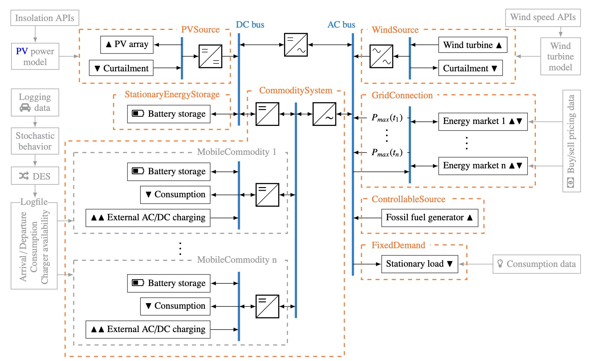

# REVOL-E-TION 

### Resilient Electric Vehicle Optimization model for Local Energy TransitION

REVOL-E-TION is an energy system model toolbox designed to optimize integration of electric vehicle fleets into 
local energy systems such as mini- and microgrids, company sites, apartment blocks or single homes and estimate
the resulting technoeconomic potentials in terms of costs and revenues within the energy (and optionally also the
mobility system). It is built as a wrapper on top of the [oemof](https://oemof.org) energy system model framework. 

#### Created by 
Philipp Rosner, M.Sc. and Brian Dietermann, M.Sc.  
Institute of Automotive Technology  
Department of Mobility Systems Engineering  
TUM School of Engineering and Design  
Technical University of Munich  
philipp.rosner@tum.de  
September 2nd, 2021

#### Contributors
Marcel Brödel, M.Sc. - Research Associate 01/2024-

David Eickholt, B.Sc. - Semester Thesis submitted 07/2021  
Marcel Brödel, B.Sc. - Semester Thesis submitted 05/2022  
Hannes Henglein, B.Sc. - Semester Thesis submitted 10/2022  
Marc Alsina Planelles, B.Sc. - Master's Thesis submitted 10/2022  
Juan Forero Yacaman - Bachelor's Thesis submitted 04/2023  
Elisabeth Spiegl - Bachelor's Thesis submitted 06/2023  
Alejandro Hernando Armengol, B.Sc. - Master's Thesis submitted 10/2023  
Hannes Henglein, B.Sc. - Master's Thesis submitted 01/2024  
Florian Melzig, B.Sc. - Master's Thesis submitted 10/2024  

## Licensing
REVOL-E-TION is licensed under the Apache 2.0 open source license.  
The full license text can be found in the LICENSE file in the root directory of the repository.

## Related publications
- P. Rosner and M. Lienkamp, "Unlocking the Joint Potential of Electric Mobility and Rural Electrification - A Concept for Improved Integration using Modular Batteries," 2022 IEEE PES/IAS PowerAfrica, Kigali, Rwanda, 2022, pp. 1-5, https://doi.org/10.1109/PowerAfrica53997.2022.9905305.
- P. Rosner, B. Dietermann, M. Brödel and M. Lienkamp, "REVOL-E-TION: A Flexible and Scalable Model to Optimally Integrate Bidirectional EV Fleets in Local Energy Systems", Poster, 2024 Vehicle2Grid Conference, Münster, Germany, 2024, https://doi.org/10.13140/RG.2.2.19632.16648
- P. Rosner, B. Dietermann (shared first authors), M. Brödel, A. Paper and M. Lienkamp, "REVOL-E-TION: A Flexible and Scalable Investment Optimization Toolbox for Local Energy Systems Incorporating Electric Vehicle Fleets", Under Review, Available at SSRN, https://dx.doi.org/10.2139/ssrn.5127283

## Description  
REVOL-E-TION is a scalable generator for (mixed integer) linear energy system models of local energy systems with or without electric vehicle fleets.
It can be used to optimize component sizes and/or dispatch behavior of the system to achieve least cost in the simulation timeframe.
Simulation results are later extrapolated and discounted to a project timeframe to estimate the technoeconomic potential of the system in the long run.
Please note that this split between simulation and extrapolation improves computational effort, but creates possibly unwanted incentives for the optimizer (e.g. preferring low initial cost but operationally expensive power sources), especially when sizing components.

REVOL-E-TION groups oemof components and buses into blocks representing real-world systems (e.g. a PV array) for easy application.
Electric vehicles (in fact any mobile storage devices) are modeled individually within a block called a CommoditySystem.
Their behavior (i.e. when they depart and arrive again, how much energy they use in between and whether they can be charged externally) is described in a so called log file.
Log files can be created using the integrated Discrete Event Simulation (DES), which is also capable of modeling range extension through a Battery CommoditySystem as well as multiple use cases in different time frames (e.g. summer/winter) for the commoditites.

The following system diagram shows the basic structure including one example of each block class (blocks are indicated by dashed lines):


## Installation
REVOL-E-TION is designed to run under Windows 10, Ubuntu 22.04 LTS and MacOS 15 Sequoia.
While portability is generally built in, other operating systems are untested.

#### Step 1: Getting the source code
REVOL-E-TION is available at the institute's [GitHub](https://github.com/TUMFTM/REVOL-E-TION) and can be cloned from there using 
```
git clone https://github.com/TUMFTM/REVOL-E-TION.git
```

#### Step 2: Create a clean virtual environment
It is recommended to create and activate a clean virtual environment for the installation of REVOL-E-TION.
This can be done using the following command:
```
python -m venv <path_to_virtual_environment>
source <path_to_virtual_environment>/bin/activate
```
or alternatively with conda:
```
conda create -n <name_of_virtual_environment> python=3.11
conda activate <name_of_virtual_environment>
```

#### Step 3: Install package and dependencies locally
Navigate to the root directory of the cloned repository and install the package and its dependencies using pip:
```
pip install -e .
```
This will install the ```revoletion``` package in editable mode, meaning that changes to the source code will be reflected in the installed package without reinstalling it.

#### Step 4: MILP Solver
REVOL-E-TION requires a [pyomo compatible](https://pyomo.readthedocs.io/en/stable/solving_pyomo_models.html#supported-solvers) Mixed Integer Linear Programming (MILP) solver (as does oemof).
The open-source [cbc](https://github.com/coin-or/Cbc/releases/latest) solver works well.
The proprietary [Gurobi](https://www.gurobi.com/downloads/) solver is recommended however, as it is faster in execution, especially for large problems and offers a free academic license.
If [Gurobi](https://www.gurobi.com/downloads/) is used, the version of Gurobi, gurobipy and the license file have to match.
To ensure this get the version of both your gurobi license/installation (```grbgetkey --version```) and the installed gurobipy package (```pip show gurobipy```).
If their major version numbers do not match, install the correct version of gurobipy using pip:
```
pip install gurobipy==<your_gurobi_version>
```

#### Step 5: Basic Usage
REVOL-E-TION can be run using one of two terminal commands, given the correct virtual environment is activated:
1. Call to the main module: ```python -m revoletion.main <arguments>``` (best for local execution on host machine, e.g. through a run configuration in PyCharm)
2. Call to the entry point: ```revoletion <arguments>``` (best for remote execution on a server as it works irrespective of the current working directory as long as the correct environment is active)

The possible arguments are:

| Argument                          | Short form | Long form          | Default value | Description                                                                                                                                                                          | Valid input                                                                                                                                                  |
|-----------------------------------|------------|--------------------|---------------|--------------------------------------------------------------------------------------------------------------------------------------------------------------------------------------|--------------------------------------------------------------------------------------------------------------------------------------------------------------|
| Scenario file path (mandatory)    | -scn       | --scenario         | -             | File path to scenario file                                                                                                                                                           | string with path or filename of scenario file (options specified below) OR 'example'                                                                         |
| Input directory path (mandatory)  | -in        | --inputdir         | -             | Directory path to input data files                                                                                                                                                   | string with path or filename of input directory (options specified below)                                                                                    |
| Output directory path (mandatory) | -out       | --outputdir        | -             | Directory path to save output data                                                                                                                                                   | string with path or filename of output directory (options specified below)                                                                                   |
| Solver                            | -slv       | --solver           | 'gurobi'      | Solver to be used for optimization                                                                                                                                                   | string containing lowercase name of pyomo compatible solver to be used                                                                                       |
| Number of Processes               | -np        | --n_processes      | 1             | Number of processes (i.e. cores) to be used for parallelization                                                                                                                      | integer, is limited to maximum thread count of CPU automatically                                                                                             |
| Large scale execution mode        | -ls        | --largescalemode   | False         | Boolean controlling output saving and display detail. Timeseries parameters are omitted in large scale mode.                                                                         | True, False                                                                                                                                                  |
| Debugmode                         | -db        | --debugmode        | False         | Boolean controlling whether to print solver progress information during the solving process. This is resource intensive and should therefore be avoided unless explicitly necessary. | True, False                                                                                                                                                  |
| Rerun previous run                | -rer       | --rerun            | False         | Rerun scenarios of a previous run which were not completed successfully (due to unexpected termination of SimulationRun or non-deterministic infeasibilities)                        | False or string with (a) directory name within output directory from settings file containing results of previous run or (b) absolute path to that directory |
| Rerun only infeasible scenarios   | -rin       | --rerun_infeasible | True          | Rerun infeasible scenarios, for which the solver did not find an optimal solution (may lead to the same result again) Neglected for ```--rerun False```                              | True, False                                                                                                                                                  |
| Solcast API key                   | -ksc       | --key_solcast_api  | None          | API key to use for the proprietary Solcast PV/Wind data API                                                                                                                          | string                                                                                                                                                       |

For the scenario, input and output path arguments, four options are available:

1. 'example' as the scenario file path. This option ignores the input and output directory arguments and executes the REVOL-E-TION example scenarios.
2. No argument is passed: graphical selection dialogs open automatically to select file.
3. Valid relative or absolute path passed: file is searched in the specified path (best for remote execution on a server)
4. Only filename passed: file is searched in the current working directory.

The scenario file is a CSV table.
Its exact API is described in the section "Scenario Input Parameters".
A runnable example scenario file is provided in the example directory. 
Some parameters in the scenario file reference to other files specified by file name, mostly for timeseries data.
These are searched within the input directory specified.

Furthermore, to describe the mapping of different timeframes defining behavior of CommoditySystems (see below), modification of the ```mapper_timeframe_example.py``` code file might be necessary to fit the scenario as this is not simply and flexibly done in parameter files.
The filename of the modified file has to be given in the scenario file under the key ```filename_mapper``` and the file has to be placed in the input directory specified in the settings file.

Concerning computational effort, REVOL-E-TION relies heavily on single core computing power for each scenario and uses significant memory, especially in the 'go' strategy.
To avoid memory limitations, it is advised to limit the number of parallel scenarios to be executed in the settings file depending on the hardware used.

#### Common Problems & Troubleshooting
| Error message                                                                                                                    | Cause                                                                                                             | Solution                                                                                                                                                                                                                                                                                                                                                                                                                                                  |
|----------------------------------------------------------------------------------------------------------------------------------|-------------------------------------------------------------------------------------------------------------------|-----------------------------------------------------------------------------------------------------------------------------------------------------------------------------------------------------------------------------------------------------------------------------------------------------------------------------------------------------------------------------------------------------------------------------------------------------------|
| Errors while installing the required Python packages                                                                             | various                                                                                                           | Make sure to start with a clean Python environment using Python >=3.11. We recommend conda for dependency resolution.                                                                                                                                                                                                                                                                                                                                     |
| Gurobi related installation & execution errors                                                                                   | Faulty Gurobi installation, missing Gurobi license, or faulty Gurobipy version                                    | Check your Gurobi installation by executing ```gurobi-cl``` in a shell. If the command itself fails, Gurobi itself is not installed properly. In this case, follow the [Gurobi Install and Troubleshooting Guide](https://support.gurobi.com/hc/en-us/articles/14799677517585-Getting-Started-with-Gurobi-Optimizer). If the command prints your Gurobi version and license information, make sure Gurobipy has the same version number as Gurobi itself. |                                                                                                                                                                                                                                                                                                                                                
| ```IndexError: Block "X": Input timeseries data does not cover simulation timeframe```                                           | A timeseries data file provided does not cover the complete simulation period or resampling it has failed         | Specify a different simulation period or select a different timeseries input file. Make sure the entire simulation timeframe (possibly including overhanging data for the last prediction horizons)                                                                                                                                                                                                                                                       |
| ```Class "X" not found in blocks.py file```                                                                                      | The class name specified in the blocks dictionary in the scenario file is not specified in REVOL-E-TION           | Check the blocks dictionary string in the scenario csv file for typos.                                                                                                                                                                                                                                                                                                                                                                                    |
| ```Scenario failed: Infeasible or Unbounded (To solve this error try to set investment limits for blocks or for the scenario)``` | Depending on the costs specified the optimization problem might be unbounded as infinite investment is beneficial | Redefine the provided cost structure (i.e. reduce prices for energy feed-in or increase CAPEX or OPEX for energy generation)                                                                                                                                                                                                                                                                                                                              |
| Any other error messages or errors                                                                                               | various                                                                                                           | REVOL-E-TION prints specific error messages in most cases which help you to understand the cause of the error. Nevertheless, REVOL-E-TION is still in development and therefore might contain bugs and errors that are not covered yet. If you encounter a bug or an error message that you do not understand, please feel free to open an issue on GitHub or contact the developers.                                                                     |


## General Terms & Definitions
The following table details common terms occuring in further descriptions and the code:

| Term      | Description                                                                                                                                                                                                                                                                                                                                                                                                                                                                                                                                                                                                                                                                                                                                                                                                                                                                      |
|-----------|----------------------------------------------------------------------------------------------------------------------------------------------------------------------------------------------------------------------------------------------------------------------------------------------------------------------------------------------------------------------------------------------------------------------------------------------------------------------------------------------------------------------------------------------------------------------------------------------------------------------------------------------------------------------------------------------------------------------------------------------------------------------------------------------------------------------------------------------------------------------------------|
| Project   | An application of REVOL-E-TION in a specific setting. All files (scenarios file, input data files, etc.) should be contained in a single directory. ```./example``` is an example project.                                                                                                                                                                                                                                                                                                                                                                                                                                                                                                                                                                                                                                                                                       |
| Run       | A single execution of REVOL-E-TION defined by a single scenario file (possibly containing multiple scenario definitions as columns) and settings file each. Common information and methods valid for all scenarios are defined in a SimulationRun object.                                                                                                                                                                                                                                                                                                                                                                                                                                                                                                                                                                                                                        |
| Scenario  | A set of parameters (i.e. an energy system) to be simulated and/or optimized. It is defined by a column in the scenario file and some timeseries inputs.                                                                                                                                                                                                                                                                                                                                                                                                                                                                                                                                                                                                                                                                                                                         |
| Strategy  | The (energy management) strategy to dispatch the energy system's blocks generally (see CommoditySystem capability levels later on for differences). REVOL-E-TION supports two strategies: "go" for single shot global optimization and "rh" for rolling horizon (i.e. time slotted myopic) optimization similar to Model Predictive Control (MPC). The former is a special case of the latter with just a single horizon. Component size optimization is only applicable in "go".                                                                                                                                                                                                                                                                                                                                                                                                |
| Horizon   | A single optimization process by the solver, whether as the only one of the scenario ("go" strategy) or as a slice of the simulation timeframe ("rh" strategy). In the latter case, the total simulation time is split up into prediction horizons (each of which is represented in the code by a PredictionHorizon object) that are simulated consecutively. However, overlap between the horizons is necessary to ensure feasibilty of dispatch. Therefore, only the first part of the prediction horizon (called control horizon) is actually used for overall result calculation, while the rest is discarded. The simulation timeframe is automatically split up into horizons as per the defined length of prediction and control horizons from the scenario file. See the following diagram for clarification:  |
| Block     | A set of oemof components representing a real-world system including necessary converters and buses. Each is represented by an instance of the Block parent class with further child classes. The blocks present in the energy system are defined in the scenario file as a dictionary, except for the core block (of class SystemCore) containing the AC and DC buses as well as the converter(s) inbetween them. Multiple instances of one block can coexist in a model. The possible types (i.e. Classes) are laid out in the following chapter.                                                                                                                                                                                                                                                                                                                              |
| Component | A component is an oemof element that is either a source, a sink, a bus, a converter or a storage.                                                                                                                                                                                                                                                                                                                                                                                                                                                                                                                                                                                                                                                                                                                                                                                |

## Classes of Blocks
The following table details the classes of blocks that can be specified in the "blocks" parameter of the scenario in the scenario file with respective names for the instances. Block instances cannot be named "scenario". Each instance requires a certain set of parameters dependent on its class. These are specified in the following chapter.

| Class Name             | Description                                                                                                                                                                                                                                                                                                                                                                                                                                                                                                                                                                                                                                                    |
|------------------------|----------------------------------------------------------------------------------------------------------------------------------------------------------------------------------------------------------------------------------------------------------------------------------------------------------------------------------------------------------------------------------------------------------------------------------------------------------------------------------------------------------------------------------------------------------------------------------------------------------------------------------------------------------------|
| InvestBlock            | Parent class for all blocks that are possibly being sized in optimization (i.e. where an investment decision has to be taken) and for which entering ```'opt'``` as the size in the scenario file will trigger that size optimization. However, this option is only compatible with the "go" strategy. Class contains mostly methods for result evaluation.                                                                                                                                                                                                                                                                                                    |
| RenewableInvestBlock   | Parent class for all InvestBlocks representing a renewable source with a curtailment sink component and variable potential power (defined as a fraction of nominal power to enable sizing) over time. Child of class InvestBlock.                                                                                                                                                                                                                                                                                                                                                                                                                              |
| SystemCore             | Class for collection of central energy system components (AC and DC buses and the two unidirectional transformers between them). Child of class Block. This is present once and only once in every energy system defined in REVOL-E-TION under the name "core". For pure AC or DC systems, the respective core cost and size parameters can be set to zero to have no effect on the result.                                                                                                                                                                                                                                                                    |
| FixedDemand            | Class for undeferrable (i.e. inflexible) power demand such as households. Child of class Block. Power timeseries is defined in a csv file.                                                                                                                                                                                                                                                                                                                                                                                                                                                                                                                     |
| PVSource               | Class for photovoltaic array. Child of class RenewableInvestBlock. Power potential is defined either in a [Solcast](https://solcast.com/) or [PVGIS](https://re.jrc.ec.europa.eu/pvg_tools/en/) formatted csv file (both pre-downloaded) or retrieved from either the [Solcast](https://docs.solcast.com.au/#intro) or [PVGIS](https://joint-research-centre.ec.europa.eu/photovoltaic-geographical-information-system-pvgis/getting-started-pvgis/api-non-interactive-service_en) API (selection of API requires active internet connection. In addition the Solcast API requires an active subscription plan. There is a limited free plan for researchers). | 
| WindSource             | Class for wind turbine. Child of class RenewableInvestBlock. Power potential is defined either in a csv timeseries file or from PVSource data containing wind speed, which is then converted to power for a specific turbine height. For the latter option, a PVSource block must exist.                                                                                                                                                                                                                                                                                                                                                                       |
| ControllableSource     | Class for independently controllable power sources (e.g. fossil generator, hydro power plant) that is unlimited in energy. Child of class InvestBlock.                                                                                                                                                                                                                                                                                                                                                                                                                                                                                                         |
| GridConnection         | Class for utility grid and/or energy market connection. Child of class InvestBlock. A GridConnection instance can contain multiple GridMarkets. Definition of GridMarket instances happens in a separate csv file.                                                                                                                                                                                                                                                                                                                                                                                                                                             |
| StationaryBattery      | Class for stationary battery energy storage systems. Child of class InvestBlock. A posteriori aging (i.e. capacity reduction) estimation is possible and will be taken into the next horizon as a reduced available SOC range. Storage modelling is done linearly without SOC or temperature based limits of charge or discharge power.                                                                                                                                                                                                                                                                                                                        |
| CommoditySystem        | Parent class for fleets of mobile battery based devices (e.g. electric vehicles or battery rental). Child of class InvestBlock. Behavior is defined in a csv file (the log) that can either be given or generated within the integrated Discrete Event Simulation from stochastic behavioral parameters to be given in a usecase definition csv file for different timeframes defined in ```mapper_timeframe.py``` in code. Each CommoditySystem consists of at least one MobileCommodity representing one vehicle or battery.                                                                                                                                 |
| VehicleCommoditySystem | Class for fleet of electric vehicles, possibly with range extension using a BatteryCommoditySystem (see [publication](https://ieeexplore.ieee.org/document/9905305)). Child of class CommoditySystem.                                                                                                                                                                                                                                                                                                                                                                                                                                                          |
| BatteryCommoditySystem | Class for fleet of mobile batteries. Child of class CommoditySystem.                                                                                                                                                                                                                                                                                                                                                                                                                                                                                                                                                                                           |
| ICEVSystem             | Class for comparative calculation of ICEV fleet cost.                                                                                                                                                                                                                                                                                                                                                                                                                                                                                                                                                                                                          |

## Scenario Input Parameters
The scenario file defines all noncomplex (i.e. integer, float, string, boolean) parameters of the scenarios.
Complex (multidimensional) parameters are mostly defined through links to other files (by filename) in the scenario file.
The following table specifies each parameter for each possible block class in the scenario file.
If and only if a block of a certain class exists within the scenario are these parameters required and read in. 
Therefore not every scenario file contains all possible parameters.
Multiple scenarios can be defined as multiple columns.
The first row (header) of each scenario column defines the scenarios name.
By adding a '#' to the start of the name of a scenario column, the scenario is ignored during the simulation process.
The first column of the scenario file defines the name of the block the parameter in the second column applies to.
An example scenario file is provided in the ```./example``` directory.
As all string values specified in the scenario definition file are converted to lower case, all files have to be named in lower case to be read in properly. 

<!ENTRY_POINT_SCENARIOS_TABLE>

| Block                  | Key                            | Name                                                            | Type         | Required                                            | Description                                                                                                                                                                                                                                                                                                                                                                                                | Valid values or format                                                                            |
|------------------------|--------------------------------|-----------------------------------------------------------------|--------------|-----------------------------------------------------|------------------------------------------------------------------------------------------------------------------------------------------------------------------------------------------------------------------------------------------------------------------------------------------------------------------------------------------------------------------------------------------------------------|---------------------------------------------------------------------------------------------------|
| **Scenario**           | ```starttime```                | Start time                                                      | str          | yes                                                 | Start time of the project and the simulation in local time. If no time is given in addition to the date the project starts at 00:00 local time.                                                                                                                                                                                                                                                            | 'dd.mm.YYYY' or 'dd.mm.YYYY HH:MM'                                                                |
|                        | ```timestep```                 | Time step                                                       | str          | yes                                                 | Time step used for the simulation.                                                                                                                                                                                                                                                                                                                                                                         | formats compatible with pd.to_timedelta() such as '15min' or '1H'                                 |
|                        | ```sim_duration```             | Simulation duration                                             | int or str   | yes                                                 | Simulation duration. If given as integer the number is interpreted as number of days. Specifying a pandas.Timedelta() compliant string is also supported. The duration is rounded down to the specified timestep.                                                                                                                                                                                          | [1, inf[ or str such as '1 day 12 hours 14 minutes'                                               |
|                        | ```prj_duration```             | Project duration                                                | int          | yes                                                 | Project duration in years to which the economic results of the simulation duration are extrapolated.                                                                                                                                                                                                                                                                                                       | [1, inf[                                                                                          |
|                        | ```compensate_sim_prj```       | Specific Capex/Opex compensation trigger                        | bool         | yes                                                 | Trigger whether to optimize for sim duration (False) or project duration (True).                                                                                                                                                                                                                                                                                                                           | True, False                                                                                       |
|                        | ```strategy```                 | Strategy                                                        | str          | yes                                                 | Optimization strategy.                                                                                                                                                                                                                                                                                                                                                                                     | 'go' or 'rh' (global optimum, rolling horizon)                                                    |
|                        | ```len_ph```                   | Prediction horizon length                                       | float        | yes                                                 | Length of the prediction horizon in hours rounded down to specified timestep of simulation. Neglected for every optimization strategy other than 'rh'.                                                                                                                                                                                                                                                     | ]0, inf[                                                                                          |
|                        | ```len_ch```                   | Control horizon length                                          | int          | yes                                                 | Length of the control horizon in hours rounded down to specified timestep of simulation. Neglected for every optimization strategy other than 'rh'.                                                                                                                                                                                                                                                        | ]0, inf[                                                                                          |
|                        | ```truncate_ph```              | Truncate Prediction Horizon                                     | bool         | yes                                                 | Toggles whether to truncate predictions horizons to simulation end time when using 'rh' optimization strategy. If activated all horizons are truncated to the simulation end time. Deactivation requires additional input data for all Prediction Horizons even beyond the end of the simulation specified by ```starttime``` and ```sim_duration```.                                                      | True, False                                                                                       |
|                        | ```invest_max```               | Maximum initial investment costs                                | float        | yes                                                 | Limit the initial investment costs to a specific amount. If no limit should be considered set this parameter to None.                                                                                                                                                                                                                                                                                      | [0, inf[ or None                                                                                  |
|                        | ```wacc```                     | Weighted average cost of capital                                | float        | yes                                                 | Weighted average cost of capital: discount rate for future expenses/revenues and energies per year.                                                                                                                                                                                                                                                                                                        | [0, 1]                                                                                            |
|                        | ```currency```                 | Currency                                                        | str          | yes                                                 | Currency used to display results of economic calculations. No influence of calculation itself, only used for displaying.                                                                                                                                                                                                                                                                                   | 'str', e.g. 'EUR', 'USD'                                                                          |
|                        | ```latitude```                 | Latitude                                                        | float        | yes                                                 | Latitude of the location of the local energy system in WGS84. Used to determine timezone, pv and wind data.                                                                                                                                                                                                                                                                                                | [-90, 90]                                                                                         |
|                        | ```longitude```                | Longitude                                                       | float        | yes                                                 | Longitude of the location of the local energy system in WGS84. Used to determine timezone, pv and wind data.                                                                                                                                                                                                                                                                                               | [-90, 90]                                                                                         |
|                        | ```temp_air```                 | Air temperature                                                 | float or str | yes                                                 | Air temperature. Can be given as string wih filename to csv file containing the columns 'time' (timezone aware timestamps) and 'temp_air' (temperature in °C), a float or int specifying a constant temperature in °C or the name of a PVSource.                                                                                                                                                           | string with filename or name of PVSource instance or ]-inf, inf[                                  |
|                        | ```cost_eps```                 | Epsilon costs                                                   | float        | yes                                                 | Cost added to some flows in order to disincentivice circular flows.                                                                                                                                                                                                                                                                                                                                        | [0, inf[                                                                                          |
|                        | ```blocks```                   | Blocks                                                          | dict         | yes                                                 | All blocks present in the scenario except for the SystemCore, which is added automatically, in the format {block_name: class_name}. Non valid names are 'run', 'scenario' and 'core' (default name for block of class SystemCore). Multiple blocks of the same class can be specified by assigning different custom block names.                                                                           | "{'custom block name': 'class name of block'}"                                                    |
| **SystemCore**         | ```size_preexisting_acdc```    | Preexisting AC/DC size                                          | float or str | yes                                                 | Installed power of the AC/DC converter in the SystemCore in W. Set either ```size_preexisting_acdc``` or ```size_preexisting_dcac``` to 'equal' to set both preexisting converter sizes to the same value.                                                                                                                                                                                                 | [0, inf[ or 'equal'                                                                               |
|                        | ```capex_preexisting_acdc```   | Consideration of preexisting AC/DC size in capex                | bool         | yes                                                 | Trigger whether to consider preexisting component size specified in ```size_preexisting_acdc``` in initial capex calculation. Replacement capex are unaffected.                                                                                                                                                                                                                                            | True, False                                                                                       |
|                        | ```size_max_acdc```            | Maximum size of AC/DC converter                                 | float        | yes                                                 | Maximum size of the AC/DC converter of the SystemCore including preexisting size specified in ```size_preexisting_acdc```. To enable unlimited investment set this parameter to None. Set either ```size_max_acdc``` or ```size_max_dcac``` to 'equal' to set both converters' maximum investments to the same value.                                                                                      | [0, inf[ or None                                                                                  |
|                        | ```invest_acdc```              | Investment into AC/DC converter                                 | bool or str  | yes                                                 | Enable additional investment into the AC/DC converter of the SystemCore. Set either ```invest_acdc``` or ```invest_dcac``` to 'equal' to force the same expansion for both converters.                                                                                                                                                                                                                     | True, False, 'equal'                                                                              |
|                        | ```size_preexisting_dcac```    | Preexisting DC/AC size                                          | float or str | yes                                                 | Installed power of the DC/AC converter in the SystemCore in W. Set either ```size_preexisting_acdc``` or ```size_preexisting_dcac``` to 'equal' to set both preexisting converter sizes to the same value.                                                                                                                                                                                                 | [0, inf[ or 'equal'                                                                               |
|                        | ```capex_preexisting_dcac```   | Consideration of preexisting DC/AC size in capex                | bool         | yes                                                 | Trigger whether to consider preexisting component size specified in ```size_preexisting_dcac``` in initial capex calculation. Replacement capex are unaffected.                                                                                                                                                                                                                                            | True, False                                                                                       |
|                        | ```size_max_dcac```            | Maximum size of DC/AC converter                                 | float        | yes                                                 | Maximum size of the DC/AC converter of the SystemCore including preexisting size specified in ```size_preexisting_dcac```. To enable unlimited investment set this parameter to None. Set either ```size_max_acdc``` or ```size_max_dcac``` to 'equal' to set both converters' maximum investments to the same value.                                                                                      | [0, inf[ or None                                                                                  |
|                        | ```invest_dcac```              | Investment into DC/AC converter                                 | bool or str  | yes                                                 | Enable additional investment into the DC/AC converter of the SystemCore. Set either ```invest_acdc``` or ```invest_dcac``` to 'equal' to force the same expansion for both converters.                                                                                                                                                                                                                     | True, False, 'equal'                                                                              |
|                        | ```capex_spec```               | Specific capital expenditures                                   | float        | yes                                                 | Specific capital expenditures for each of the converters in the SystemCore: cost in currency per installed power (cumulative size of both converters) in W.                                                                                                                                                                                                                                                | [0, inf[                                                                                          |
|                        | ```mntex_spec```               | Specific maintenance expenditures                               | float        | yes                                                 | Specific maintenance expenditures for each of the converters in the SystemCore: cost in currency per year per installed power (cumulative size of both converters) in W.                                                                                                                                                                                                                                   | [0, inf[                                                                                          |
|                        | ```opex_spec```                | Specific operational expenditures                               | float or str | yes                                                 | Specific operational expenditures for each of the converters in the SystemCore cost in currency per converted energy in Wh. Energy is measured at each converter's inflow.Can be given as float or filename of a csv file containing a timeseries.                                                                                                                                                         | string with filename or [0, inf[                                                                  |
|                        | ```ls```                       | Lifespan                                                        | float        | yes                                                 | Lifespan of the block in years after which it will be replaced.                                                                                                                                                                                                                                                                                                                                            | [1, inf[                                                                                          |
|                        | ```ccr```                      | Cost change ratio                                               | float        | yes                                                 | Cost change ratio of the block's nominal price per year to be considered for replacement after its lifespan.                                                                                                                                                                                                                                                                                               | [0, inf[                                                                                          |
|                        | ```eff_dcac```                 | DC/AC efficiency                                                | float        | yes                                                 | Efficiency of the DC/AC converter in the SystemCore.                                                                                                                                                                                                                                                                                                                                                       | [0, 1]                                                                                            |
|                        | ```eff_acdc```                 | AC/DC efficiency                                                | float        | yes                                                 | Efficiency of the AC/DC converter in the SystemCore.                                                                                                                                                                                                                                                                                                                                                       | [0, 1]                                                                                            |
| **FixedDemand**        | ```load_profile```             | Load Profile                                                    | str          | yes                                                 | Load profile for the fixed demand. Can either be set to the filename of a timeseries csv file including the two columns 'time' (timezone aware timestamps) and 'power' (in W), or to a string specifying a constant load profile or one of the standard load profiles by BDEW.                                                                                                                             | string with filename, {'const', 'H0', 'G0', 'G1', 'G2', 'G3', 'G4', 'G5', 'G6', 'L0', 'L1', 'L2'} |
|                        | ```consumption_yrl```          | Yearly consumption                                              | float        | yes                                                 | Yearly consumption in Wh. Neglected if a filename is provided in ```load_profile```.                                                                                                                                                                                                                                                                                                                       | [0, inf[                                                                                          |
|                        | ```system```                   | System                                                          | str          | yes                                                 | The bus (AC or DC) the block is connected to.                                                                                                                                                                                                                                                                                                                                                              | 'AC', 'DC'                                                                                        |
|                        | ```crev_spec```                | Specific customer revenue                                       | float or str | yes                                                 | Specific customer revenue for consumed energy in currency per Wh. Can be given as float or filename of a csv file containing a timeseries.                                                                                                                                                                                                                                                                 | string with filename or [0, inf[                                                                  |
| **WindSource**         | ```size_preexisting_block```   | Preexisting size                                                | float        | yes                                                 | Installed rated power of wind turbine in W.                                                                                                                                                                                                                                                                                                                                                                | [0, inf[                                                                                          |
|                        | ```capex_preexisting```        | Consideration of preexisting block size in capex                | bool         | yes                                                 | Trigger whether to consider preexisting component size specified in ```size_preexisting_block``` in initial capex calculation. Replacement capex are unaffected.                                                                                                                                                                                                                                           | True, False                                                                                       |
|                        | ```size_max_block```           | Maximum size                                                    | float        | yes                                                 | Maximum size of WindSource including preexisting size specified in ```size_preexisting_block```. To enable unlimited investment set this parameter to None.                                                                                                                                                                                                                                                | [0, inf[ or None                                                                                  |
|                        | ```invest_block```             | Investment                                                      | bool         | yes                                                 | Enable additional investment into the wind turbine.                                                                                                                                                                                                                                                                                                                                                        | True, False                                                                                       |
|                        | ```system```                   | System                                                          | str          | yes                                                 | The bus (AC or DC) the block is connected to.                                                                                                                                                                                                                                                                                                                                                              | 'AC', 'DC'                                                                                        |
|                        | ```data_source```              | Data source                                                     | str          | yes                                                 | Data source for wind power. Wind power can either be given as a separate csv file or calculated from a ```PVSource``` block's data.                                                                                                                                                                                                                                                                        | 'file' or a string with the name of a block of class ```PVSource```                               |
|                        | ```height```                   | Height                                                          | float        | yes                                                 | Hub height of the wind turbine in meters.                                                                                                                                                                                                                                                                                                                                                                  | [0, inf[                                                                                          |
|                        | ```filename```                 | Filename                                                        | str          | yes                                                 | Filename of csv file containing wind power data inculding the columns 'time' (timezone aware timestamps) and 'power_spec' (specific power in W per rated power in W). Only considered if 'file' is given in ```data_source```.                                                                                                                                                                             | string with filename                                                                              |
|                        | ```capex_spec```               | Specific capital expenditures                                   | float        | yes                                                 | Specific capital expenditures: cost in currency per installed rated power in W.                                                                                                                                                                                                                                                                                                                            | [0, inf[                                                                                          |
|                        | ```mntex_spec```               | Specific maintenance expenditures                               | float        | yes                                                 | Specific maintenance expenditures: cost in currency per year per installed rated power in W.                                                                                                                                                                                                                                                                                                               | [0, inf[                                                                                          |
|                        | ```opex_spec```                | Specific operational expenditures                               | float or str | yes                                                 | Specific operational expenditures: cost in currency per generated energy in Wh. Can be given as float or filename of a csv file containing a timeseries.                                                                                                                                                                                                                                                   | string with filename or [0, inf[                                                                  |
|                        | ```ls```                       | Lifespan                                                        | float        | yes                                                 | Lifespan of the block in years after which it will be replaced.                                                                                                                                                                                                                                                                                                                                            | [1, inf[                                                                                          |
|                        | ```ccr```                      | Cost change ratio                                               | float        | yes                                                 | Cost change ratio of the block's nominal price per year to be considered for replacement after its lifespan.                                                                                                                                                                                                                                                                                               | [0, inf[                                                                                          |
|                        | ```eff_block```                | Efficiency                                                      | float        | yes                                                 | Efficiency of the wind turbine.                                                                                                                                                                                                                                                                                                                                                                            | [0, 1]                                                                                            |
| **PVSource**           | ```size_preexisting_block```   | Preexisting size                                                | float        | yes                                                 | Installed peak power of the pv array in in W<sub>p</sub>.                                                                                                                                                                                                                                                                                                                                                  | [0, inf[                                                                                          |
|                        | ```capex_preexisting```        | Consideration of preexisting block size in capex                | bool         | yes                                                 | Trigger whether to consider preexisting component size specified in ```size_preexisting_block``` in initial capex calculation. Replacement capex are unaffected.                                                                                                                                                                                                                                           | True, False                                                                                       |
|                        | ```size_max_block```           | Maximum size                                                    | float        | yes                                                 | Maximum size of PVSource including preexisting size specified in ```size_preexisting_block```. To enable unlimited investment set this parameter to None.                                                                                                                                                                                                                                                  | [0, inf[ or None                                                                                  |
|                        | ```invest_block```             | Investment                                                      | bool         | yes                                                 | Enable additional investment into the PV system.                                                                                                                                                                                                                                                                                                                                                           | True, False                                                                                       |
|                        | ```data_source```              | Data source                                                     | str          | yes                                                 | Data source for pv power. This can be an API (PVGIS or Solcast) or a file containing data (PVGIS, Solcast or custom file). If Solcast API is chosen a valid API key has to specified in the run's arguments. A custom file has to include the columns 'time' (timezone aware timestamps), 'power_spec' (specific power in W per W<sub>p</sub>), 'wind_speed' (in m/s), 'temp_air' (air temperature in °C). | 'pvgis api', 'solcast api', pvgis file', 'solcast file', 'file'                                   |
|                        | ```filename```                 | Filename                                                        | str          | yes                                                 | Name of a PVGIS, Solcast, or custom csv file if ```data_source``` is set to 'pvgis file', 'solcast file', or 'file', respectively. Name of a parameter file or None to use the default values if 'pvgis api' or 'solcast api' is chosen.                                                                                                                                                                   | string with filename or None                                                                      |
|                        | ```system```                   | System                                                          | str          | yes                                                 | The bus (AC or DC) the block is connected to.                                                                                                                                                                                                                                                                                                                                                              | 'AC', 'DC'                                                                                        |
|                        | ```capex_spec```               | Specific capital expenditures                                   | float        | yes                                                 | Specific capital expenditures: cost in currency per installed peak power in W.                                                                                                                                                                                                                                                                                                                             | [0, inf[                                                                                          |
|                        | ```mntex_spec```               | Specific maintenance expenditures                               | float        | yes                                                 | Specific maintenance expenditures: cost in currency per year per installed peak power in W.                                                                                                                                                                                                                                                                                                                | [0, inf[                                                                                          |
|                        | ```opex_spec```                | Specific operational expenditures                               | float or str | yes                                                 | Specific operational expenditures: cost in currency per generated energy in Wh. Can be given as float or filename of a csv file containing a timeseries.                                                                                                                                                                                                                                                   | string with filename or [0, inf[                                                                  |
|                        | ```ls```                       | Lifespan                                                        | float        | yes                                                 | Lifespan of the block in years after which it will be replaced.                                                                                                                                                                                                                                                                                                                                            | [1, inf[                                                                                          |
|                        | ```ccr```                      | Cost change ratio                                               | float        | yes                                                 | Cost change ratio of the block's nominal price per year to be considered for replacement after its lifespan.                                                                                                                                                                                                                                                                                               | [0, inf[                                                                                          |
|                        | ```eff_block```                | Efficiency                                                      | float        | yes                                                 | Efficiency of the PV array, taking into account all losses occurring from insulation up to the point of feeding power into the bus to which the block is connected.                                                                                                                                                                                                                                        | [0, 1]                                                                                            |
|                        | ```raddatabase```              | Radiation database                                              | str          | no; only valid, if ```data_source``` == 'PVGIS API' | Name of the radiation database. Dependent on location and chosen simulation timeframe. 'PVGIS-SARAH' for Europe, Africa and Asia or 'PVGIS-NSRDB' for the Americas between 60°N and 20°S, 'PVGIS-ERA5' and 'PVGIS-COSMO' for Europe (including high-latitudes), and 'PVGIS-CMSAF' for Europe and Africa (will be deprecated). Default value, if not specified: 'PVGIS-SARAH3'.                             | 'PVGIS-SARAH2', 'PVGIS-SARAH3', 'PVGIS-NSRDB', 'PVGIS-ERA5', 'PVGIS-COSMO', 'PVGIS-CMSAF'         |
|                        | ```pvtechchoice```             | PV technology                                                   | str          | no; only valid, if ```data_source``` == 'PVGIS API' | PV technology. Default value, if not specified: 'crystSi'.                                                                                                                                                                                                                                                                                                                                                 | 'crystSi', 'CIS', 'CdTe', 'Unknown'                                                               |
|                        | ```mountingplace```            | Mounting place                                                  | str          | no; only valid, if ```data_source``` == 'PVGIS API' | Type of mounting for PV system. Options of 'free' for free-standing and 'building' for building-integrated. Default value, if not specified: 'free'.                                                                                                                                                                                                                                                       | 'free', 'building'                                                                                |
|                        | ```optimalangles```            | Optimal angles                                                  | bool         | no; only valid, if ```data_source``` == 'PVGIS API' | Calculate the optimum tilt and azimuth angles. Ignored for two-axis tracking. Not possible in combination with specified user horizon. Default value, if not specified: True.                                                                                                                                                                                                                              | 'True', 'False'                                                                                   |
|                        | ```optimal_surface_tilt```     | Optimal surface tilt                                            | bool         | no; only valid, if ```data_source``` == 'PVGIS API' | Calculate the optimum tilt angle. Ignored for two-axis tracking. Default value, if not specified: True.                                                                                                                                                                                                                                                                                                    | 'True', 'False'                                                                                   |
|                        | ```surface_azimuth```          | Surface azimuth                                                 | float        | no; only valid, if ```data_source``` == 'PVGIS API' | Orientation (azimuth angle) of the (fixed) plane. Clockwise from north (north=0, east=90, south=180, west=270). This is offset 180 degrees from the convention used by PVGIS. Ignored for tracking systems. Default value, if not specified: 0.                                                                                                                                                            | [0, 360[                                                                                          |
|                        | ```surface_tilt```             | Surface tilt angle                                              | float        | no; only valid, if ```data_source``` == 'PVGIS API' | Tilt angle from horizontal plane. Ignored for two-axis tracking. Default value, if not specified: 0.                                                                                                                                                                                                                                                                                                       | [0, 90]                                                                                           |
|                        | ```trackingtype```             | Tracking type                                                   | int          | no; only valid, if ```data_source``` == 'PVGIS API' | Type of suntracking. 0=fixed, 1=single horizontal axis aligned north-south, 2=two-axis tracking, 3=vertical axis tracking, 4=single horizontal axis aligned east-west, 5=single inclined axis aligned north-south. Default value, if not specified: 0.                                                                                                                                                     | 0, 1, 2, 3, 4, 5                                                                                  |
|                        | ```usehorizon```               | Use horizon                                                     | bool         | no; only valid, if ```data_source``` == 'PVGIS API' | Include effects of horizon. Default value, if not specified: False.                                                                                                                                                                                                                                                                                                                                        | True, False                                                                                       |
|                        | ```userhorizon```              | User horizon                                                    | list         | no; only valid, if ```data_source``` == 'PVGIS API' | Optional user specified elevation of horizon in degrees, at equally spaced azimuth clockwise from north, only valid if ```usehorizon``` is True, if ```usehorizon``` is True but ```userhorizon``` is set to None PVGIS will calculate the horizon. Not possible in combination with activated ```optimalangles```. Default value, if not specified: None.                                                 | list of floats (has to be specified surrounded by " ") e.g. "[45, 30, 0, 0]"                      |
| **ControllableSource** | ```size_preexisting_block```   | Preexisting size                                                | float        | yes                                                 | Installed rated power of the source in W                                                                                                                                                                                                                                                                                                                                                                   | [0, inf[                                                                                          |
|                        | ```capex_existing```           | Consideration of preexisting block size in capex                | bool         | yes                                                 | Trigger whether to consider preexisting component size specified in ```size_preexisting_block``` in initial capex calculation. Replacement capex are unaffected.                                                                                                                                                                                                                                           | True, False                                                                                       |
|                        | ```size_max_block```           | Maximum size                                                    | float        | yes                                                 | Maximum size of ControllableSource including preexisting size specified in ```size_preexisting_block```. To enable unlimited investment set this parameter to None.                                                                                                                                                                                                                                        | [0, inf[ or None                                                                                  |
|                        | ```invest_block```             | Investment                                                      | bool         | yes                                                 | Enable additional investment into the power source.                                                                                                                                                                                                                                                                                                                                                        | True, False                                                                                       |
|                        | ```system```                   | System                                                          | str          | yes                                                 | The bus (AC or DC) the block is connected to.                                                                                                                                                                                                                                                                                                                                                              | 'AC', 'DC'                                                                                        |
|                        | ```capex_spec```               | Specific capital expenditures                                   | float        | yes                                                 | Specific capital expenditures: cost in currency per installed power in W.                                                                                                                                                                                                                                                                                                                                  | [0, inf[                                                                                          |
|                        | ```mntex_spec```               | Specific maintenance expenditures                               | float        | yes                                                 | Specific maintenance expenditures: cost in currency per year per installed peak power in W.                                                                                                                                                                                                                                                                                                                | [0, inf[                                                                                          |
|                        | ```opex_spec```                | Specific operational expenditures                               | float or str | yes                                                 | Specific operational expenditures: cost in currency per generated energy in Wh. Can be given as float or filename of a csv file containing a timeseries.                                                                                                                                                                                                                                                   | string with filename or [0, inf[                                                                  |
|                        | ```ls```                       | Lifespan                                                        | float        | yes                                                 | Lifespan of the block in years after which it will be replaced.                                                                                                                                                                                                                                                                                                                                            | [1, inf[                                                                                          |
|                        | ```ccr```                      | Cost change ratio                                               | float        | yes                                                 | Cost change ratio of the block's nominal price per year to be considered for replacement after its lifespan.                                                                                                                                                                                                                                                                                               | [0, inf[                                                                                          |
|                        | ```eff_block```                | Efficiency                                                      | float        | yes                                                 | Efficiency of the source.                                                                                                                                                                                                                                                                                                                                                                                  | [0, 1]                                                                                            |
| **GridConnection**     | ```size_preexisting_g2s```     | Preexisting connection power from public grid to local site     | float        | yes                                                 | Installed power for the power flow from the public grid to the local site (Grid2Site) in W. Set either ```size_preexisting_g2s``` or ```size_preexisting_s2g``` to 'equal' to set both directions' sizes to the same value.                                                                                                                                                                                | [0, inf[ or 'equal'                                                                               |
|                        | ```capex_preexisting_g2s```    | Consideration of preexisting AC/DC size in capex                | bool         | yes                                                 | Trigger whether to consider preexisting component size specified in ```size_preexisting_g2s``` in initial capex calculation. Replacement capex are unaffected.                                                                                                                                                                                                                                             | True, False                                                                                       |
|                        | ```size_max_g2s```             | Maximum size of Grid2Site                                       | float        | yes                                                 | Maximum size of Grid2Site including preexisting size specified in ```size_preexisting_g2s```. To enable unlimited investment set this parameter to None. Set either ```size_max_g2s``` or ```size_max_s2g``` to 'equal' to set both directions' maximum investments to the same value.                                                                                                                     | [0, inf[ or None                                                                                  |
|                        | ```invest_g2s```               | Investment into Grid2Site                                       | bool or str  | yes                                                 | Enable additional investment into the maximum power of Grid2Site. Set either ```invest_acdc``` or ```invest_dcac``` to 'equal' to force the same expansion for both directions.                                                                                                                                                                                                                            | True, False, 'equal'                                                                              |
|                        | ```size_preexisting_s2g```     | Preexisting connection power from public grid to local site     | float        | yes                                                 | Installed power for the power flow from the local site to the public grid (Site2Grid) in W. Set either ```size_preexisting_g2s``` or ```size_preexisting_s2g``` to 'equal' to set both directions' sizes to the same value.                                                                                                                                                                                | [0, inf[ or 'equal'                                                                               |
|                        | ```capex_preexisting_s2g```    | Consideration of preexisting block size in capex                | bool         | yes                                                 | Trigger whether to consider preexisting component size specified in ```size_preexisting_s2g``` in initial capex calculation. Replacement capex are unaffected.                                                                                                                                                                                                                                             | True, False                                                                                       |
|                        | ```size_max_s2g```             | Maximum size of Site2Grid                                       | float        | yes                                                 | Maximum size of Site2Grid including preexisting size specified in ```size_preexisting_g2s```. To enable unlimited investment set this parameter to None. Set either ```size_max_g2s``` or ```size_max_s2g``` to 'equal' to set both directions' maximum investments to the same value.                                                                                                                     | [0, inf[ or None                                                                                  |
|                        | ```invest_s2g```               | Investment into Site2Grid                                       | bool or str  | yes                                                 | Enable additional investment into the maximum power of Site2Grid. Set either ```invest_acdc``` or ```invest_dcac``` to 'equal' to force the same expansion for both directions.                                                                                                                                                                                                                            | True, False, 'equal'                                                                              |
|                        | ```system```                   | System                                                          | str          | yes                                                 | The bus (AC or DC) the block is connected to.                                                                                                                                                                                                                                                                                                                                                              | 'AC', 'DC'                                                                                        |
|                        | ```peakshaving```              | Activation of Peakshaving                                       | bool         | yes                                                 | Trigger whether to consider peak power costs in the optimization (leads to Peakshaving). Peak power costs will always be considered in the post-processing regardless the parameter specified here.                                                                                                                                                                                                        | True, False                                                                                       |
|                        | ```peak_period```              | Peak power cost period                                          | str          | yes                                                 | Peak power cost period.                                                                                                                                                                                                                                                                                                                                                                                    | 'day', 'week', 'month', 'quarter', 'year'                                                         |
|                        | ```peak_power_init```          | Inital peak power                                               | float        | yes                                                 | Initial peak power per peak power period in W. Can be used in Rolling Horizon simulations to avoid overly reduced power consumption from the grid in first horizons of a peak period.                                                                                                                                                                                                                      | [0, inf[                                                                                          |
|                        | ```opex_spec_peak```           | Specific operational expenditures for peak power                | float        | yes                                                 | Specific operational expenditures for maximum power drawn from the public grid per timestep in cost in currency per peak power in W per peak power period specified in ```peak_period```. Resulting costs are always considered in post-processing, but are only taken into account by the optimizer, if ```peakshaving``` is set to 'True'.                                                               | [0, inf[                                                                                          |
|                        | ```capex_spec```               | Specific capital expenditures                                   | float        | yes                                                 | Specific capital expenditures: cost in currency per installed power (cumulative power of both directions) in W of the grid connection.                                                                                                                                                                                                                                                                     | [0, inf[                                                                                          |
|                        | ```mntex_spec```               | Specific maintenance expenditures                               | float        | yes                                                 | Specific maintenance expenditures: cost in currency per year per installed power (cumulative power of both directions) in W of the grid connection.                                                                                                                                                                                                                                                        | [0, inf[                                                                                          |
|                        | ```ls```                       | Lifespan                                                        | float        | yes                                                 | Lifespan of the block in years after which it will be replaced.                                                                                                                                                                                                                                                                                                                                            | [1, inf[                                                                                          |
|                        | ```ccr```                      | Cost change ratio                                               | float        | yes                                                 | Cost change ratio of the block's nominal price per year to be considered for replacement after its lifespan.                                                                                                                                                                                                                                                                                               | [0, inf[                                                                                          |
|                        | ```eff_block```                | Efficiency                                                      | float        | yes                                                 | Efficiency of the grid connection.                                                                                                                                                                                                                                                                                                                                                                         | [0, 1]                                                                                            |
|                        | ```markets```                  | Markets                                                         | list         | yes                                                 | List containing names of GridMarket instances which are connected to the GridConnection.                                                                                                                                                                                                                                                                                                                   | "['name_of_market1', 'name_of_market2']"                                                          |
| **GridMarket**         | ```res_only```                 | Renewable energy sources only                                   | bool         | yes                                                 | If activated, selling energy to the grid is restricted to energy produced by renewable energies blocks (```PVSource```, ```WindSource```) in the current timestep and energy stored in a storage with activated ```res_only``` parameter.                                                                                                                                                                  | True or False                                                                                     |
|                        | ```opex_spec_g2s```            | Specific operational expenditures for public grid to local site | float or str | yes                                                 | Specific operational expenditures for buying energy: cost in currency per energy in Wh. Can be given as float or filename of a csv file containing a timeseries.                                                                                                                                                                                                                                           | string with filename or ]-inf, inf[                                                               |
|                        | ```opex_spec_s2g```            | Specific operational expenditures for local site to public grid | float or str | yes                                                 | Specific operational expenditures for selling energy: cost in currency per energy in Wh (set this parameter to a negative number to earn money for feeding in energy). Can be given as float or filename of a csv file containing a timeseries.                                                                                                                                                            | string with filename or ]-inf, inf[                                                               |
|                        | ```pwr_s2g```                  | Power limit from public grid to local site                      | float        | yes                                                 | Power limit considered for the power flow from the public grid to the local site in W. If no additional limit for the market but only the limits of the physical grid connection should be taken into account, set to None.                                                                                                                                                                                | [0, inf[ or None                                                                                  |
|                        | ```pwr_s2g```                  | Power limit from local site to public grid                      | float        | yes                                                 | Power limit considered for the power flow from the local site to the public grid in W. If no additional limit for the market but only the limits of the physical grid connection should be taken into account, set to None.                                                                                                                                                                                | [0, inf[ or None                                                                                  |
| **StationaryBattery**  | ```size_preexisting_storage``` | Preexisting size                                                | float        | yes                                                 | Installed nominal capacity of the storage in Wh.                                                                                                                                                                                                                                                                                                                                                           | [0, inf[                                                                                          |
|                        | ```capex_preexisting```        | Consideration of preexisting block size in capex                | bool         | yes                                                 | Trigger whether to consider preexisting component size specified in ```size_preexisting_storage``` in initial capex calculation. Replacement capex are unaffected.                                                                                                                                                                                                                                         | True, False                                                                                       |
|                        | ```size_max_storage```         | Maximum size                                                    | float        | yes                                                 | Maximum size of StationaryBattery including preexisting size specified in ```size_preexisting_storage```. To enable unlimited investment set this parameter to None.                                                                                                                                                                                                                                       | [0, inf[ or None                                                                                  |
|                        | ```invest_storage```           | Investment                                                      | bool         | yes                                                 | Enable additional investment into the storage capacity.                                                                                                                                                                                                                                                                                                                                                    | True, False                                                                                       |
|                        | ```system```                   | System                                                          | str          | yes                                                 | The bus (AC or DC) the block is connected to.                                                                                                                                                                                                                                                                                                                                                              | 'AC', 'DC'                                                                                        |
|                        | ```res_only```                 | Renewable energy sources only                                   | bool         | yes                                                 | If activated, only energy from renewable sources (PVSource, WindSource) can be stored in the storage. This allows to feed energy from the storage into GridMarket instances with activated ```res_only``` parameter.                                                                                                                                                                                       | True or False                                                                                     |
|                        | ```aging```                    | Consideration of battery aging                                  | bool         | yes                                                 | Battery aging calculation after each horizon. Aging results are taken into account for the next horizon by limiting the available SOC range. Maximum power is not reduced.                                                                                                                                                                                                                                 | True or False                                                                                     |
|                        | ```chemistry```                | Cell chemistry                                                  | str          | yes                                                 | Cell chemistry of the storage to select the correct aging model for aging calculation.                                                                                                                                                                                                                                                                                                                     | 'NMC', 'LFP'                                                                                      |
|                        | ```temp_battery```             | Battery temperature                                             | float or str | yes                                                 | Battery temperature used as stress factor in aging model. Can be set to a constant value, defined using the timeseries of a PVSource block as this contains a temperature timeseries, or set to None to inherit the temperature specified in ```temp_air``` of the Scenario.                                                                                                                               | string with name of block of class PVSource or ]-inf, inf[                                        |
|                        | ```capex_spec```               | Specific capital expenditures                                   | float        | yes                                                 | Specific capital expenditures: cost in currency per installed nominal storage capacity in Wh.                                                                                                                                                                                                                                                                                                              | [0, inf[                                                                                          |
|                        | ```mntex_spec```               | Specific maintenance expenditures                               | float        | yes                                                 | Specific maintenance expenditures: cost in currency per year per installed nominal storage capacity in Wh.                                                                                                                                                                                                                                                                                                 | [0, inf[                                                                                          |
|                        | ```opex_spec```                | Specific operational expenditures                               | float or str | yes                                                 | Specific operational expenditures: cost in currency per energy stored in the storage in Wh. Energy is measured at storage inflow. Can be given as float or filename of a csv file containing a timeseries.                                                                                                                                                                                                 | string with filename or [0, inf[                                                                  |
|                        | ```ls```                       | Lifespan                                                        | float        | yes                                                 | Lifespan of the block in years after which it will be replaced.                                                                                                                                                                                                                                                                                                                                            | [1, inf[                                                                                          |
|                        | ```eff_storage_roundtrip```    | Roundtrip efficiency                                            | float        | yes                                                 | Storage roundtrip efficiency. Charge and discharge efficiency is calculated using ```sqrt(eff_storage_roundtrip)```.                                                                                                                                                                                                                                                                                       | [0, 1]                                                                                            |
|                        | ```eff_acdc```                 | Efficiency of the AC/DC converter                               | float        | yes                                                 | Efficiency of the AC/DC converter connecting the block to the AC bus. This parameter is neglected if the block is connected to the DC bus.                                                                                                                                                                                                                                                                 | [0, 1]                                                                                            |
|                        | ```eff_dcac```                 | Efficiency of the DC/AC converter                               | float        | yes                                                 | Efficiency of the DC/AC converter connecting the block to the AC bus. This parameter is neglected if the block is connected to the DC bus.                                                                                                                                                                                                                                                                 | [0, 1]                                                                                            |
|                        | ```crate_chg```                | Charge C-rate                                                   | float        | yes                                                 | Maximum C-rate for charging.                                                                                                                                                                                                                                                                                                                                                                               | [0, inf[                                                                                          |
|                        | ```crate_dis```                | Discharge C-rate                                                | float        | yes                                                 | Maximum C-rate for discharging.                                                                                                                                                                                                                                                                                                                                                                            | [0, inf[                                                                                          |
|                        | ```soc_init```                 | Initial SOC                                                     | float        | yes                                                 | Initial SOC of the storage at simulation start.                                                                                                                                                                                                                                                                                                                                                            | [0, 1]                                                                                            |
|                        | ```q_loss_cal_init```          | Initial capacity loss due to calendric aging                    | float        | yes                                                 | Initial capacity loss of the storage at simulation start due to calendric aging given as fraction of the total capacity. The capacity-related initial SOH is calculated by 1 - (q_loss_cal_init + q_loss_cyc_init).                                                                                                                                                                                        | [0, 1]                                                                                            |
|                        | ```q_loss_cyc_init```          | Initial capacity loss due to cyclic aging                       | float        | yes                                                 | Initial cyclic loss of the storage at simulation start due to cyclic aging given as fraction of the total capacity. The capacity-related initial SOH is calculated by 1 - (q_loss_cal_init + q_loss_cyc_init).                                                                                                                                                                                             | [0, 1]                                                                                            |
|                        | ```sdr```                      | Self discharge rate                                             | float        | yes                                                 | Self discharge rate of storage component related to its nominal capacity per month (30 days).                                                                                                                                                                                                                                                                                                              | [0, inf[                                                                                          |
|                        | ```ccr```                      | Cost change ratio                                               | float        | yes                                                 | Cost change ratio of the block's nominal price per year to be considered for replacement after its lifespan.                                                                                                                                                                                                                                                                                               | [0, inf[                                                                                          |
| **Fleet**              | ```subfleets```                | Subfleets                                                       | list         | yes                                                 | List containing names of Subfleet instances which are assigend to the Fleet.                                                                                                                                                                                                                                                                                                                               | "['subfleet1', 'subfleet2']"                                                                      |
|                        | ```system```                   | System                                                          | str          | yes                                                 | The bus (AC or DC) the block is connected to.                                                                                                                                                                                                                                                                                                                                                              | 'AC', 'DC'                                                                                        |
|                        | ```size_preexisting_f2s```     | Existing size of fleet to site                                  | float        | yes                                                 | Existing maximum power flow from Fleet to the local site (Fleet2Site) in W. To enable unlimited power flow set this parameter to None.                                                                                                                                                                                                                                                                     | [0, inf[ or None                                                                                  |
|                        | ```size_preexisting_s2f```     | Existing size of site to fleet                                  | float        | yes                                                 | Existing maximum power flow from the local site to Fleet (Site2Fleet) in W. To enable unlimited power flow set this parameter to None.                                                                                                                                                                                                                                                                     | [0, inf[ or None                                                                                  |
|                        | ```opex_spec_f2s```            | Specific operational expenditures for fleet charging            | float or str | yes                                                 | Specific operational expenditures for Fleet charging: cost in currency per energy charged into Fleet in Wh. This can be used to simulate different operators for fleets and local energy grid. Negative costs can lead to unwanted behavior (e.g. wasting energy)! Can be given as float or filename of a csv file containing a timeseries                                                                 | string with filename or [0, inf[                                                                  |
|                        | ```opex_spec_s2f```            | Specific operational expenditures for fleet discharging         | float or str | yes                                                 | Specific operational expenditures for Fleet discharging: cost in currency per energy discharged from Fleet in Wh. This can be used to simulate different operators for fleets and local energy grid. Negative costs can lead to unwanted behavior (e.g. wasting energy)! Can be given as float or filename of a csv file containing a timeseries                                                           | string with filename or [0, inf[                                                                  |
| **Subfleet**           | ```num```                      | Number of fleet units                                           | int          | yes                                                 | Number of fleet units within the SubFleet.                                                                                                                                                                                                                                                                                                                                                                 | [1, inf[                                                                                          |
|                        | ```type_unit```                | Fleet unit type                                                 | str          | yes                                                 | Type of Fleet units contained in the Subfleet. 'ev': Electric Vehicle, 'icev': Internal Combustion Engine Vehicle, 'mb': Mobile Battery.                                                                                                                                                                                                                                                                   | 'ev', 'icev', 'mb'                                                                                |
|                        | ```data_source```              | Data source                                                     | str          | yes                                                 | Define whether usage timeseries should be (a) generated through mobility and dispatch simulation when given a usecase file, (b) generated through dispatch simulation only given a demand file or (c) read directly from a log file, forgoing a priori simulations.                                                                                                                                        | 'usecases', 'demand', 'log'                                                                       |
|                        | ```filename```                 | Filename                                                        | str          | yes                                                 | Filename of csv file containing (a) usecase definition for DES, (b) sampled demand, or (c) existing log file.                                                                                                                                                                                                                                                                                              | string with filename                                                                              |
|                        | ```filename_mapper```          | Filename TimeframeMapper                                        | str          | yes                                                 | Filename of the file containing the mapping function for the SubFleet's DES. The filename has to be given without the ending ".py". The file itself has to be placed in the input directory.                                                                                                                                                                                                               | string with filename of python file without ".py"                                                 |
|                        | ```size_preexisting_storage``` | Preexisting size of storage                                     | float        | if ```type_unit``` in ['ev', 'mb']                  | Installed nominal capacity of the Fleet unit's storage in Wh per single Fleet unit for all Fleet units within the Subfleet. Parameter is neglected if ```type_unit``` is set to 'icev'.                                                                                                                                                                                                                    | [0, inf[                                                                                          |
|                        | ```size_max_storage```         | Maximum size of storage                                         | float        | if ```type_unit``` in ['ev', 'mb']                  | Maximum size of storage per Fleet unit including preexisting size spezified in ```size_preexisting_storage```. To enable unlimited investment set this parameter to None.                                                                                                                                                                                                                                  | [0, inf[ or None                                                                                  |
|                        | ```invest```                   | Investment into storage                                         | bool         | if ```type_unit``` in ['ev', 'mb']                  | Enable additional investment into the Fleet units' storages.                                                                                                                                                                                                                                                                                                                                               | True, False                                                                                       |
|                        | ```capex_preexisting```        | Consideration of preexisting block size in capex                | bool         | yes                                                 | Trigger whether to consider preexisting component size specified in ```size_preexisting_storage``` in initial capex calculation. Replacement capex are unaffected.                                                                                                                                                                                                                                         | True, False                                                                                       |
|                        | ```capex_fix_glider```         | Capital expenditures for base vehicle                           | float        | yes                                                 | Fixed capital expenditures for each of the Fleet units in the SubFleet, irrespective of storage size, representing the base vehicle.                                                                                                                                                                                                                                                                       | [0, inf[                                                                                          |
|                        | ```capex_fix_charger```        | Capital expenditures for charger                                | float        | if ```type_unit``` in ['ev', 'mb']                  | Fixed capital expenditures for each of the Fleet units in the SubFleet, irrespective of storage size, representing the charger.                                                                                                                                                                                                                                                                            | [0, inf[                                                                                          |
|                        | ```ccr```                      | Cost change ratio                                               | float        | yes                                                 | Cost change ratio of the block's (glider, storage, and charger) nominal price per year to be considered for replacement after its lifespan.                                                                                                                                                                                                                                                                | [0, 1]                                                                                            |
|                        | ```ls```                       | Lifespan                                                        | float        | yes                                                 | Lifespan of the block (glider, storage, and charger) in years after which it will be replaced.                                                                                                                                                                                                                                                                                                             | [1, inf[                                                                                          |
|                        | ```mntex_fix_glider```         | Fixed maintenance expenditures for glider                       | float        | yes                                                 | Fixed maintenance expenditures: cost in currency per year per Fleet unit, irrespective of traction battery size.                                                                                                                                                                                                                                                                                           | [0, inf[                                                                                          |
|                        | ```opex_spec_dist```           | Specific operational expenditures per distance                  | float        | yes                                                 | Specific operational expenditures per distance: cost in currency per driven distance in km.                                                                                                                                                                                                                                                                                                                | [0, inf[                                                                                          |
|                        | ```crev_spec_time```           | Specific customer revenues per time                             | float        | yes                                                 | Specific customer revenues per time: Revenues from vehicle utilization specified as revenue in currency per used time in hours. Total revenue is calculated by summing up time and distance revenue.                                                                                                                                                                                                       | [0, inf[                                                                                          |
|                        | ```crev_spec_dist```           | Specific customer revenues per distance                         | float        | yes                                                 | Specific customer revenues per distance: Revenues from vehicle utilization specified as revenue in currency per driven distance in km. Total revenue is calculated by summing up time and distance revenue.                                                                                                                                                                                                | [0, inf[                                                                                          |
|                        | ```opex_spec_ext_ac```         | Specific operational expenditures for external AC charging      | float or str | if ```type_unit``` in ['ev', 'mb']                  | Specific operational expenditures for external AC charging: cost in currency per charged energy in Wh. Can be given as float or filename of a csv file containing a timeseries.                                                                                                                                                                                                                            | string with filename or [0, inf[                                                                  |
|                        | ```opex_spec_ext_dc```         | Specific operational expenditures for external DC charging      | float or str | if ```type_unit``` in ['ev', 'mb']                  | Specific operational expenditures for external DC charging: cost in currency per charged energy in Wh. Can be given as float or filename of a csv file containing a timeseries.                                                                                                                                                                                                                            | string with filename or [0, inf[                                                                  |
|                        | ```capex_spec```               | Specific capital expenditures for storage                       | float        | yes                                                 | Specific capital expenditures for Fleet unit's storages: cost in currency per installed nominal storage capacity in Wh.                                                                                                                                                                                                                                                                                    | [0, inf[                                                                                          |
|                        | ```rex```                      | Range extender SubFleet                                         | str          | if ```type_unit``` == 'ev'                          | Name of a Mobile Battery SubFleet which can be used as Range Extender. Neglected, if (a) DES is not activated or (b) ```unit_type``` is not 'ev'.                                                                                                                                                                                                                                                          | string with name of SubFleet                                                                      |
|                        | ```mode_scheduling```          | Scheduling Mode                                                 | str          | yes                                                 | Scheduling Mode for charging the SubFleet's Fleet units: Available options are uncoordinated charging ('uc'), three different rulebased strategies (equal distribution of the available power - 'equal', first come first served - 'fcfs', soc based charging - 'soc') and optimized charging ('oc'). Bidirectional charging is only available for 'oc'.                                                   | 'uc', equal', fcfs', 'soc', 'oc'                                                                  |
|                        | ```forecast_hours```           | Forecast hours                                                  | float        | if ```type_unit``` in ['ev', 'mb']                  | Neglected, if ```mode_scheduling``` is 'oc': Defines how much time in advance a trip can be seen by the charging scheduler in order to adjust the target SOC based on ```soc_target_high``` and ```soc_target_low```. <mark>Feature currently not enabled.</mark>                                                                                                                                          | [0, inf[                                                                                          |
|                        | ```aging```                    | Consideration of battery aging                                  | bool         | if ```type_unit``` in ['ev', 'mb']                  | Trigger whether to calculate battery aging for the Fleet unit's storage after each horizon. Aging results are taken into account for the next horizon by limiting the available SOC range. Maximum power is not reduced.                                                                                                                                                                                   | True, False                                                                                       |
|                        | ```chemistry```                | Cell chemistry                                                  | str          | if ```type_unit``` in ['ev', 'mb']                  | Cell chemistry of the storage to select the correct aging model for aging calculation.                                                                                                                                                                                                                                                                                                                     | 'NMC', 'LFP'                                                                                      |
|                        | ```temp_battery```             | Battery temperature                                             | float or str | if ```type_unit``` in ['ev', 'mb']                  | Battery temperature used as stress factor in aging model. Can be set to a constant value, defined using the timeseries of a PVSource block as this contains a temperature timeseries, or set to None to inherit the temperature specified in ```temp_air``` of the Scenario.                                                                                                                               | string with name of block of class PVSource or ]-inf, inf[                                        |
|                        | ```q_loss_cal_init```          | Initial capacity loss due to calendric aging                    | float        | if ```type_unit``` in ['ev', 'mb']                  | Initial capacity loss of the storage at simulation start due to calendric aging given as fraction of the total capacity. The capacity-related initial SOH is calculated by 1 - (q_loss_cal_init + q_loss_cyc_init).                                                                                                                                                                                        | [0, 1]                                                                                            |
|                        | ```q_loss_cyc_init```          | Initial capacity loss due to cyclic aging                       | float        | if ```type_unit``` in ['ev', 'mb']                  | Initial cyclic loss of the storage at simulation start due to cyclic aging given as fraction of the total capacity. The capacity-related initial SOH is calculated by 1 - (q_loss_cal_init + q_loss_cyc_init).                                                                                                                                                                                             | [0, 1]                                                                                            |
|                        | ```soc_init```                 | Initial SOC                                                     | float        | if ```type_unit``` in ['ev', 'mb']                  | Initial SOC of the storage at simulation start.                                                                                                                                                                                                                                                                                                                                                            | [0, 1]                                                                                            |
|                        | ```soc_target```               | Target SOC                                                      | float        | if ```type_unit``` in ['ev', 'mb']                  | Target SOC up to which DES charges a Fleet unit until it can be used for the next trip.                                                                                                                                                                                                                                                                                                                    | [0, 1]                                                                                            |
|                        | ```soc_return```               | Return SOC                                                      | float        | if ```type_unit``` in ['ev', 'mb']                  | Minimum SOC after the trip. For DES this is used to calculate (a) the usable range of a battery and (b) the numbers of necessary Range Extender batteries if available.                                                                                                                                                                                                                                    | [0, 1]                                                                                            |
|                        | ```dsoc_buffer```              | Delta SOC buffer                                                | float        | if ```type_unit``` in ['ev', 'mb']                  | Buffer given as SOC to compensate for aging occurring during the simulation and self discharge during a trip. <mark>Parameter is neglected for every other simulation paradigm than Rolling Horizon.</mark>                                                                                                                                                                                                | [0, 1]                                                                                            |
|                        | ```pwr_chg_max```              | Maximum charging power                                          | float        | if ```type_unit``` in ['ev', 'mb']                  | Maximum charging power at the local energy system in W.                                                                                                                                                                                                                                                                                                                                                    | [0, inf[                                                                                          |
|                        | ```pwr_dis_max```              | Maximum discharging power                                       | float        | if ```type_unit``` in ['ev', 'mb']                  | Maximum discharging power at the local energy system in W.                                                                                                                                                                                                                                                                                                                                                 | [0, inf[                                                                                          |
|                        | ```pwr_ext_ac```               | Maximum power for external AC charging                          | float        | if ```type_unit``` in ['ev', 'mb']                  | Maximum charging power at an external AC charger in W.                                                                                                                                                                                                                                                                                                                                                     | [0, inf[                                                                                          |
|                        | ```pwr_ext_dc```               | Maximum power for external DC charging                          | float        | if ```type_unit``` in ['ev', 'mb']                  | Maximum charging power at an external DC charger in W.                                                                                                                                                                                                                                                                                                                                                     | [0, inf[                                                                                          |
|                        | ```eff_storage_roundtrip```    | Storage roundtrip efficiency                                    | float        | if ```type_unit``` in ['ev', 'mb']                  | Roundtrip efficiency of the Fleet unit's storage measured at the connection between the Fleet unit's bus and the storage. Charge and discharge efficiency is calculated using ```sqrt(eff_storage_roundtrip)```.                                                                                                                                                                                           | [0, 1]                                                                                            |
|                        | ```eff_chg_ac```               | AC charging efficiency                                          | float        | if ```type_unit``` in ['ev', 'mb']                  | Efficiency of the Fleet unit's On-Board-Charger (OBC) in charging direction. Taken into account for AC charging at the local grid (if Fleet's ```system``` is set to AC) and external AC charging.                                                                                                                                                                                                         | [0, 1]                                                                                            |
|                        | ```eff_chg_dc```               | DC charging efficiency                                          | float        | if ```type_unit``` in ['ev', 'mb']                  | Efficiency of a DC charging station in charging direction. Taken into account for DC charging at the local grid only, as losses at public charging stations are not relevant for an fleet operator but the charging station operator only.                                                                                                                                                                 | [0, 1]                                                                                            |
|                        | ```eff_dis_ac```               | AC discharging efficiency                                       | float        | if ```type_unit``` in ['ev', 'mb']                  | Efficiency of the commodity's On-Board-Charger (OBC) in discharging direction. Taken into account for DC charging at the local grid (if Fleet's ```system``` is set to AC) and external AC charging.                                                                                                                                                                                                       | [0, 1]                                                                                            |
|                        | ```eff_dis_dc```               | DC discharging efficiency                                       | float        | if ```type_unit``` in ['ev', 'mb']                  | Efficiency of a DC charging station in discharging direction. Taken into account for DC discharging at the local grid only, as losses at public charging stations are not relevant for an fleet operator but the charging station operator only.                                                                                                                                                           | [0, 1]                                                                                            |
|                        | ```sdr```                      | Self discharge rate                                             | float        | if ```type_unit``` in ['ev', 'mb']                  | Self discharge rate of storage component related to its nominal capacity per month (30 days).                                                                                                                                                                                                                                                                                                              | [0, inf[                                                                                          |

<!EXIT_POINT_SCENARIOS_TABLE>

## PVSource
The PVSource block models a photovoltaic system. If the insulation data is retrieved from an API (PVGIS or solcast) a API-specific parameter file can be passed to REVOL-E-TION to further specify the PV system.
Examples for these files are ```./example/pvgis_api_params.csv``` and ```./example/solcast_api_params.csv```
This file is structured as follows if the PVGIS API is chosen:

For the solcast API the following parameters are required. Set values to 'None' to use the default values from the API:

| Parameter       | Type  | Default Value | Description                                                                                                                                                                | Valid values or format            |
|-----------------|-------|---------------|----------------------------------------------------------------------------------------------------------------------------------------------------------------------------|-----------------------------------|
| azimuth         | float | 180           | An azimuth of 0 means the system is facing true north. Positive values are anticlockwise (-90: east-facing, 135: southwest-facing).                                        | [-180, 180]                       |
| tilt            | float | 23            | Only used when array_type is 'fixed'. The angle (degrees) that the PV system is tilted off the horizontal (0 faces directly upwards, 90: vertical and facing the horizon). | [0, 90]                           |
| array_type      | str   | fixed         | Tracking type of the pv array. Can be 'fixed' or 'horizontal_single_axis'                                                                                                  | 'fixed', 'horizontal_single_axis' |
| terrain_shading | bool  | False         | Calculate the optimum tilt and azimuth angles. Ignored for two-axis tracking. Not possible in combination with specified user horizon                                      | 'True', 'False'                   |

## EV-Specific submodules
Since REVOL-E-TION's main purpose is optimum EV integration, this is where focus lies in modelling detail, resulting in the DES and a priori power scheduling submodules.
The following sections give more detail on these submodules:

###  Discrete Event Simulation (DES)
The DES takes stochastically defined mobility or energy demand in multiple use cases and timeframes, samples an actual demand and assigns it to a CommoditySystem (more specifically to the individual MobileCommodities within it) in a first-come-first-serve approach.
This enables to model the mobility/energy demand independently from the commodity fleet size.
However, the DES is run a priori to the dispatch/sizing optimization, so no consideration of whether the resulting commodity dispatch is beneficial to the energy system is taken and limitations through battery aging and/or other limitations have to be covered by safety margins in dispatch to achieve a feasible energy system.
Through the sampling, the DES also makes REVOL-E-TION outputs non-deterministic once it is activated even though the actual core optimization is deterministic.
The DES is run separately for every scenario in a simulation run, but only once per scenario, as some CommoditySystems might be linked and can therefore not be simulated independently.
It is built on the [simpy](https://simpy.readthedocs.io/en/latest/) library and is implemented in the ```commodity_des.py``` file.
A modification is made to simpy in order to enable processes to require multiple resources at once, which is necessary for battery commodity use cases requiring high energy.

The core element of the DES is a so-called environment which is populated with processes that each represent one rental of a commodity from a store holding those commodities.
The request time for each rental is sampled from a dual normal distribution over time of day defined for each timeframe and use case in the use case definition csv file.
An example usecase file is distributed with REVOL-E-TION for both VehicleCommoditySystems and BatteryCommoditySystems (explanation see chapter "Classes of Blocks") in the respective input directories.
Inside the code for the DES, RentalSystem instances are created for each CommoditySystem in the scenario as well as a RentalProcess instance for each process.

Each process not only covers the actual rental time (which itself is made up of an active part and idle time, both of which are sampled stochastically), but also a block time to give the energy system enough time to recharge before renting the commodity out again to a new request.
For VehicleCommoditySystems, this block time is placed before each rental, while for BatteryCommoditySystems it is placed after.
<mark>explanation of block time placement not clear</mark>.

Since VehicleCommoditySystems can be linked to BatteryCommoditySystems through the scenario parameter "rex_cs" for range extension, VehicleRentalSystems can also populate BatteryRentalSystems with additional processes representing range extension as a use case.
Such a process then has a primary and secondary commodity, both of which need to be available for the process to be successful.
For each RentalSystem, the primary commodity is the one from that RentalSystem, while the secondary is from the linked one.
This results in range extension batteries being treated as primary in the BatteryRentalSystem and as secondary in the VehicleRentalSystem.

Once all stores have been populated with commodities and all processes have been created, the environment is run and determines which processes are successful (i.e. get their required commodities) and which ones fail.
The successful processes are then converted to a time based log format for the core energy system optimization to use as input.
This contains columns of availability in the energy system(called "<commodity_name>_atbase"), energy consumption while not at base, availability of external AC and DC charging and the Delta SOC ("<commodity_name>_dsoc") of a rental for every commodity and timestep.
For VehicleCommoditySystems, this is expanded by a column with the trip distance, as even with a constant consumption this is no more traceable from the energy consumption due to the possibility of range extension.
Only if the dispatch of the commodities is left to the optimizer (as opposed to the a priori power scheduling) myopically (i.e. in the "rh" strategy"), the dsoc column is actually transferred to a hard minimum SOC constraint for the optimizer, as all other cases handle this intrinsically.

### A Priori Power Scheduling
Dependent on the chosen scheduling method ("mode_scheduling") of a commodity system a charging schedule for the commodity system's commodities is calculated before the linear optimization starts (a priori).
This approach is applied to commodities in commodity systems with optimization level of all types of uncoordinated charging ('uc') and rulebased strategies ('equal', 'fcfs', 'soc').
All optimization levels causing an a priori calculation of the commodity's charging power require a unidirectional ('ud') integration level ("lvl_cap").  
In addition to the optimization level, rule-based systems may implement a static load management system by defining the maximum available power using the "power_lim_static" parameter.
If "power_lim_static" is set to 'None', static load management is disabled, and the system defaults to dynamic load management.
For all commodities within uncoordinated or rulebased commodity systems in addition to the charging power when being plugged in at the local energy system the required charging power on-route at external charging infrastructure is calculated.
The precomputed charging schedules are then enforced in the linear optimization model by applying them as fixed power constraints to the relevant model flows.

#### General Approach of A Priori Power Scheduling
The a priori power scheduling process is iterative and operates on a per-timestep basis as the State of Charge (SOC) at each timestep is influenced by the previous timestep.
Within a single timestep in a first step the charging powers for all commodities plugged in to the local energy system (column 'atbase' in log file is set to True) are calculated.
Initially, the charging power calculation for uncoordinated commodities connected to the local energy system is determined, followed by rulebased commodity systems with static load management.
In the next step the remaining available power within the local energy system is allocated to all commodities being part of the dynamic load management. The linear optimization algorithm subsequently handles the allocation of any excess power.
Lastly, the external AC and DC charging power is calculated for commodities for which this infrastructure is currently available (indicated by the 'atac' or 'atdc' columns being True in the log file).

#### Load management system: static vs. dynamic ("power_lim_static")
For rule-based commodity systems, a static power limit can be defined in the scenario file, which restricts the cumulative charging power of all commodities within the system.
If no static power limit is set, the commodity system's commodities will be part of a dynamic load management.
In this case, the available power within the local energy system is distributed among all commodities which are part of the dynamic load management.
The available power is calculated by calculated subtracting the required power of FixedDemand blocks and the power already allocated to all unccordinated commodities and rulebased commodity systems with static load management from the maximum power output of GridConnection, PVSource, WindSource, and ControllableSource blocks.
All rulebased commodity systems without a static power limit have to be of the same integration level as they are all controlled by the same dynamic load management system (can be seen as one large commodity system) and the rulebased charging strategy is applied as described.
If this integration level is supposed to be 'equal' furthermore all commodity systems have to be connected to the same bus.
As a dynamic load management system requires knowledge about the available power within the local energy system for each timestep, it is not possible to combine a dynamic load management system with a StationaryEnergyStorage block as this would require an a priori calculation of the StationaryEnergyStorage's SOC which is not possible in a straight-forward way, due to different prioritization of power sources based on their current opex and the efficiency of the SystemCore.

#### Charge Scheduling Modes  ("mode_scheduling")
- uncoordinated charging: only a single commodity neglecting effects caused by other commodities is taken into account to determine its charging power.  
  - 'uc':Once plugged in to the local energy system, the commodity charges at the maximum charging power specified for the commodity in the scenario file until the target SOC is reached.
         Charging power is determined for a single commodity in isolation, neither considering the influence of other commodities nor any type of load management system.
- rulebased charging strategies: multiple commodities (within the same commodity system for static load management or across several commodity systems for dynamic load management) are considered to determine their charging power.
  - 'equal': Charging power is evenly distributed among all commodities within the commodity system. Any surplus power, resulting from a commodity reaching its target SOC, is redistributed among the remaining commodities until all available power is allocated.
  - 'fcfs': Commodities are prioritized by their plug-in time, with the earliest plug-in receiving the highest priority. In cases where plug-in times are identical, commodities are prioritized alphabetically by name.
  - 'soc': Commodities are prioritized based on their SOC, with the lowest SOC receiving the highest priority. In cases where SOC levels are identical, priority is assigned alphabetically by name.
- optimized charging: The charging power of the commodities is optimized by the linear optimization algorithm without any a priori calculation.

#### External charging
The power for all commodities with available external charging infrastructure (column 'atac' or 'atdc' in log file is set to True) is calculated.
- AC charging: Once AC charging gets available, the required energy until the return to the local energy system is calculated.
  If the current SOC does not ensure a return SOC above the specified minimum return SOC (does not consider self-discharge), AC charging is activated. The specified charging power is then applied until the target SOC is reached.
- DC charging: If DC charging is available and the SOC at the next timestep with a charging possibility is below 5 %, DC charging is activated for the current timestep. The maximum SOC for DC charging is 80 % neglecting "soc_target". 

### A Posteriori Aging Model (also available for StationaryEnergyStorage)
Simple semi-empirical aging models are implemented for the BatteryCommoditySystem and StationaryEnergyStorage classes.
More specifically, these are the Naumann model ([publication 1](https://doi.org/10.1016/j.est.2018.01.019) and [publication 2](https://doi.org/10.1016/j.jpowsour.2019.227666)) for LFP batteries and the [Schmalstieg model](https://doi.org/10.1016/j.jpowsour.2014.02.012) for NMC batteries.
They are both contained within the ```battery.py``` file and work on superposing calendric and cycle aging.
The latter is based on cycling parameters (e.g. depths of discharge) determined using a rainflow algorithm for each horizon.

Results of the aging model (if activated through the scenario file parameter "aging") are evaluated and the capacity degradation applied as a restricted usable SOC window after every horizon.
This results in a dependency of the aging model output on the horizon resolution (i.e. length) with the extreme case of the "go" strategy, where only the State of Health at the end of the simulation timeframe is evaluated.
Please note that the lifetime used for economic extrapolation of simulation results is not connected to the aging model and sizing the battery block on its results is infeasible due to it being run a posteriori and nonlinearly.
Therefore, the aging model's output does not have any influence on the economic results of the simulation, but is only of an informative character.

## REVOL-E-TION Outputs
REVOL-E-TION creates a uniquely named (containing the runtimestamp and the scenario file name) result directory for every run.
There, the following files are saved (some of them optionally):
- The log file of the run named ```<runtimestamp>_<scenario_file_name>_log.csv```. This contains all terminal log messages of the run, including errors and warnings.
- A single result summary file named ```<runtimestamp>_<scenario_file_name>_summary.csv``` containing all noncomplex (int, float, bool or string) attributes of the SimulationRun, Scenario, and all blocks in the scenario.
- A single result summary file named ```<runtimestamp>_<scenario_file_name>_summary.pkl```. This is the same as the summary csv file but in pickle format which eases further processing.
- A single scenario status file named ```<runtimestamp>_<scenario_file_name>_status.csv``` containing the current status ('started', 'fully initialized', 'completed horizon x out of y', 'successful', 'failed') and occurring exceptions of all scenarios in the run. It is constantly updated during the run and can be used for monitoring purposes and filtering in the analysis of the results.
- (Optional) One result timeseries file per scenario named ```<runtimestamp>_<scenario_file_name>_<scenario_name>_results_ts.csv```. This contains all timeseries results of the energy system for every timestep, facilitating easy plotting.
- (Optional) One DES processes and one log file per SubFleet named ```<runtimestamp>_<scenario_file_name>_<scenario_name>_<subfleet_name>_processes.csv``` and ```<runtimestamp>_<scenario_name>_<commodity_system_name>_log.csv```. This facilitates debugging and reuse as an input for another scenario that is then deterministically run on that behavior.
- (Optional) One plot file per scenario named ```<runtimestamp>_<scenario_file_name>_<scenario_name>.html``` containing an interactive line plot of the dispatch and state variables (i.e. SOCs and SOHs) of every block in the scenario.