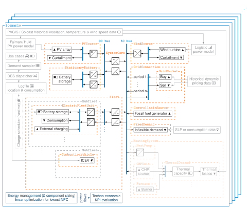
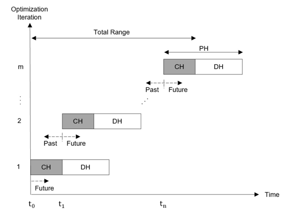

# REVOL-E-TION 

## Resilient Electric Vehicle Optimization model for Local Energy TransitION

REVOL-E-TION is an energy system model toolbox designed to optimize integration of electric vehicle fleets into
local energy systems such as mini- and microgrids, company sites, apartment blocks or single homes and estimate
the resulting technoeconomic potentials in terms of costs and revenues within the energy (and optionally also the
mobility system). It is built as a wrapper on top of the [oemof](https://oemof.org) energy system model framework.

## Created by
Philipp Rosner, M.Sc. and Brian Dietermann, M.Sc.<br>
Institute of Automotive Technology<br>
Department of Mobility Systems Engineering<br>
TUM School of Engineering and Design<br>
Technical University of Munich<br>
philipp.rosner@tum.de<br>
September 2nd, 2021<br>

#### Contributors
Marcel Brödel, M.Sc. - Research Associate 01/2024-<br>
David Eickholt, B.Sc. - Semester Thesis submitted 07/2021<br>
Marcel Brödel, B.Sc. - Semester Thesis submitted 05/2022<br>
Hannes Henglein, B.Sc. - Semester Thesis submitted 10/2022<br>
Marc Alsina Planelles, B.Sc. - Master's Thesis submitted 10/2022<br>
Juan Forero Yacaman - Bachelor's Thesis submitted 04/2023<br>
Elisabeth Spiegl - Bachelor's Thesis submitted 06/2023<br>
Alejandro Hernando Armengol, B.Sc. - Master's Thesis submitted 10/2023<br>
Hannes Henglein, B.Sc. - Master's Thesis submitted 01/2024<br>
Florian Melzig, B.Sc. - Master's Thesis submitted 10/2024<br>
Florian Honeder, B.Sc. - Semester Thesis submitted 09/2025<br>
Jan-Niklas Weghorn, B.Sc. - IDP submitted 09/2025<br>
Jan-Niklas Weghorn, B.Sc. - Master's Thesis ongoing<br>

## Table of Contents
- [Licensing](#licensing)
- [Related publications](#related-publications)
- [Description](#description)
- [Installation](#installation)
- [Basic Usage](#basic-usage)
- [Common Problems & Troubleshooting](#common-problems--troubleshooting)
- [General Terms & Definitions](#general-terms--definitions)
- [Scenario Input Parameters](#scenario-input-parameters)
- [EV-Specific submodules](#ev-specific-submodules)
  - [Discrete Event Simulation (DES)](#discrete-event-simulation-des)
  - [A priori Power Scheduling](#a-priori-power-scheduling)
  - [A Posteriori Aging Model (also available for StationaryBattery)](#a-posteriori-aging-model-also-available-for-stationarybattery)
- [Outputs](#outputs)

## Licensing
REVOL-E-TION is licensed under the Apache 2.0 open source license.<br>
The full license text can be found in the LICENSE file in the root directory of the repository.

## Related publications
- P. Rosner and M. Lienkamp, "Unlocking the Joint Potential of Electric Mobility and Rural Electrification - A Concept for Improved Integration using Modular Batteries," 2022 IEEE PES/IAS PowerAfrica, Kigali, Rwanda, 2022, pp. 1-5, https://doi.org/10.1109/PowerAfrica53997.2022.9905305.
- P. Rosner, B. Dietermann, M. Brödel and M. Lienkamp, "REVOL-E-TION: A Flexible and Scalable Model to Optimally Integrate Bidirectional EV Fleets in Local Energy Systems", Poster, 2024 Vehicle2Grid Conference, Münster, Germany, 2024, https://doi.org/10.13140/RG.2.2.19632.16648
- P. Rosner, B. Dietermann (shared first authors), M. Brödel, A. Paper and M. Lienkamp, "REVOL-E-TION: A Flexible and Scalable Investment Optimization Toolbox for Local Energy Systems Incorporating Electric Vehicle Fleets", 2025, SoftwareX, https://doi.org/10.1016/j.softx.2025.102178
- B. Dietermann, P. Rosner, N. Nachtigall and M. Lienkamp, "Enabling Residential Electric Car-Sharing Models Through Optimum Local Energy System Integration: A Concept", 2025, 5th International Conference on Electrical, Computer, Communications and Mechatronics Engineering (ICECCME), https://doi.org/10.1109/ICECCME64568.2025.11277639

## Description
REVOL-E-TION is a scalable generator for (mixed integer) linear energy system models of local energy systems with or without electric vehicle fleets.
It can be used to optimize component sizes and/or dispatch behavior of the system to achieve the least cost in the simulation timeframe.
Simulation results are later extrapolated and discounted to a project timeframe to estimate the technoeconomic potential of the system in the long run.
Please note that this split between simulation and extrapolation improves computational effort, but creates possibly unwanted incentives for the optimizer (e.g. preferring low initial cost but operationally expensive power sources), especially when sizing components.

REVOL-E-TION groups oemof components and buses into blocks representing real-world systems (e.g. a PV array) for easy application.
Electric vehicles (in fact, any mobile storage devices) as well as Internal Combustion Engine Vehicles are modeled individually as instances of class FleetUnit within a Fleet block.
Their behavior (i.e. when they depart and arrive again, how much energy they use in between and whether they can be charged externally) is described in a so-called log file.
Log files can be created using the integrated Discrete Event Simulation (DES), which is also capable of modeling range extension through mobile batteries as well as multiple use cases in different time frames (e.g. summer/winter) for the FleetUnits.

The following system diagram shows the basic structure including one example of each block class (blocks are indicated by dashed lines):<br>

<div style="text-align: center;">
  
</div>

## Installation
REVOL-E-TION is designed to run under Windows 11, Ubuntu 22.04 LTS and macOS 15 Sequoia.
While portability is generally built in, other operating systems are untested.

#### Step 1: Getting the source code
REVOL-E-TION is available on [GitLab](https://gitlab.lrz.de/energysystemmodelling/revol-e-tion) and can be cloned from there using
```bash
git clone https://gitlab.lrz.de/energysystemmodelling/revol-e-tion.git
```

#### Step 2: Create a clean virtual environment
It is recommended to create and activate a clean virtual environment for the installation of REVOL-E-TION.
This can be done using conda:
```bash
conda create -n <name_of_virtual_environment> python=3.11
conda activate <name_of_virtual_environment>
```
or alternatively with the following command:
```bash
python -m venv <path_to_virtual_environment>
source <path_to_virtual_environment>/bin/activate
```

#### Step 3: Install package and dependencies locally
After cloning the repository, navigate to its root directory (where ```README.md``` and ```pyproject.toml``` are located) in your terminal.
Then install the package and its dependencies using one of the following commands depending on the chosen mode of installation:
##### a) Standard Installation
This copies the package into your (virtual environment’s) site-packages directory:
```bash
pip install .
```
After pulling new changes from the repository, the package has to be reinstalled using the same command to take the changes into account.

##### b) Editable Installation (recommended for development)

This links the package to your local source code, so any changes (you make or pulled from the repository) are immediately reflected without reinstalling:
```bash
pip install -e . --group dev --group tests
```
Use the editable mode if you plan to modify the code during development. The previous command also installs additional dependencies required for development and testing, which are not necessary for running the package but required for development.

#### Step 4: MILP Solver
REVOL-E-TION requires a [pyomo compatible](https://pyomo.readthedocs.io/en/stable/solving_pyomo_models.html#supported-solvers) Mixed Integer Linear Programming (MILP) solver (as does oemof).
The open-source [cbc](https://github.com/coin-or/Cbc/releases/latest) solver works well.
The proprietary [Gurobi](https://www.gurobi.com/downloads/) solver is recommended however, as it is faster in execution, especially for large problems and offers a free academic license.
If [Gurobi](https://www.gurobi.com/downloads/) is used, the version of Gurobi and the license file have to match. The python package gurobipy is NOT required to run REVOL-E-TION.
To ensure this get the version of both your gurobi license and installation (```grbgetkey --version```).

## Basic Usage
> ⚠️ **Important** ⚠️
>
> **When using REVOL-E-TION, all input data such as timeseries and the scenario file should be stored in a separate directory and not within the package's source code.**  
> **Do not store any custom files within the source code of the package.**
> **This includes the example directory in particular.**

### 1. Running REVOL-E-TION as package
REVOL-E-TION can be run using one of two terminal commands, given the correct virtual environment is activated:
1. Call to the main module: ```python -m revoletion <arguments>``` (best for local execution on host machine, e.g. through a run configuration in PyCharm)
2. Call to the entry point: ```revoletion <arguments>``` (best for remote execution on a server as it works irrespective of the current working directory as long as the correct environment is active)

<details style="margin-bottom: 1em;">
<summary style="
  border: 2px solid #333333;
  padding: 10px;
  background-color: #f0f0f0;
  font-weight: bold;
  border-radius: 6px;
  cursor: pointer;
">
  <span style="display: inline-block;width: 3em;text-align: center;font-size: 1.5em;">
    ⚙️
  </span>
  Overview of Arguments
</summary>

| Argument                        | Short form | Long form          | Default value                                                                | Description                                                                                                                                                                                                                        | Valid input                                                                                                                                           |
|---------------------------------|------------|--------------------|------------------------------------------------------------------------------|------------------------------------------------------------------------------------------------------------------------------------------------------------------------------------------------------------------------------------|-------------------------------------------------------------------------------------------------------------------------------------------------------|
| Scenario file path (mandatory)  | -scn       | --scenario         | If not given, a GUI window opens to select the scenario file                 | File path to scenario file. If 'example' is provided, the example project included in REVOL-E-TION is executed and ```--input``` is neglected. If not provided, a graphical selection dialog opens automatically to select a file. | string with path (absolute or relative to current working directory) of scenario file or 'example'                                                    |
| Input directory path            | -in        | --input            | Directory of the scenario file provided in ```--scenario```                  | Directory path to input data files.                                                                                                                                                                                                | string with directory path (absolute or relative to current working directory)                                                                        |
| Output directory path           | -out       | --output           | Directory "results" in the current working directory (created automatically) | Directory path to save output data.                                                                                                                                                                                                | string with directory path (absolute or relative to current working directory)                                                                        |
| Rerun previous run              | -rer       | --rerun            | None                                                                         | Rerun scenarios of a previous run which were not completed successfully (due to unexpected termination of SimulationRun or non-deterministic infeasibilities). Specify a path or 'latest' to rerun latest run in output directory. | False, 'latest' or string with directory path (absolute or relative to output directory defined in ```--output```) containing results of previous run |
| Solver                          | -slv       | --solver           | 'gurobi'                                                                     | Solver to be used for optimization.                                                                                                                                                                                                | string containing lowercase name of pyomo compatible solver to be used                                                                                |
| Number of Processes             | -np        | --n_processes      | 1                                                                            | Number of parallel processed (i.e. cores) scenarios.                                                                                                                                                                               | integer, is limited to maximum thread count of CPU automatically                                                                                      |
| Large scale execution mode      | -ls        | --largescalemode   | False                                                                        | Boolean controlling output saving and display detail. Timeseries parameters are omitted in large scale mode.                                                                                                                       | True, False                                                                                                                                           |
| Debugmode                       | -db        | --debugmode        | False                                                                        | Boolean controlling whether to print solver progress information during the solving process. This is resource intensive and should therefore be avoided unless explicitly necessary.                                               | True, False                                                                                                                                           |
| Rerun only infeasible scenarios | -rin       | --rerun_infeasible | True                                                                         | Rerun infeasible scenarios, for which the solver did not find an optimal solution (may lead to the same result again) Neglected for ```--rerun False```                                                                            | True, False                                                                                                                                           |
| Solcast API key                 | -ksc       | --key_solcast_api  | None                                                                         | API key to use for the proprietary Solcast PV/Wind data API                                                                                                                                                                        | string                                                                                                                                                |
</details>

The scenario file is a CSV table.
Its exact API is described in the section "Scenario Input Parameters".
A runnable example scenario file is provided in the example directory.
Some parameters in the scenario file reference to other files specified by file name, mostly for timeseries data.
These are searched within the input directory specified.

Furthermore, to describe the mapping of different timeframes defining behavior of Fleets (see below), modification of the ```mapper_timeframe_example.py``` code file might be necessary to fit the scenario as this is not simply and flexibly done in parameter files.
The filename of the modified file has to be given in the scenario file under the key ```filename_mapper``` and the file has to be placed in the input directory specified in ```--input```.

Concerning computational effort, REVOL-E-TION relies heavily on single core computing power for each scenario and uses significant memory, especially in the 'go' strategy.
To avoid memory limitations, it is advised to limit the number of parallel scenarios to be executed using ```--n_processes``` depending on the available hardware.

To run the provided example project, execute the following command in the terminal:
```bash
python -m revoletion -scn example
```

### 2. Running REVOL-E-TION in Python
REVOL-E-TION can also be used as a module in your own code.
```python
import revoletion

# specify the simulation's settings (optional); arguments are the same the long form of command line arguments:
# solver, n_processes, largescale, debugmode, rerun, rerun_infeasible, key_solcast_api
settings = revoletion.SimulationSettings()

# specify the relevant paths
paths = revoletion.SimulationPaths(scenario='path/to/your/scenario.csv',  # this is the only required parameter
                                   input='path/to/your/input/dir',  # same logic as --input argument
                                   output='path/to/your/output/dir',  # same logic as --output argument
                                   )

# perform the optimization for all scenarios defined in the scenario file
revoletion.SimulationRun(paths=paths,
                         settings=settings,  # optional, defaults to SimulationSettings()
                         )
```


## Common Problems & Troubleshooting
| Error message                                                                                                                    | Cause                                                                                                             | Solution                                                                                                                                                                                                                                                                                                                                                                               |
|----------------------------------------------------------------------------------------------------------------------------------|-------------------------------------------------------------------------------------------------------------------|----------------------------------------------------------------------------------------------------------------------------------------------------------------------------------------------------------------------------------------------------------------------------------------------------------------------------------------------------------------------------------------|
| Errors while installing the required Python packages                                                                             | various                                                                                                           | Make sure to start with a clean Python environment using Python >=3.11. We recommend conda for dependency resolution.                                                                                                                                                                                                                                                                  |
| Gurobi related installation & execution errors                                                                                   | Faulty Gurobi installation, missing Gurobi license                                                                | Check your Gurobi installation by executing ```gurobi-cl``` in a shell. If the command itself fails, Gurobi itself is not installed properly. In this case, follow the [Gurobi Install and Troubleshooting Guide](https://support.gurobi.com/hc/en-us/articles/14799677517585-Getting-Started-with-Gurobi-Optimizer). The python package gurobipy is NOT required to run REVOL-E-TION. |
| ```IndexError: Block "X": Input timeseries data does not cover simulation timeframe```                                           | A timeseries data file provided does not cover the complete simulation period or resampling it has failed         | Specify a different simulation period or select a different timeseries input file. Make sure the entire simulation timeframe (possibly including overhanging data for the last prediction horizons)                                                                                                                                                                                    |
| ```Class "X" not found in blocks.py file```                                                                                      | The class name specified in the blocks dictionary in the scenario file is not specified in REVOL-E-TION           | Check the blocks dictionary string in the scenario csv file for typos.                                                                                                                                                                                                                                                                                                                 |
| ```Scenario failed: Infeasible or Unbounded (To solve this error try to set investment limits for blocks or for the scenario)``` | Depending on the costs specified the optimization problem might be unbounded as infinite investment is beneficial | Redefine the provided cost structure (i.e. reduce prices for energy feed-in or increase CAPEX or OPEX for energy generation)                                                                                                                                                                                                                                                           |
| Any other error messages or errors                                                                                               | various                                                                                                           | REVOL-E-TION prints specific error messages in most cases which help you to understand the cause of the error. Nevertheless, REVOL-E-TION is still in development and therefore might contain bugs and errors that are not covered yet. If you encounter a bug or an error message that you do not understand, please feel free to open an issue on GitHub or contact the developers.  |


## General Terms & Definitions
The following table details common terms occurring in further descriptions and the code:

| Term      | Description                                                                                                                                                                                                                                                                                                                                                                                                                                                                                                                                                                                                                                                                                                                                                                                                                                                                       |
|-----------|-----------------------------------------------------------------------------------------------------------------------------------------------------------------------------------------------------------------------------------------------------------------------------------------------------------------------------------------------------------------------------------------------------------------------------------------------------------------------------------------------------------------------------------------------------------------------------------------------------------------------------------------------------------------------------------------------------------------------------------------------------------------------------------------------------------------------------------------------------------------------------------|
| Project   | An application of REVOL-E-TION in a specific setting. All files (scenarios file, input data files, etc.) should be contained in a single directory. ```./example``` is an example project.                                                                                                                                                                                                                                                                                                                                                                                                                                                                                                                                                                                                                                                                                        |
| Run       | A single execution of REVOL-E-TION defined by a single scenario file (possibly containing multiple scenario definitions as columns). Common information and methods valid for all scenarios are defined in a SimulationRun object.                                                                                                                                                                                                                                                                                                                                                                                                                                                                                                                                                                                                                                                |
| Scenario  | A set of parameters (i.e. an energy system) to be simulated and/or optimized. It is defined by a column in the scenario file and optional some additional timeseries inputs.                                                                                                                                                                                                                                                                                                                                                                                                                                                                                                                                                                                                                                                                                                      |
| Strategy  | The (energy management) strategy to dispatch the energy system's blocks generally. REVOL-E-TION supports two strategies: "go" for single shot global optimization and "rh" for rolling horizon (i.e. time slotted myopic) optimization similar to Model Predictive Control (MPC). The former is a special case of the latter with just a single horizon. Component size optimization is only applicable in "go".                                                                                                                                                                                                                                                                                                                                                                                                                                                                  |
| Horizon   | A single optimization process by the solver, whether as the only one of the scenario ("go" strategy) or as a slice of the simulation timeframe ("rh" strategy). In the latter case, the total simulation time is split up into prediction horizons (each of which is represented in the code by a PredictionHorizon object) that are simulated consecutively. However, overlap between the horizons is necessary to ensure feasibility of dispatch. Therefore, only the first part of the prediction horizon (called control horizon) is actually used for overall result calculation, while the rest is discarded. The simulation timeframe is automatically split up into horizons as per the defined length of prediction and control horizons from the scenario file. See the following diagram for clarification:  |
| Block     | A set of oemof components representing a real-world system including necessary converters and buses. Each is represented by an instance of the Block parent class with further child classes. The blocks present in the energy system are defined in the scenario file as a dictionary, except for the core block (of class SystemCore) containing the AC and DC buses as well as the converter(s) inbetween them. Multiple instances of one block can coexist in a model. The possible types (i.e. Classes) are laid out in the following chapter.                                                                                                                                                                                                                                                                                                                               |
| Component | A component is an oemof element that is either a source, a sink, a bus, a converter or a storage.                                                                                                                                                                                                                                                                                                                                                                                                                                                                                                                                                                                                                                                                                                                                                                                 |

## Scenario Input Parameters
Scenarios are defined in a CSV file, the so-called scenario file.
This file can contain multiple scenarios, each of which is defined by a column in the file.
Each column then holds all required parameters for the scenario, which are structured by blocks, leading to the following formatting of the scenario file:

| Block              | Key               | ```<name_scenario_1>```  | ```<name_scenario_2>```  | ... | ```<name_scenario_n>```  |
|--------------------|-------------------|--------------------------|--------------------------|-----|--------------------------|
| ```<block_name>``` | ```<parameter>``` | ```<value_scenario_1>``` | ```<value_scenario_2>``` | ... | ```<value_scenario_n>``` |
| ...                | ...               | ...                      | ...                      | ... | ...                      |

In the first row, 'Block' and 'Key' are fixed column names. All other column names define the names of distinct scenarios.
To ignore a scenario during the simulation process, add a '#' in front of the scenario's name.
The first column defines the name of the block to which the parameter in the second column applies.
This name is defined in the scenarios ```blocks``` parameter for all blocks except for the scenario itself and the SystemCore which have to be named 'scenario' and 'core', respectively.

Although the scenario itself is no block in REVOL-E-TION's code logic, it is treated as a block in the scenario file.
A scenario file starts with a header row containing the fixed column names 'Block' and 'Key', followed by the names of the scenarios as column names.
The first rows represent the parameters of the scenario itself, which are not block specific.
The block name for the scenario always is 'scenario'.
The 'scenario' section is followed by the parameters for each block present in the scenario.
To ensure scalability of the scenario file, the parameters of a block are only read in, if the block is present in the scenarios parameter ```blocks```.
This allows to define scenarios with different blocks in the same scenario file.
In addition to the blocks defined in the ```blocks``` parameter of the scenario exactly one instance of class SystemCore is automatically created and named 'core'.
Although the SystemCore must not be specified in the ```blocks``` dict, its parameters have to be defined in the scenario file (block name: 'core').
Instances of type GridMarket and SubFleet are also not specified in the scenario's ```blocks``` parameter, but in the parameters of their parent classes GridConnection and Fleet, respectively.

Complex (multidimensional) parameters are mostly defined through links to other files (by filename) in the scenario file.
As all string values specified in the scenario definition file are converted to lower case, all files have to be named in lower case to be read in properly.
The following table specifies each parameter for each possible block class in the scenario file.
If and only if a block of a certain class exists within the scenario, these parameters are required and read in.
Therefore, not every scenario file contains all possible parameters.
An example scenario file is provided in the ```.revoletion/example``` directory.

A further explanation of each block and its parameters is given in the expandable boxes below.


<!ENTRY_POINT_SCHEMA_TABLES>

<details style="margin-bottom: 1em;">
<summary style="border: 2px solid #333333;
  padding: 10px;
  font-weight: bold;
  border-radius: 6px;
  cursor: pointer;
">
  <span style="display: inline-block;width: 3em;text-align: center;font-size: 1.5em;">
    📋
  </span>
  Scenario
</summary>

Each run can contain multiple scenario objects.
A scenario object holds several parameters that are used by multiple blocks in the scenario.
After a successful optimization it also contains the aggregated techno-economic results such as energy throughput, costs, revenues as well as LCOE, NPC, and NPV.

| Key | Name | Type | Not required for | Description | Valid values or format |
|-----|------|------|------------------|-------------|------------------------|
| `starttime` | Start Time | str |  | Start time of the project and the simulation in local time. If no time is given in addition to the date the project starts at 00:00 local time | 'dd.mm.YYYY' or 'dd.mm.YYYY HH:MM' |
| `timestep` | Time step | str |  | Time step used for the simulation | Formats compatible with pd.to_timedelta() such as 15min, 1h, 1D. |
| `sim_duration` | Project duration | int or str or None | `sim_endtime` is given | Simulation duration. If given as integer the number is interpreted as number of days. Specifying a pandas.Timedelta() compliant string is also supported. The duration is rounded down to the specified timestep. | [1, inf[ or strings such as '1 day 12 hours 14 minutes' |
| `sim_endtime` | Simulation end time | str or None | `sim_duration` is given | End time of the simulation in local time. If no time is given in addition to the date the simulation ends at 00:00 local time. Only one of the parameters sim_duration and sim_endtime can be specified. The other one has to be None. | 'dd.mm.YYYY' or 'dd.mm.YYYY HH:MM' or None |
| `prj_duration` | Project duration | int |  | Project duration in years to which the economic results of the simulation duration are extrapolated | [1, inf[ |
| `compensate_sim_prj` | Specific Capex/Opex compensation trigger | bool |  | Trigger whether to optimize for sim duration (False) or project duration (True) | True, False |
| `strategy` | Strategy | str |  | Optimization strategy | 'go' or 'rh' (global optimum, rolling horizon) |
| `len_ph` | Prediction horizon length | float or str or None |  | Length of the prediction horizon in hours. Will be rounded down to specified timestep of simulation. It can be given as float, which is interpreted as number of hours or a pd.Timedelta readable string. Neglected for every optimization strategy other than 'rh'. | ]0, inf[ or string such as 1 day |
| `len_ch` | Control horizon length | int or str or None |  | Length of the control horizon in hours. Will be rounded down to specified timestep of simulation. It can be given as float, which is interpreted as number of hours or a pd.Timedelta readable string. Neglected for every optimization strategy other than 'rh'. | ]0, inf[ or string such as 12 hours |
| `truncate_ph` | Truncate Prediction Horizon | bool |  | Toggles whether to truncate predictions horizons to simulation end time when using 'rh' optimization strategy. If activated all horizons are truncated to the simulation end time. Deactivation requires additional input data for all Prediction Horizons even beyond the end of the simulation specified by starttime and sim_duration. | True, False |
| `invest_max` | Maximum initial investment costs | float or None |  | Limit the initial investment costs to a specific amount. If no limit should be considered set this parameter to None. | ]-inf, inf[ or None |
| `wacc` | Weighted average cost of capital | float or None |  | Weighted average cost of capital: discount rate for future expenses/revenues and energies per year. | [0, 1] |
| `currency` | Currency | str |  | Currency used to display results of economic calculations. No influence of calculation itself, only used for displaying. | 'str', e.g. 'EUR', 'USD' |
| `latitude` | Latitude | float |  | Latitude of the location of the local energy system. Used to determine timezone, pv and wind data. Has to be given in WGS84 | [-90, 90] |
| `longitude` | Longitude  | float |  | Longitude of the location of the local energy system. Used to determine timezone, pv and wind data. Has to be given in WGS84 | [-90, 90] |
| `temp_air` | Air temperature | float or str or None |  | Air temperature. Can be given as string wih filename to csv file containing the columns 'time' (timezone aware timestamps) and 'temp_air' (temperature in °C), a float or int specifying a constant temperature in °C or the name of a PVSource. | string with filename or name of PVSource instance or ]-inf, inf[ |
| `cost_eps` | Epsilon costs | float |  | Cost added to some flows in order to disincentivice circular flows | [0, inf[ |
| `blocks` | Blocks | dict |  | All blocks present in the scenario except for the SystemCore, which is added automatically, in the format {block_name: class_name}. Non valid names are 'run', 'scenario' and 'core' (default name for block of class SystemCore). | "{'custom block name': 'class name of block'}" |

</details>


<details style="margin-bottom: 1em;">
<summary style="border: 2px solid #333333;
  padding: 10px;
  font-weight: bold;
  border-radius: 6px;
  cursor: pointer;
">
  <span style="display: inline-block;width: 3em;text-align: center;font-size: 1.5em;">
    ⇄
  </span>
  SystemCore
</summary>

Collection of central energy system components (AC and DC buses and the two unidirectional transformers between them).
This is present once and only once in every energy system defined in REVOL-E-TION under the name "core".
For pure AC or DC systems, the respective core cost and size parameters can be set to zero to have no effect on the result.

| Key | Name | Type | Not required for | Description | Valid values or format |
|-----|------|------|------------------|-------------|------------------------|
| `size_preexisting_acdc` | Preexisting AC/DC size | float or str |  | Installed power of the AC/DC converter in the SystemCore in W. Set either size_preexisting_acdc or size_preexisting_dcac to 'equal' to set both preexisting converter sizes to the same value. | [0, inf[ or 'equal' |
| `capex_preexisting_acdc` | Consideration of preexisting AC/DC size in capex | bool |  | Trigger whether to consider preexisting component size specified in size_preexisting_acdc in initial capex calculation. Replacement capex are unaffected. | True, False |
| `size_max_acdc` | Maximum size of AC/DC converter | float or str or None |  | Maximum size of the AC/DC converter of the SystemCore including preexisting size specified in size_preexisting_acdc. To enable unlimited investment set this parameter to None. Set either size_max_acdc or size_max_dcac to 'equal' to set both converters' maximum investments to the same value. | [0, inf[ or None or 'equal' |
| `invest_acdc` | Investment into AC/DC converter | bool or str |  | Enable additional investment into the AC/DC converter of the SystemCore. Set either invest_acdc or invest_dcac to 'equal' to force the same expansion for both converters. | True, False |
| `size_preexisting_dcac` | Existing DC/AC size | float or str |  | Installed power of the DC/AC converter in the SystemCore in W. Set either size_preexisting_acdc or size_preexisting_dcac to 'equal' to set both preexisting converter sizes to the same value. | [0, inf[ or 'equal' |
| `capex_preexisting_dcac` | Consideration of preexisting DC/AC size in capex | bool |  | Consider existing DC/AC size in initial capex calculation. | True, False |
| `size_max_dcac` | Maximum size of DC/AC converter | float or str or None |  | Maximum size of the DC/AC converter of the SystemCore including preexisting size specified in `size_preexisting_dcac`. To enable unlimited investment set this parameter to None. Set either `size_max_acdc` or `size_max_dcac` to 'equal' to set both converters' maximum investments to the same value. | [0, inf[ or None or 'equal' |
| `invest_dcac` | Investment into DC/AC converter | bool or str |  | Enable additional investment into the DC/AC converter of the `SystemCore`. Set either `invest_acdc` or `invest_dcac` to 'equal' to force the same expansion for both converters. | True, False |
| `capex_spec` | Specific capital expenditures | float |  | Specific capital expenditures for each of the converters in the `SystemCore`: cost in currency per installed power (cumulative size of both converters) in W. | [0, inf[ |
| `mntex_spec` | Specific maintenance expenditures | float |  | Specific maintenance expenditures for each of the converters in the `SystemCore`: cost in currency per year per installed power (cumulative size of both converters) in W. | [0, inf[ |
| `opex_spec` | Specific operational expenditures | float or str |  | Specific operational expenditures for each of the converters in the `SystemCore` cost in currency per converted energy in Wh. Energy is measured at each converter's inflow. Can be given as float or filename of a csv file containing a timeseries. | string with filename or [0, inf[ |
| `ls` | Lifespan | float |  | Lifespan of the block in years after which it will be replaced. | [1, inf[ |
| `ccr` | Cost change ratio | float |  | Cost change ratio of the block's nominal price per year to be considered for replacement after its lifespan. | [0, inf[ |
| `eff_dcac` | DC/AC efficiency | float |  | Efficiency of the DC/AC converter in the `SystemCore`. | [0, 1] |
| `eff_acdc` | AC/DC efficiency | float |  | Efficiency of the AC/DC converter in the `SystemCore`. | [0, 1] |

</details>


<details style="margin-bottom: 1em;">
<summary style="border: 2px solid #333333;
  padding: 10px;
  font-weight: bold;
  border-radius: 6px;
  cursor: pointer;
">
  <span style="display: inline-block;width: 3em;text-align: center;font-size: 1.5em;">
    🏠
  </span>
  FixedDemand
</summary>

Undeferrable (i.e. inflexible) power demand such as households.

| Key | Name | Type | Not required for | Description | Valid values or format |
|-----|------|------|------------------|-------------|------------------------|
| `capex_preexisting_metering` | Consideration of preexisting metering capital expensditures | bool |  | Consider existing metering and operational capex in cost calculation. | True, False |
| `capex_fix_metering` | Fixed capital expenditures for metering infrastructure | float |  | Fixed maintenance expenditures: total cost in currency per year, irrespective of actual demand | [0.0, inf[ |
| `mntex_fix_metering` | Fixed maintenance expenditures for metering infrastructure and operations | float |  | Fixed maintenance expenditures: total cost in currency per year, irrespective of actual demand | [0.0, inf[ |
| `load_profile` | Load Profile | str |  | Load profile for the fixed demand. Can be given as filename of a csv file containing a timeseries specifying the fixed demand of the block or as string defining a constant load or one of the standard load profiles by BDEW. If a filename is given, the file has to include the two columns 'time' and 'power' including a timezone aware timestamp and the corresponding power value in W | string with filename, {'const', 'H0', 'G0', 'G1', 'G2', 'G3', 'G4', 'G5', 'G6', 'L0', 'L1', 'L2', 'H25', 'G25', 'L25', 'P25', 'S25'} |
| `consumption_yrl` | Yearly consumption | float |  | Yearly consumption in Wh. Neglected if a filename is provided in load_profile. | [0, inf[ |
| `system` | System | str |  | The bus (AC or DC) the block is connected to. | 'ac', 'dc' |
| `crev_spec` | Specific customer revenue | float or str |  | Specific customer revenue for consumed energy in currency per Wh. Can be given as float or filename of a csv file containing a timeseries. | ]-inf, inf[ |

</details>


<details style="margin-bottom: 1em;">
<summary style="border: 2px solid #333333;
  padding: 10px;
  font-weight: bold;
  border-radius: 6px;
  cursor: pointer;
">
  <span style="display: inline-block;width: 3em;text-align: center;font-size: 1.5em;">
    ☀️
  </span>
  PVSource
</summary>

Photovoltaic array. Power potential is defined either using Solcast (pre-downloaded CSV file or API), PVGIS (pre-downloaded CSV file or API), or a timeseries CSV file.
Although the Solcast API requires an active subscription plan, there is a limited free plan for researchers.

| Key | Name | Type | Not required for | Description | Valid values or format |
|-----|------|------|------------------|-------------|------------------------|
| `size_preexisting_block` | Preexisting size | float |  | Installed peak power of the pv array in in W. | [0, inf[ |
| `capex_preexisting_block` | Consideration of preexisting block size in capex | bool |  | Trigger whether to consider preexisting component size specified in `size_preexisting_block` in initial capex calculation. Replacement capex are unaffected. | True, False |
| `size_max_block` | Maximum size | float or None |  | Maximum size of `PVSource` including preexisting size specified in `size_preexisting_block`. To enable unlimited investment set this parameter to None. | [0, inf[ or None |
| `invest_block` | Investment | bool |  | Enable additional investment into the PV system. | True, False |
| `data_source` | Data source | str |  | Data source for pv power. This can be an API (PVGIS or Solcast) or a file containing data (PVGIS, Solcast or custom file). If Solcast API is chosen a valid API key has to specified in the run's arguments. A custom file has to include the columns 'time' (timezone aware timestamps), 'power_spec' (specific power in W per Wp), 'speed_wind' (in m/s), 'temp_air' (air temperature in °C). | 'pvgis api', 'solcast api', 'pvgis file', 'solcast file', 'file' |
| `filename` | Filename | str or None |  | Name of a PVGIS, Solcast, or custom csv file if data_source is set to 'pvgis file', 'solcast file', or 'file', respectively. Otherwise set to None. | filename or None |
| `system` | System | str |  | The bus (AC or DC) the block is connected to | 'ac', 'dc' |
| `capex_spec` | Specific capital expenditures | float |  | Specific capital expenditures: cost in currency per installed peak power in W | [0, inf[ |
| `mntex_spec` | Specific maintenance expenditures | float |  | Specific maintenance expenditures: cost in currency per year per installed peak power in W | [0, inf[ |
| `opex_spec` | Specific operational expenditures | float or str |  | Specific operational expenditures: cost in currency per generated energy in Wh. Can be given as float or filename of a csv file containing a timeseries | string with filename or [0, inf[ |
| `ls` | Lifespan | float |  | Lifespan of the block in years after which it will be replaced | [1, inf[ |
| `ccr` | Cost change ratio | float |  | Cost change ratio of the block's nominal price per year to be considered for replacement after its lifespan | [0, inf[ |
| `eff_block` | Efficiency | float |  | Efficiency of the PV array, taking into account all losses occurring from insulation up to the point of feeding power into the bus to which the block is connected. | [0, 1] |
| `azimuth` | Surface azimuth | float or None |  | Clockwise from north (north=0, east=90, south=180, west=270). Ignored for tracking systems. Only considered if any API or 'Solcast file' is specified in data_source. None is equal to energy yield optimum. | [0, 360[ or None. |
| `tilt` | Surface tilt angle | float or None |  | Tilt angle from horizontal plane. Ignored for two-axis tracking. Horizontal=0, Vertical=90. Only considered if any API or 'Solcast file' is specified in data_source. None sets the tilt angle to the specified location's latitude. | [0, 90] or None |
| `trackingtype` | Tracking type | int or None |  | Type of sun tracking. 0=fixed, 1=single horizontal axis aligned north-south, 2=two-axis tracking, 3=vertical axis tracking, 4=single horizontal axis aligned east-west, 5=single inclined axis aligned north-south. For data_source 'Solcast API' only 0 and 1 are valid. Ignored for any other data_source than 'PVGIS API' and 'Solcast API'. | 0, 1, 2, 3, 4, 5 |
| `horizon_custom` | User horizon | list or None |  | Optional user specified elevation of horizon in degrees for 'PVGIS API', at equally spaced angular positions starting clockwise from north. Only valid if horizon is True. Not possible in combination with activated azimuth or tilt set to 'optimal'. Ignored for any other data_source than 'PVGIS API'. | list of floats (has to be specified surrounded by " ") e.g. "[45, 30, 0, 0]" or None |
| `database` | Radiation database | str or None |  | Name of the radiation database for 'PVGIS-API'. Dependent on location and chosen simulation timeframe. 'PVGIS-SARAH' for Europe, Africa and Asia or 'PVGIS-NSRDB' for the Americas between 60°N and 20°S, 'PVGIS-ERA5' and 'PVGIS-COSMO' for Europe (including high-latitudes), and 'PVGIS-CMSAF' for Europe and Africa (will be deprecated). | 'PVGIS-SARAH2', 'PVGIS-SARAH3', 'PVGIS-NSRDB', 'PVGIS-ERA5', 'PVGIS-COSMO', 'PVGIS-CMSAF' |
| `type_cell` | PV technology | str |  | PV technology for 'PVGIS API'. | 'crystSi', 'CIS', 'CdTe', 'Unknown' |
| `mountingplace` | Mounting place | str |  | Type of mounting for PV system for 'PVGIS API'. Options: free = free-standing, building = building-integrated. | 'free', 'building' |

</details>


<details style="margin-bottom: 1em;">
<summary style="border: 2px solid #333333;
  padding: 10px;
  font-weight: bold;
  border-radius: 6px;
  cursor: pointer;
">
  <span style="display: inline-block;width: 3em;text-align: center;font-size: 1.5em;">
    💨
  </span>
  WindSource
</summary>

Wind turbine. Power potential is defined either in a csv timeseries file or retrieved from PVSource data containing wind speed, which is then converted to power for a specific turbine height.
For the latter option, a PVSource block must exist.

| Key | Name | Type | Not required for | Description | Valid values or format |
|-----|------|------|------------------|-------------|------------------------|
| `size_preexisting_block` | Preexisting size | float |  | Installed rated power of wind turbine in W | [0, inf[ |
| `capex_preexisting_block` | Consideration of preexisting block size in capex | bool |  | Trigger whether to consider existing component size in initial capex calculation. Replacement capex are unaffected. | True, False |
| `size_max_block` | Maximum size | float or None |  | Maximum size of WindSource including existing size. To enable unlimited investment set this parameter to None | [0, inf[ or None |
| `invest_block` | Investment | bool |  | Enable additional investment into the wind turbine | True, False |
| `system` | System | str |  | The bus (AC or DC) the block is connected to | 'ac', 'dc' |
| `data_source` | Data source | str |  | Data source for wind power. Wind power can either be given as a separate csv file or calculated from a PVSource block's data. | 'file' or a string with the name of a block of class PVSource |
| `height` | Height | float |  | Hub height of the wind turbine in meters | [0, inf[ |
| `filename` | Filename | str or None |  | Filename of csv file containing wind power data including the columns 'time' (timezone aware timestamps) and 'power_spec' (specific power in W per rated power in W). Only considered if 'file' is given in data_source. | string with filename or None |
| `capex_spec` | Specific capital expenditures | float |  | Specific capital expenditures: cost in currency per installed rated power in W | [0, inf[ |
| `mntex_spec` | Specific maintenance expenditures | float |  | Specific maintenance expenditures: cost in currency per year per installed rated power in W | [0, inf[ |
| `opex_spec` | Specific operational expenditures | float or str |  | Specific operational expenditures: cost in currency per generated energy in Wh. Can be given as float or filename of a csv file containing a timeseries. | string with filename |
| `ls` | Lifespan | float |  | Lifespan of the block in years after which it will be replaced | [1, inf[ |
| `ccr` | Cost change ratio | float |  | Cost change ratio of the block's nominal price per year to be considered for replacement after its lifespan. | [0, inf[ |
| `eff_block` | Efficiency | float |  | Efficiency of the wind turbine. | [0, 1] |

</details>


<details style="margin-bottom: 1em;">
<summary style="border: 2px solid #333333;
  padding: 10px;
  font-weight: bold;
  border-radius: 6px;
  cursor: pointer;
">
  <span style="display: inline-block;width: 3em;text-align: center;font-size: 1.5em;">
     🔩
  </span>
  ControllableSource
</summary>

Independently controllable power sources (e.g. fossil generator, hydro power plant) that is unlimited in energy.

| Key | Name | Type | Not required for | Description | Valid values or format |
|-----|------|------|------------------|-------------|------------------------|
| `size_preexisting_block` | Preexisting size | float |  | Installed rated power of the source in W | [0, inf[ |
| `capex_preexisting_block` | Consideration of preexisting block size in capex | bool |  | Trigger whether to consider preexisting component size specified in `size_preexisting_block` in initial capex calculation. Replacement capex are unaffected. | True, False |
| `size_max_block` | Maximum size | float or None |  | Maximum size of ControllableSource including preexisting size specified in size_preexisting_block. To enable unlimited investment set this parameter to None. | [0, inf[ or None |
| `invest_block` | Investment | bool |  | Enable additional investment into the power source | True, False |
| `system` | System | str |  | The bus (AC or DC) the block is connected to | 'ac', 'dc' |
| `capex_spec` | Specific capital expenditures | float |  | Specific capital expenditures: cost in currency per installed power in W | [0, inf[ |
| `mntex_spec` | Specific maintenance expenditures | float |  | Specific maintenance expenditures: cost in currency per year per installed peak power in W | [0, inf[ |
| `opex_spec` | Specific operational expenditures | float or str |  | Specific operational expenditures: cost in currency per generated energy in Wh. Can be given as float or filename of a csv file containing a timeseries | string with filename or [0, inf[ |
| `ls` | Lifespan | float |  | Lifespan of the block in years after which it will be replaced | [1, inf[ |
| `ccr` | Cost change ratio | float |  | Cost change ratio of the block's nominal price per year to be considered for replacement after its lifespan | [0, inf[ |
| `eff_block` | Efficiency | float |  | Efficiency of the source | [0, 1] |

</details>


<details style="margin-bottom: 1em;">
<summary style="border: 2px solid #333333;
  padding: 10px;
  font-weight: bold;
  border-radius: 6px;
  cursor: pointer;
">
  <span style="display: inline-block;width: 3em;text-align: center;font-size: 1.5em;">
     🔌⚡
  </span>
  GridConnection
</summary>

Physical grid connection. A GridConnection instance requires one or multiple GridMarkets.

| Key | Name | Type | Not required for | Description | Valid values or format |
|-----|------|------|------------------|-------------|------------------------|
| `size_preexisting_g2s` | Preexisting connection power from public grid to local site | float or str |  | Installed power for the power flow from the public grid to the local site (Grid2Site) in W. Set either `size_preexisting_g2s` or `size_preexisting_s2g` to 'equal' to set both directions' sizes to the same value. | [0, inf[ or 'equal' |
| `capex_preexisting_g2s` | Consideration of preexisting AC/DC size in capex | bool |  | Trigger whether to consider preexisting component size specified in size_preexisting_g2s in initial capex calculation. Replacement capex are unaffected. | True, False |
| `size_max_g2s` | Maximum size of Grid2Site | float or str or None |  | Maximum size of Grid2Site including preexisting size specified in size_preexisting_g2s. To enable unlimited investment set this parameter to None. Set either size_max_g2s or size_max_s2g to 'equal' to set both directions' maximum investments to the same value. | [0, inf[ or None or 'equal' |
| `invest_g2s` | Investment into Grid2Site | bool or str |  | Enable additional investment into the maximum power from the grid to the local site. To ensure the same additional power for both directions set one invest variable to 'equal'. | True, False |
| `size_preexisting_s2g` | Existing maximum power from local site to grid | float or str |  | Installed power for the power flow from the local site to the grid in W. To set both directions' existing powers to the same value set one size to 'equal'. | [0, inf[ or 'equal' |
| `capex_preexisting_s2g` | Consider existing block size in capex | bool |  | Trigger whether to consider existing component size in initial capex calculation. Replacement capex are unaffected. | True, False |
| `size_max_s2g` | Maximum size of Site2Grid | float or str or None |  | Maximum size of Site2Grid including existing size. To enable unlimited investment set this parameter to None. To set both directions' maximum investments to the same value set one maximum investment to 'equal'. | [0, inf[ or None or 'equal' |
| `invest_s2g` | Investment into Site2Grid | bool or str |  | Enable additional investment into the maximum power from the local site to the grid. To ensure the same additional power for both directions set one invest variable to 'equal'. | True, False |
| `system` | System | str |  | The bus (AC or DC) the block is connected to. | 'ac', 'dc' |
| `peakshaving` | Activation of peak shaving | bool |  | Trigger whether to consider peak power costs in the optimization (leads to peak shaving). Peak power costs will always be considered in the post-processing regardless the parameter specified here. | True, False |
| `peak_period` | Peak power cost period | str |  | Peak power cost period. | 'day', 'week', 'month', 'year', 'quarter' |
| `peak_power_init` | Initial peak power | float |  | Initial peak power per peak power period in W. Can be used in Rolling Horizon simulations to avoid overly reduced power consumption from the grid in first horizons of a peak period. | [0, inf[ |
| `opex_spec_peak` | Specific operational expenditures for peak power | float |  | Specific operational expenditures for maximum power drawn from the public grid per timestep in cost in currency per peak power in W per peak power period specified in peak_period. Resulting costs are always considered in post-processing, but are only taken into account by the optimizer, if peakshaving is set to 'True'. | [0, inf[ |
| `capex_spec` | Specific capital expenditures | float |  | Specific capital expenditures: cost in currency per installed power (cumulative power of both directions) in W of the grid connection. | [0, inf[ |
| `mntex_spec` | Specific maintenance expenditures | float |  | Specific maintenance expenditures: cost in currency per year per installed power (cumulative power of both directions) in W of the grid connection. | [0, inf[ |
| `ls` | Lifespan | float |  | Lifespan of the block in years after which it will be replaced. | [1, inf[ |
| `ccr` | Cost change ratio | float |  | Cost change ratio of the block's nominal price per year to be considered for replacement after its lifespan. | [0, inf[ |
| `eff_block` | Efficiency | float |  | Efficiency of the grid connection. | [0, 1] |
| `markets` | Markets | list |  | List containing names of GridMarket instances which are connected to the GridConnection. | "['name_of_market1', 'name_of_market2']" |

</details>


<details style="margin-bottom: 1em;">
<summary style="border: 2px solid #333333;
  padding: 10px;
  font-weight: bold;
  border-radius: 6px;
  cursor: pointer;
">
  <span style="display: inline-block;width: 3em;text-align: center;font-size: 1.5em;">
     📈
  </span>
  GridMarket
</summary>

Virtual GridMarket connected to a specific physical GridConnection.

| Key | Name | Type | Not required for | Description | Valid values or format |
|-----|------|------|------------------|-------------|------------------------|
| `res_only` | Renewable energy sources only | bool |  | If activated, selling energy to the grid is restricted to energy produced by renewable energies blocks (PVSource, WindSource) in the current timestep and energy stored in a storage with activated res_only parameter. | True, False |
| `opex_spec_g2s` | Specific operational expenditures for public grid to local site | str or float |  | Specific operational expenditures for buying energy: cost in currency per energy in Wh. Can be given as float or filename of a csv file containing a timeseries. | string with filename or ]-inf, inf[ |
| `opex_spec_s2g` | Specific operational expenditures for local site to public grid | str or float |  | Specific operational expenditures for selling energy: cost in currency per energy in Wh (set this parameter to a negative number to earn money for feeding in energy). Can be given as float or filename of a csv file containing a timeseries. | string with filename or ]-inf, inf[ |
| `pwr_s2g` | Power limit from public grid to local site | float or None |  | Power limit considered for the power flow from the public grid to the local site in W. If no additional limit for the market but only the limits of the physical grid connection should be taken into account, set to None. | [0, inf[ or None |
| `pwr_g2s` | Power limit from public grid to local site | float or None |  | Power limit considered for the power flow from the local site to the public grid in W. If no additional limit for the market but only the limits of the physical grid connection should be taken into account, set to None. | [0, inf[ or None |

</details>


<details style="margin-bottom: 1em;">
<summary style="border: 2px solid #333333;
  padding: 10px;
  font-weight: bold;
  border-radius: 6px;
  cursor: pointer;
">
  <span style="display: inline-block;width: 3em;text-align: center;font-size: 1.5em;">
     🔋
  </span>
  StationaryBattery
</summary>

Stationary battery energy storage systems.
A posteriori aging (i.e. capacity reduction) estimation is possible and will be taken into the next horizon as a reduced available SOC range.
Storage modelling is done linearly without SOC or temperature based limits of charge or discharge power.

| Key | Name | Type | Not required for | Description | Valid values or format |
|-----|------|------|------------------|-------------|------------------------|
| `size_preexisting_storage` | Preexisting size | float |  | Installed nominal capacity of the storage in Wh. | [0, inf[ |
| `capex_preexisting_storage` | Consideration of preexisting block size in capex | bool |  | Trigger whether to consider preexisting component size specified in size_preexisting_storage in initial capex calculation. Replacement capex are unaffected. | True, False |
| `size_max_storage` | Maximum size | float or None |  | Maximum size of StationaryBattery including preexisting size specified in size_preexisting_storage. To enable unlimited investment set this parameter to None. | [0, inf[ or None |
| `invest_storage` | Investment | bool |  | Enable additional investment into the storage capacity. | True, False |
| `system` | System | str |  | The bus (AC or DC) the block is connected to. | 'ac', 'dc' |
| `res_only` | Renewable energy sources only | bool |  | If activated, only energy from renewable sources (PVSource, WindSource) can be stored in the storage. This allows to feed energy from the storage into GridMarket instances with activated res_only parameter. | True, False |
| `aging` | Consideration of battery aging | bool |  | Battery aging calculation after each horizon. Aging results are taken into account for the next horizon by limiting the available SOC range. Maximum power is not reduced. | True, False |
| `chemistry` | Cell Chemistry | str |  | Cell chemistry of the storage to select the correct aging model for aging calculation. | 'nmc', 'lfp' |
| `temp_battery` | Battery temperature | float or str |  | Battery temperature used as stress factor in aging model. Can be set to a constant value, defined using the timeseries of a PVSource block as this contains a temperature timeseries, or set to None to inherit the temperature specified in temp_air of the Scenario. | string with name of block of class StationaryBattery or ]-inf, inf[ |
| `capex_spec` | Specific capital expenditures | float |  | Specific capital expenditures: cost in currency per installed nominal storage capacity in Wh. | [0, inf[ |
| `mntex_spec` | Specific maintenance expenditures | float |  | Specific maintenance expenditures: cost in currency per year per installed nominal storage capacity in Wh. | [0, inf[ |
| `opex_spec` | Specific operational expenditures | float or str |  | Specific operational expenditures: cost in currency per energy stored in the storage in Wh. Energy is measured at storage inflow. Can be given as float or filename of a csv file containing a timeseries. | string with filename or [0, inf[ |
| `ls` | Lifespan | float |  | Lifespan of the block in years after which it will be replaced. | [1, inf[ |
| `eff_storage_roundtrip` | Roundtrip efficiency | float |  | Storage roundtrip efficiency. Charge and discharge efficiency is calculated using sqrt(eff_roundtrip). | [0, 1] |
| `eff_acdc` | Efficiency of the AC/DC converter | float |  | Efficiency of the AC/DC converter connecting the block to the AC bus. This parameter is neglected if the block is connected to the DC bus. | [0, 1] |
| `eff_dcac` | Efficiency of the DC/AC converter | float |  | Efficiency of the DC/AC converter connecting the block to the AC bus. This parameter is neglected if the block is connected to the DC bus. | [0, 1] |
| `crate_chg` | Charge C-rate | float |  | Maximum C-rate for charging. | [0, inf[ |
| `crate_dis` | Discharge C-rate | float |  | Maximum C-rate for discharging. | [0, inf[ |
| `soc_init` | Initial SOC | float |  | Initial SOC of the storage at simulation start. | [0, 1] |
| `q_loss_cal_init` | Initial capacity loss due to calendric aging | float |  | Initial capacity loss of the storage at simulation start due to calendric aging given as fraction of the total capacity. The capacity-related initial SOH is calculated by 1 - (q_loss_cal_init + q_loss_cyc_init). | [0, 1] |
| `q_loss_cyc_init` | Initial capacity loss due to cyclic aging | float |  | Initial cyclic loss of the storage at simulation start due to calendric aging given as fraction of the total capacity. The capacity-related initial SOH is calculated by 1 - (q_loss_cal_init + q_loss_cyc_init). | [0, 1] |
| `sdr` | Self discharge rate | float |  | Self discharge rate of storage components per month (30 days). | [0, inf[ |
| `ccr` | Cost change ratio | float |  | Cost change ratio of the block's nominal price per year to be considered for replacement after its lifespan. | [0, inf[ |

</details>


<details style="margin-bottom: 1em;">
<summary style="border: 2px solid #333333;
  padding: 10px;
  font-weight: bold;
  border-radius: 6px;
  cursor: pointer;
">
  <span style="display: inline-block;width: 3em;text-align: center;font-size: 1.5em;">
     🚚🚗
  </span>
  Fleet
</summary>

Fleet consisting of one or several SubFleets.

| Key | Name | Type | Not required for | Description | Valid values or format |
|-----|------|------|------------------|-------------|------------------------|
| `system` | System | str |  | The bus (AC or DC) the block is connected to | 'ac', 'dc' |
| `subfleets` | Subfleets | list |  | List of names of subfleets in Fleet in no particular order. Each of these subfleets must exist as such in the scenario file. |  |
| `data_source` | Data source | str |  | Define whether usage timeseries (log file) should be (a) generated through mobility and dispatch simulation when given a usecase file, (b) generated through dispatch simulation only given a demand file or (c) read directly from a log file, forgoing a priori simulations. | 'usecases', 'demand', 'log' |
| `filename` | Filename of input file | str or None |  | Filename of csv file containing (a) usecase definition for DES, (b) sampled demand, or None, if the usage of a log file is specified in ```data_source```. Base search path is the scenario file's path, unless explicitly specified. | string with filename or None |
| `filename_mapper` | Filename of TimeframeMapper file | str |  | Filename of the file containing the mapping function assigning timeframes to individual days (e.g. weekday/weekend) for the Group's DES with or without the ending '.py'. The file itself has to be placed in the input directory. Base search path is the scenario file's path, unless explicitly specified. | string with filename of python file with or without '.py' |
| `pwr_lim_f2s` | Power limit of fleet to site | float or None |  | Maximum power flow from Fleet to the local site (Fleet2Site) in W. To enable unlimited power flow set this parameter to None. | [0, inf[ or None |
| `pwr_lim_s2f` | Power limit of site to fleet | float or None |  | Maximum power flow from the local site to Fleet (Site2Fleet) in W. To enable unlimited power flow set this parameter to None. | [0, inf[ or None |
| `opex_spec_f2s` | Specific operational expenditures for fleet charging | float or str |  | Specific operational expenditures for Fleet charging: cost in currency per energy charged into Fleet in Wh. This can be used to simulate different operators for fleets and local energy grid. Negative costs can lead to unwanted behavior (e.g. wasting energy)! Can be given as float or filename of a csv file containing a timeseries | string with filename or [0, inf[ |
| `opex_spec_s2f` | Specific operational expenditures for fleet discharging | float or str |  | Specific operational expenditures for Fleet discharging: cost in currency per energy discharged from Fleet in Wh. This can be used to simulate different operators for fleets and local energy grid. Negative costs can lead to unwanted behavior (e.g. wasting energy)! Can be given as float or filename of a csv file containing a timeseries | string with filename or [0, inf[ |

</details>


<details style="margin-bottom: 1em;">
<summary style="border: 2px solid #333333;
  padding: 10px;
  font-weight: bold;
  border-radius: 6px;
  cursor: pointer;
">
  <span style="display: inline-block;width: 3em;text-align: center;font-size: 1.5em;">
     🚗🚗
  </span>
  SubFleet
</summary>

SubFleet consisting of initially identical FleetUnits (Electric Vehicle, Internal Combustion Engine Vehicle, Mobile Battery).
Behavior can either be given or generated within the integrated Discrete Event Simulation from stochastic behavioral parameters (use case definition in CSV file and python script with timeframe mapper)

| Key | Name | Type | Not required for | Description | Valid values or format |
|-----|------|------|------------------|-------------|------------------------|
| `num` | Number of fleet units | int |  | Number of fleet units within the SubFleet. | [1, inf[ |
| `type_unit` | Fleet unit type | str |  | Type of Fleet units contained in the Subfleet. 'ev': Electric Vehicle, 'icev': Internal Combustion Engine Vehicle, 'mb': Mobile Battery | 'ev', 'icev', 'mb' |
| `size_preexisting_storage` | Preexisting size of storage | float | `type_unit` == 'icev' | Installed nominal capacity of the Fleet unit's storage in Wh per single Fleet unit for all Fleet units within the Subfleet. Parameter is neglected if type_unit is set to 'icev' | [0.0, inf[ |
| `size_max_storage` | Maximum size of storage | float or None | `type_unit` == 'icev' | Maximum size of storage per Fleet unit including preexisting size specified in size_preexisting_storage. To enable unlimited investment set this parameter to None | [0, inf[ or None |
| `invest_storage` | Investment into storage | bool | `type_unit` == 'icev' | Enable additional investment into the Fleet units' storages | True, False |
| `capex_preexisting_storage` | Consideration of preexisting block size in capex | bool |  | Trigger whether to consider preexisting component size specified in size_preexisting_storage in initial capex calculation. Replacement capex are unaffected. | True, False |
| `capex_fix_glider` | Capital expenditures for base vehicle | float |  | Fixed capital expenditures for each of the Fleet units in the SubFleet, irrespective of storage size, representing the base vehicle | [0.0, inf[ |
| `capex_preexisting_glider` | Consideration of preexisting glider in capex | bool |  | Trigger whether to consider preexisting glider capex specified in capex_fix_glider in initial capex calculation. Replacement capex are unaffected. | True, False |
| `capex_fix_charger` | Capital expenditures for charger | float | `type_unit` == 'icev' | Fixed capital expenditures for each of the Fleet units in the SubFleet, irrespective of storage size, representing the charger | [0.0, inf[ |
| `capex_preexisting_charger` | Consideration of preexisting charger in capex | bool | `type_unit` == 'icev' | rigger whether to consider preexisting charger capex specified in capex_fix_charger in initial capex calculation. Replacement capex are unaffected. | True, False |
| `ccr` | Cost change ratio | float |  | Cost change ratio of the block's (glider, storage, and charger) nominal price per year to be considered for replacement after its lifespan | [0.0, 1.0] |
| `ls` | Lifespan | float |  | Lifespan of the block (glider, storage, and charger) in years after which it will be replaced | [1.0, inf[ |
| `mntex_fix_glider` | Fixed maintenance expenditures for glider | float |  | Fixed maintenance expenditures: cost in currency per year per Fleet unit, irrespective of traction battery size | [0.0, inf[ |
| `opex_spec_dist` | Specific operational expenditures per distance | float |  | Specific operational expenditures per distance: cost in currency per driven distance in km | [0.0, inf[ |
| `crev_spec_time` | Specific customer revenues per time | float |  | Specific customer revenues per time: Revenues from vehicle utilization specified as revenue in currency per used time in hours. Total revenue is calculated by summing up time and distance revenue | [0.0, inf[ |
| `crev_spec_dist` | Specific customer revenues per distance | float |  | Specific customer revenues per distance: Revenues from vehicle utilization specified as revenue in currency per driven distance in km. Total revenue is calculated by summing up time and distance revenue | [0.0, inf[ |
| `opex_spec_ext_ac` | Specific operational expenditures for external AC charging | float or str | `type_unit` == 'icev' | Specific operational expenditures for external AC charging: cost in currency per charged energy in Wh. Can be given as float or filename of a csv file containing a timeseries | string with filename or [0, inf[ |
| `opex_spec_ext_dc` | Specific operational expenditures for external DC charging | float or str | `type_unit` == 'icev' | Specific operational expenditures for external DC charging: cost in currency per charged energy in Wh. Can be given as float or filename of a csv file containing a timeseries | string with filename or [0, inf[ |
| `capex_spec` | Specific capital expenditures for storage | float |  | Specific capital expenditures for Fleet unit's storages: cost in currency per installed nominal storage capacity in Wh | [0.0, inf[ |
| `rex` | Range extender SubFleet | str | `type_unit` == 'icev' | Name of a Mobile Battery SubFleet which can be used as Range Extender. Neglected, if (a) DES is not activated or (b) unit_type is not 'ev' | string with name of SubFleet |
| `mode_scheduling` | Scheduling Mode | str |  | Scheduling Mode for charging the SubFleet's Fleet units: Available options are uncoordinated charging ('uc'), three different rulebased strategies (equal distribution of the available power - 'equal', first come first served - 'fcfs', soc based charging - 'soc') and optimized charging ('oc'). Bidirectional charging is only available for 'oc' | 'uc', 'equal', 'fcfs', 'soc', 'oc' |
| `forecast_hours` | Forecast hours | float | `type_unit` == 'icev' | Neglected, if mode_scheduling is 'oc': Defines how much time in advance a trip can be seen by the charging scheduler in order to adjust the target SOC based on soc_target_high and soc_target_low. Feature currently not enabled | [0.0, inf[ |
| `aging` | Consideration of battery aging | bool | `type_unit` == 'icev' | Trigger whether to calculate battery aging for the Fleet unit's storage after each horizon. Aging results are taken into account for the next horizon by limiting the available SOC range. Maximum power is not reduced | True, False |
| `chemistry` | Cell chemistry | str | `type_unit` == 'icev' | Cell chemistry of the storage to select the correct aging model for aging calculation | 'NMC', 'LFP' |
| `temp_battery` | Battery temperature | float or str | `type_unit` == 'icev' | Battery temperature used as stress factor in aging model. Can be set to a constant value, defined using the timeseries of a PVSource block as this contains a temperature timeseries, or set to None to inherit the temperature specified in temp_air of the Scenario | string with name of block of class SubFleet or ]-inf, inf[ |
| `q_loss_cal_init` | Initial capacity loss due to calendric aging | float | `type_unit` == 'icev' | Initial capacity loss of the storage at simulation start due to calendric aging given as fraction of the total capacity. The capacity-related initial SOH is calculated by 1 - (q_loss_cal_init + q_loss_cyc_init) | [0.0, 1.0] |
| `q_loss_cyc_init` | Initial capacity loss due to cyclic aging | float | `type_unit` == 'icev' | Initial cyclic loss of the storage at simulation start due to cyclic aging given as fraction of the total capacity. The capacity-related initial SOH is calculated by 1 - (q_loss_cal_init + q_loss_cyc_init) | [0.0, 1.0] |
| `soc_init` | Initial SOC | float | `type_unit` == 'icev' | Initial SOC of the storage at simulation start | [0.0, 1.0] |
| `soc_target` | Target SOC | float | `type_unit` == 'icev' | Target SOC up to which DES charges a Fleet unit until it can be used for the next trip | [0.0, 1.0] |
| `soc_return` | Return SOC | float | `type_unit` == 'icev' | Minimum SOC after the trip. For DES this is used to calculate (a) the usable range of a battery and (b) the numbers of necessary Range Extender batteries if available | [0.0, 1.0] |
| `dsoc_buffer` | Delta SOC buffer | float | `type_unit` == 'icev' | Buffer given as SOC to compensate for aging occurring during the simulation and self discharge during a trip. Parameter is neglected for every other simulation paradigm than Rolling Horizon | [0.0, 1.0] |
| `pwr_chg_max` | Maximum charging power | float | `type_unit` == 'icev' | Maximum charging power at the local energy system in W | [0.0, inf[ |
| `pwr_dis_max` | Maximum discharging power | float | `type_unit` == 'icev' | Maximum discharging power at the local energy system in W | [0.0, inf[ |
| `pwr_ext_ac` | Maximum power for external AC charging | float | `type_unit` == 'icev' | Maximum charging power at an external AC charger in W | [0.0, inf[ |
| `pwr_ext_dc` | Maximum power for external DC charging | float | `type_unit` == 'icev' | Maximum charging power at an external DC charger in W | [0.0, inf[ |
| `eff_storage_roundtrip` | Storage roundtrip efficiency | float | `type_unit` == 'icev' | Roundtrip efficiency of the Fleet unit's storage measured at the connection between the Fleet unit's bus and the storage. Charge and discharge efficiency is calculated using sqrt(eff_storage_roundtrip) | [0.0, 1.0] |
| `eff_chg_ac` | AC charging efficiency | float | `type_unit` == 'icev' | Efficiency of the Fleet unit's On-Board-Charger (OBC) in charging direction. Taken into account for AC charging at the local grid (if Fleet's system is set to AC) and external AC charging | [0.0, 1.0] |
| `eff_chg_dc` | DC charging efficiency | float | `type_unit` == 'icev' | Efficiency of a DC charging station in charging direction. Taken into account for DC charging at the local grid only, as losses at public charging stations are not relevant for an fleet operator but the charging station operator only | [0.0, 1.0] |
| `eff_dis_ac` | AC discharging efficiency | float | `type_unit` == 'icev' | Efficiency of the commodity's On-Board-Charger (OBC) in discharging direction. Taken into account for DC charging at the local grid (if Fleet's system is set to AC) and external AC charging | [0.0, 1.0] |
| `eff_dis_dc` | DC discharging efficiency | float | `type_unit` == 'icev' | Efficiency of a DC charging station in discharging direction. Taken into account for DC discharging at the local grid only, as losses at public charging stations are not relevant for an fleet operator but the charging station operator only | [0.0, 1.0] |
| `sdr` | Self discharge rate | float | `type_unit` == 'icev' | Self discharge rate of storage component related to its nominal capacity per month (30 days) | [0.0, inf[ |

</details>

<!EXIT_POINT_SCHEMA_TABLES>


## EV-Specific submodules
Since REVOL-E-TION's main purpose is optimum EV integration, this is where focus lies in modeling detail, resulting in the DES and a priori power scheduling submodules.
The following sections give more detail on these submodules:

### Discrete Event Simulation (DES)
The DES takes stochastically defined mobility or energy demand in multiple use cases and timeframes, samples an actual demand and assigns it to a Fleet (more specifically to the individual FleetUnit within it) in a first-come-first-serve approach.
This enables to model the mobility/energy demand independently of the (Sub)Fleet's size.
However, the DES is run a priori to the dispatch/sizing optimization, so no consideration of whether the resulting FleetUnit dispatch is beneficial to the energy system is taken and limitations through battery aging and/or other limitations have to be covered by safety margins in dispatch to achieve a feasible solution to the energy system's optimization problem.
Through the sampling, the DES also makes REVOL-E-TION outputs non-deterministic once it is activated even though the actual core optimization is deterministic.
The DES is run separately for every scenario in a simulation run, but only once per scenario, as some Fleets might be linked and can therefore not be simulated independently.
It is built on the [simpy](https://simpy.readthedocs.io/en/latest/) library and is implemented in the ```dispatch.py``` file.
A modification is made to simpy to enable processes to require multiple resources at once, which is necessary for mobile battery use cases requiring high energy.

The core element of the DES is a so-called environment which is populated with processes that each represent one rental of a FleetUnit from a store holding those FleetUnits.
The request time for each rental is sampled from a dual normal distribution over time of day defined for each timeframe and use case in the use case definition csv file.
An example use case file is distributed with REVOL-E-TION for both Vehicles and mobile batteries (for explanation see chapter "Classes of Blocks") in the respective input directories.
Inside the code for the DES, RentalSystem instances are created for each SubFleet in the scenario as well as a RentalProcess instance for each process.

Each process not only covers the actual rental time (which itself is made up of an active part and idle time, both of which are sampled stochastically), but also a block time to give the energy system enough time to recharge before renting the FleetUnit out again to a new request.
For vehicle SubFleets, this block time is placed before each rental, while for mobile battery SubFleets it is placed after.
<mark>explanation of block time placement not clear</mark>.

Since vehicle SubFleets can be linked to mobile battery SubFleets through the scenario parameter "rex_cs" for range extension, VehicleRentalSystems can also populate BatteryRentalSystems with additional processes representing range extension as a use case.
Such a process then has a primary and secondary FleetUnit, both of which need to be available for the process to be successful.
For each RentalSystem, the primary FleetUnit is the one from that RentalSystem, while the secondary is from the linked one.
This results in range extension batteries being treated as primary in the BatteryRentalSystem and as secondary in the VehicleRentalSystem.

Once all stores have been populated with FleetUnits and all processes have been created, the environment is run and determines which processes are successful (i.e. get their required FleetUnits) and which ones fail.
The successful processes are then converted to a time based log format for the core energy system optimization to use as input.
This contains columns of availability in the energy system(called "<FleetUnit_name>_atbase"), energy consumption while not at base, availability of external AC and DC charging and the Delta SOC ("<FleetUnit_name>_dsoc") of a rental for every FleetUnit and timestep.
For vehicle SubFleets, this is expanded by a column with the trip distance, as even with a constant consumption this is no more traceable from the energy consumption due to the possibility of range extension.
Only if the dispatch of the FleetUnits is left to the optimizer (as opposed to the a priori power scheduling) myopically (i.e. in the "rh" strategy"), the 'dsoc' column is actually transferred to a hard minimum SOC constraint for the optimizer, as all other cases handle this intrinsically.

### A Priori Power Scheduling
Dependent on the chosen scheduling method ("mode_scheduling") of a SubFleet a charging schedule for the SubFleet's FleetUnits is calculated before the linear optimization starts (a priori).
This approach is applied to FleetUnits in SubFleets with optimization level of all types of uncoordinated charging ('uc') and rule-based strategies ('equal', 'fcfs', 'soc').
All optimization levels causing an a priori calculation of the FleetUnit's charging power require a unidirectional ('ud') integration level ("lvl_cap").<br>
In addition to the optimization level, rule-based systems may implement a static load management system by defining the maximum available power using the "power_lim_static" parameter.
If "power_lim_static" is set to 'None', static load management is disabled, and the system defaults to dynamic load management.
For all FleetUnits within uncoordinated or rule-based SubFleets in addition to the charging power when being plugged in at the local energy system the required charging power on-route at external charging infrastructure is calculated.
The precomputed charging schedules are then enforced in the linear optimization model by applying them as fixed power constraints to the relevant model flows.

#### General Approach of A Priori Power Scheduling
The a priori power scheduling process is iterative and operates on a per-timestep basis as the State of Charge (SOC) at each timestep is influenced by the previous timestep.
Within a single timestep in a first step the charging powers for all FleetUnits plugged in to the local energy system (column 'atbase' in log file is set to True) are calculated.
Initially, the charging power calculation for uncoordinated FleetUnits connected to the local energy system is determined, followed by rule-based FleetUnits with static load management.
In the next step the remaining available power within the local energy system is allocated to all FleetUnits being part of the dynamic load management.
The linear optimization algorithm subsequently handles the allocation of any excess power.
Lastly, the external AC and DC charging power is calculated for FleetUnits for which this infrastructure is currently available (indicated by the 'atac' or 'atdc' columns being True in the log file).

#### Load management system
For rule-based FleetUnit instances within a Fleet instance, a static power limit can be defined in the scenario file, which restricts the cumulative charging power of all FleetUnits within the Fleet.
If no static power limit is set, the Fleet's FleetUnits will be part of a dynamic load management.
In this case, the available power within the local energy system is distributed among all FleetUnits that are part of the dynamic load management.
The available power is calculated by subtracting the required power of FixedDemand blocks and the power already allocated to all uncoordinated FleetUnits and rule-based FleetUnits in Fleets with static load management from the maximum available power.
The maximum available power within the local grid is calculated by summing up the output powers of GridConnection, PVSource, WindSource, and ControllableSource blocks.
All Fleets without a static power limit that include rule-based FleetUnits have to be of the same integration level as they are all controlled by the same dynamic load management system; the rule-based charging strategy is applied as described.
Furthermore, if this integration level is supposed to be 'equal', all SubFleets have to be connected to the same bus via their corresponding Fleet.
As a dynamic load management system requires knowledge about the available power within the local energy system for each timestep, it is not possible to combine a dynamic load management system with a StationaryBattery block.
This would require an a priori calculation of the StationaryBattery's SOC which is not possible in a straight-forward way, due to different prioritization of power sources based on their current opex and the efficiency of the SystemCore.

#### Charge Scheduling Modes  ("mode_scheduling")
- uncoordinated charging: only a single FleetUnit neglecting effects caused by other FleetUnits and the local energy system's limitations is taken into account to determine its charging power.
  - 'uc':Once plugged in to the local energy system, the FleetUnit charges at the maximum charging power specified for the FleetUnit in the scenario file until the target SOC is reached.
         Charging power is determined for a single FleetUnit in isolation, neither considering the influence of other FleetUnits nor any type of load management system.
- rule-based charging strategies: multiple FleetUnits (within the same Fleet for static load management or across several Fleets for dynamic load management) are considered to determine their charging power.
  - 'equal': Charging power is evenly distributed among all FleetUnits within the Fleet. Any surplus power, resulting from a FleetUnit reaching its target SOC, is redistributed among the remaining FleetUnits until all available power is allocated.
  - 'fcfs': FleetUnits are prioritized by their plug-in time, with the earliest plug-in receiving the highest priority. In cases where plug-in times are identical, FleetUnits are prioritized alphabetically by name.
  - 'soc': FleetUnits are prioritized based on their SOC, with the lowest SOC receiving the highest priority. For identical SOC levels, priorities are assigned alphabetically by the FleetUnits' names.
- optimized charging: The charging power of the FleetUnits is optimized by the linear optimization algorithm without any a priori calculation.

#### External charging
The power for all FleetUnits with available external charging infrastructure (column 'atac' or 'atdc' in log file is set to True) is calculated.
- AC charging: Once AC charging gets available, the required energy until the return to the local energy system is calculated.
  If the current SOC does not ensure a return SOC above the specified minimum return SOC (does not consider self-discharge), AC charging is activated. The specified charging power is then applied until the target SOC is reached.
- DC charging: If DC charging is available and the SOC at the next timestep with a charging possibility is below 5 %, DC charging is activated for the current timestep. The maximum SOC for DC charging is 80 % neglecting "soc_target".

### A Posteriori Aging Model (also available for StationaryBattery)
Simple semi-empirical aging models are implemented for a blocks containing electric storages (ElectricFleetUnit and StationaryBattery).
More specifically, these are the Naumann model ([publication 1](https://doi.org/10.1016/j.est.2018.01.019) and [publication 2](https://doi.org/10.1016/j.jpowsour.2019.227666)) for LFP batteries and the [Schmalstieg model](https://doi.org/10.1016/j.jpowsour.2014.02.012) for NMC batteries.
They are both contained within the ```battery.py``` file and work on superposing calendric and cycle aging.
The latter is based on cycling parameters (e.g. depths of discharge) determined using a rainflow algorithm for each horizon.

Results of the aging model (if activated through the scenario file parameter "aging") are evaluated and the capacity degradation applied as a restricted usable SOC window after every horizon.
This results in a dependency of the aging model output on the horizon resolution (i.e. length) with the extreme case of the "go" strategy, where only the State of Health at the end of the simulation timeframe is evaluated.
Please note that the lifetime used for economic extrapolation of simulation results is not connected to the aging model and sizing the battery block on its results is infeasible due to it being run a posteriori and nonlinearly.
Therefore, the aging model's output does not have any influence on the economic results of the simulation, but is only of an informative character.

## Outputs
REVOL-E-TION creates a uniquely named (containing the runtimestamp and the scenario file name) result directory for every run.
There, the following files are saved (some of them optionally):
- The log file of the run named ```<runtimestamp>_<scenario_file_name>_log.csv```. This contains all terminal log messages of the run, including errors and warnings.
- A single result summary file named ```<runtimestamp>_<scenario_file_name>_summary.csv``` containing all noncomplex (int, float, bool or string) attributes of the SimulationRun, Scenario, and all blocks in the scenario.
- A single result summary file named ```<runtimestamp>_<scenario_file_name>_summary.pkl```. This is the same as the summary csv file but in pickle format which eases further processing.
- A single scenario status file named ```<runtimestamp>_<scenario_file_name>_status.csv``` containing the current status ('started', 'fully initialized', 'completed horizon x out of y', 'successful', 'failed') and occurring exception tracebacks of all scenarios in the run. It is constantly updated during the run and can be used for monitoring purposes and filtering in the analysis of the results.
- (Optional) One result timeseries file per scenario named ```<runtimestamp>_<scenario_file_name>_<scenario_name>_results_ts.csv```. This contains all timeseries results of the energy system for every timestep, facilitating easy plotting.
- (Optional) One DES processes and one log file per SubFleet named ```<runtimestamp>_<scenario_file_name>_<scenario_name>_<subfleet_name>_processes.csv``` and ```<runtimestamp>_<scenario_name>_<commodity_system_name>_log.csv```. This facilitates debugging and reuse as an input for another scenario that is then deterministically run on that behavior.
- (Optional) One plot file per scenario named ```<runtimestamp>_<scenario_file_name>_<scenario_name>.html``` containing an interactive line plot of the dispatch and state variables (i.e. SOCs and SOHs) of every block in the scenario.
