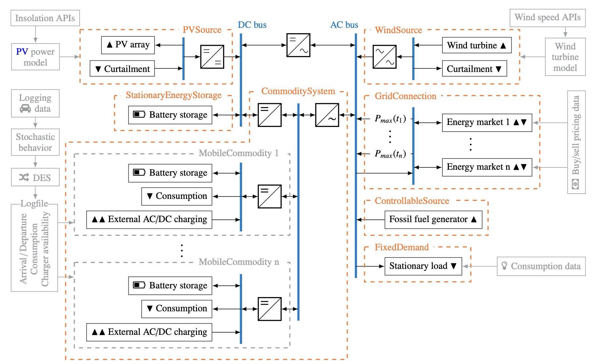

# MG_EV_Opti
Minigrid (MG) & Electric Vehicle (EV) Toolset

This toolset is designed to estimate technoeconomic potentials of electric vehicle integration into localized power systems such as mini- and microgrids.

#### Created by 
Philipp Rosner, M.Sc.
Research Associate
Institute of Automotive Technology  
Department of Mobility Systems Engineering  
School of Engineering and Design  
Technical University of Munich  
philipp.rosner@tum.de  
Originally created September 2nd, 2021

#### Contributors
Brian Dietermann, M.Sc. - Research Associate 06/2022-

David Eickholt, B.Sc. - Semester Thesis submitted 07/2021  
Marcel Brödel, B.Sc. - Semester Thesis submitted 05/2022  
Hannes Henglein, B.Sc. - Semester Thesis submitted 10/2022  
Marc Alsina Planelles, B.Sc. - Master's Thesis submitted 10/2022  
Juan Forero Yacaman - Bachelor's Thesis submitted 04/2023  
Elisabeth Spiegl - Bachelor's Thesis submitted 06/2023  
Hannes Henglein, B.Sc. - Master's Thesis ongoing  
Alejandro Hernando Armengol, B.Sc. - Master's Thesis submitted 10/2023

## Installation

This toolset was designed to run under Windows 10 and Ubuntu 22.04 LTS. While portability was built in, other operating
systems are untested.

#### Source Code, licensing & Distribution
The toolset is developed and internally distributed via LRZ Gitlab prior to being published open source via the FTM EV Lab's GitLab. It is easiest to clone the respective repository at https://gitlab.lrz.de/ftm-electric-powertrain/mg_ev_opti to obtain a working copy of the source code.

<mark> Prior to open source publication of the toolset, any distribution outside FTM researchers or their immediately affiliated students is prohibited. </mark> 

#### Environment & Packages
The toolset was developed using Python 3.11, which is recommended to use with a clean virtual environment to start with.
All required packages are listed in ```requirements.txt``` and can be installed by entering ```pip install -r requirements.txt``` into a terminal for the correct environment.

#### MILP Solver
The toolset is distributed with the open-source CBC solver for mixed integer linear programming (MILP) problems by 
default. All other solvers supported by pyomo are also applicable in it. On windows, this should work right out of the
box, while on Linux, an installation is required, e.g. using ```sudo apt-get install coinor-cbc coinor-libcbc-dev```
might be necessary (command is for Debian based distibutions - others on https://github.com/coin-or/Cbc). While CBC 
does work flawlessly, the commercial Gurobi solver enables a significant speed advantage, especially when working with
a large number of enabled system blocks or long term simulation. It is available at https://www.gurobi.com/ with a free
academic license model.

#### Plotly Server Handling
The toolset is using plotly to visualize the dispatch of the energy systems. However, once plotly is configured to open
the plots directly, it fails to close the handler properly (tested with plotly 5.14.1). To fix the resulting warning,
modify the last few lines of the ```open_html_in_browser``` function within the ```_base_renderers.py``` script in plotly/io
contained in your environment files:
```
with HTTPServer(("127.0.0.1", 0), OneShotRequestHandler) as server:
    browser.open("http://127.0.0.1:%s" % server.server_port, new=new, autoraise=autoraise)
    server.handle_request()
```
in order to properly close the server handler

## Basic Usage

A toolset run needs closely defined scenarios to simulate and simulation settings to operate on. These are provided in two separate .json-files to be specified when starting a simulation, either via a Graphical User Interface (GUI, this variant also enables a path choice of where to store results) automatically coming up when starting the toolset without any parameters given. Alternatively, the names of the files can be specified in the terminal command as follows, given the base folder is selected:
```
python main.py <scenario_file_name>.json <settings_file_name>.json
```
Formatting of the scenario and settings files can be taken from the example files.


## Detailed Description  
This is a toolset to simulate electric vehicles operating in minigrids for rural electrification in emerging economies such as sub-saharan
Africa and optimize component sizes to show least-cost and/or least-emission options. It models a stand-alone minigrid using graph-based
representation, generates a pyomo model and hands it to a solver. Results are summarized in the



#### General Terms & Definitions
| Term                   | Description                                                                                                                                                                                                                                                       |
|------------------------|-------------------------------------------------------------------------------------------------------------------------------------------------------------------------------------------------------------------------------------------------------------------|
| Run                    | A run is defined by a single Microsoft Excel file, containing one sheet with run-wide information ("global_settings") such as solver and parallel mode as well as one sheet per scenario to be executed with actual energy system parameters and links to timeseries files |
| Scenario               | A scenario is defined by a single Excel worksheet and some timeseries inputs. It models an energy system, that is then sized and dispatched using the sim_os selected                                                                                             |
| Horizon                | A scenario can be dispatched in multiple operating strategies, one of which is called "rolling horizon" and is similar to an MPC controller. In this case, each                                                                                                   |
| Block                  | A block is a set of components representing a real-world system (e.g. a PV array in combination with its controller and converter). These can be toggled on or off, except for the core block containing the AC and DC buses as well as the converter(s) inbetween them. |
| Component              | A component is an oemof building block that is either a source, a sink, a bus, a transformer or a storage.                                                                                                                                                        |
| InvestBlock            ||
| SystemCore             ||
| FixedDemand            ||
| PVSource               ||
| WindSource             ||
| ControllableSource     ||
| VehicleCommoditySystem ||
| BatteryCommoditySystem ||
| RentalSystem           ||
| RentalProcess          ||


#### Input data
The toolset requires multiple types of input data, more specifically settings, parameters and timeseries data. The
former are defined in a short json file under /input/settings and define general simulation and execution settings for
the Run. The Scenarios to be executed and their parameters are defined in a second json file in /input/scenarios,
an example of which is distributed with the toolset including its generator script, while the latter are
referenced in the scenarios json file by stem name (without extension) and have to be located in the appropriate folder
within /inputs. 

The scalar parameters used are named with the block they belong to, followed by the parameter's name or abbreviation.
The following abbreviations and parameter names are used frequently:

| Name / Abbreviation              | Description                                                                                                                                                                                                                                                                                         |
|----------------------------------|-----------------------------------------------------------------------------------------------------------------------------------------------------------------------------------------------------------------------------------------------------------------------------------------------------|
| strategy                         | Operational Strategy or Energy Management Algorithm. Determines whether the optimization problem is solved in one shot (global optimum - "go") or in multiple segments (rolling horizon- "rh"). In theory, other approaches such as rule-based or artificial intelligence strategies are thinkable. |
|go| Global Optimum:                                                                                                                                                                                                                                                                                     |
|rh| Rolling Horizon:                                                                                                                                                                                                                                                                                    |
| ph                               | Prediction Horizon: Length of the slices of input data being fed to the optimizer in rolling horizon optimization equalling the timeframe of input and demand data that can be predicted reliably in operando.                                                                                      |
| ch                               | Control Horizon: Lenth of the the                                                                                                                                                                                                                                                                   |
| wacc                             | Weighted average cost of capital: discount rate for future expenses/revenues and energies (usually suufix _dis signifies values that have been accumulatively discounted                                                                                                                            |
| size                             |                                                                                                                                                                                                                                                                                                     |
| system                           |                                                                                                                                                                                                                                                                                                     |
| filename                         |                                                                                                                                                                                                                                                                                                     |
| capex_spec                       |                                                                                                                                                                                                                                                                                                     |
| mntex_spec                       |                                                                                                                                                                                                                                                                                                     |
| opex_spec                        |                                                                                                                                                                                                                                                                                                     |
| ls                               |                                                                                                                                                                                                                                                                                                     |
| cdc                              |                                                                                                                                                                                                                                                                                                     |
| eff                              |                                                                                                                                                                                                                                                                                                     |
| chg                              |                                                                                                                                                                                                                                                                                                     |
| dis                              |                                                                                                                                                                                                                                                                                                     |
| crate                            |                                                                                                                                                                                                                                                                                                     |
| sdr                              |                                                                                                                                                                                                                                                                                                     |
| rex (CommoditySystem)            |                                                                                                                                                                                                                                                                                                     |
| int_lvl (CommoditySystem)        |                                                                                                                                                                                                                                                                                                     |
| num (CommoditySystem)            |                                                                                                                                                                                                                                                                                                     |
| patience (CommoditySystem)       |                                                                                                                                                                                                                                                                                                     |
| soc_min_return (CommoditySystem) |                                                                                                                                                                                                                                                                                                     |
| soc_dep (CommoditySystem)        |                                                                                                                                                                                                                                                                                                     |
| sys_chg_soe (CommoditySystem)    |                                                                                                                                                                                                                                                                                                     |
| sys_dis_soe (CommoditySystem)    |                                                                                                                                                                                                                                                                                                     |

The required timeseries must be provided as csv files in the following formats:

- FixedDemand blocks: A csv file with one or two columns, one of which must be labeled "Power" and contain values in W.
	If a second is contained, it must be labeled "Timestamp" and contain datetime values in a pandas-readable format
- PVSource block: Depending on the input type selected in the json file  
- Mobile commodity system data: csv file containing columns "X_misoc", "X_consumption" and "X_atbase" with X being the name of the commodity.

#### Model output
enter description here

## Requirements  


